<!--Exercise Section-->

<table style="border-spacing: 0px;border-collapse: collapse;font-family:serif">
<tr>
<td style="vertical-align:middle;background-color:darkorange;border: 2px solid darkorange">
<i class="fa fa-cogs fa-lg fa-pull-left fa-fw" style="color:white;padding-right: 12px;vertical-align:text-top"></i>
Exercise 1
</td>
<td style="border: 2px solid darkorange;background-color:darkorange;color:white">
Walkability Review Project
</td>
</tr>

<tr>
<td style="border: 1px solid darkorange; font-weight: bold">Data</td>
<td style="border: 1px solid darkorange">Public Art (Microsoft Excel) Transit Stations (File Geodatabase)</td>
</tr>

<tr>
<td style="border: 1px solid darkorange; font-weight: bold">Overall Goal</td>
<td style="border: 1px solid darkorange">Review basic FME skills </td>
</tr>

<tr>
<td style="border: 1px solid darkorange; font-weight: bold">Demonstrates</td>
<td style="border: 1px solid darkorange">Reading and writing data with basic transformer use</td>
</tr>

<tr>
<td style="border: 1px solid darkorange; font-weight: bold">Start Workspace</td>
<td style="border: 1px solid darkorange">None/td>
</tr>

<tr>
<td style="border: 1px solid darkorange; font-weight: bold">End Workspace</td>
<td style="border: 1px solid darkorange">C:\FMEData2018\Workspaces\DesktopAdvanced\FMEReview-Ex1-Complete.fmw 
C:\FMEData2018\Workspaces\DesktopAdvanced\FMEReview-Ex1-Complete-Advanced.fmw</td>
</tr>

</table>

You've just been hired by the city's GIS department. For your first project, you've been asked to create a map that shows the public art within a 5-minute walking radius (2-3 street blocks) of each train station. This project is also being used to assess your skills and see what other projects you'll be able to work on right away. 

**Project Requirements:**
- Create a blank workspace 
- Read all the sheets from PublicArt.xlsx 
- Read in a File Geodatabase and only read in the Transit Stations table
- Writing out to Google KML
- Reproject the data to UTM83-10
- Create a buffer around the transit stations set to approximately 3 blocks
- Find which art is within the station buffer
- Style the KML (optional)

---

<!--Tip Section--> 

<table style="border-spacing: 0px">
<tr>
<td style="vertical-align:middle;background-color:darkorange;border: 2px solid darkorange">
<i class="fa fa-info-circle fa-lg fa-pull-left fa-fw" style="color:white;padding-right: 12px;vertical-align:text-top"></i>
TIP
</td>
</tr>

<tr>
<td style="border: 1px solid darkorange">

Using your FME skills that you have previously learned, try and create a workspace that statisfies the requirements above without looking at the steps. 
 That's ok if you don't get it finished completely. The complete instructions are below. Just try your best! 
 If you struggled with this exercise, it might be a good idea to go back and review the <a href="https://safe-software.gitbooks.io/fme-desktop-basic-training-2018/content/">FME Desktop Basic Manual</a> before taking this advanced course. 

</td>
</tr>
</table>

---

 **1) Create a New Workspace**
 Open FME Desktop and click New to create a blank workspace. Add a new Reader, in the Add Reader dialog enter:
<table>
<tr><td><strong>Reader Format:</strong></td><td>Microsoft Excel</td></tr>
<tr><td><strong>Reader Dataset:</td><td>PublicArt.xlsx</td></tr>
<tr><td><strong>Coord. System:</strong></td><td>LL84</td></tr>
<tr><td><strong>Workflow Options:</strong></td><td>Single Merged Feature Type</td></tr>
</table>

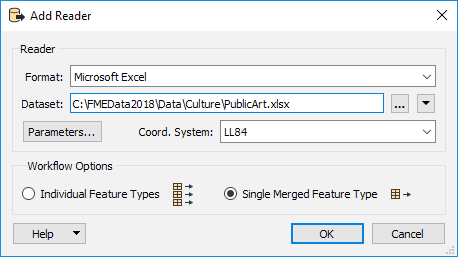

Once the Microsoft Excel reader is added, inspect the data to ensure that the point data is being read correctly. 

 **2) Add Geodatabase Data**
 Next, add another Reader, this time we will read in the Transit Stations from a Geodatabase. In the Add Reader dialog enter:
<table>
<tr><td><strong>Reader Format:</strong></td><td>File Geodatabase (File Geodb Open API)</td></tr>
<tr><td><strong>Reader Dataset:</td><td>CommunityMapping.gdb</td></tr>
<tr><td><strong>Parameters > Table List:</strong></td><td>TransitStations</td></tr>
<tr><td><strong>Workflow Options:</strong></td><td>Individual Feature Type</td></tr>
</table>

Inspect this new dataset paying attention to the coordinate system:

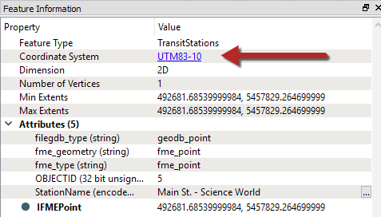

The coordinate system for this data is UTM83-10, our other dataset was LL84, we will have to reproject one of them. 

 **3) Reproject PublicArt**
 Since UTM83-10 is a more localized coordinate system lets reproject the PublicArt to it. Add a Reprojector transformer to the canvas and connect it to the Public Art feature type (<All>). In the parameters set the Destination Coordinate System to UTM83-10:

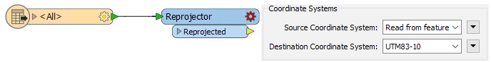

 **4) Buffer the Transit Stations**
 To create a 5-minute walking radius for each transit station, which is about 2-3 city blocks, we will need to create a buffer. To do this we will use the Bufferer transformer. Add a Bufferer transformer to the canvas and connect it to the TransitStations feature type. In the parameters set the Buffer Amount to 100, click OK to close the parameters:

 **5) Inspect Features**
 Next we will run the translation to check if the buffer amount was enough. On the top menu bar go to Run > Run with Feature Caching, then run the translation: 

On your keyboard hold CTRL and click on both the Reprojector and the Bufferer. Then right click > Inspect Cached Features... This will open both the features in the Data Inspector:

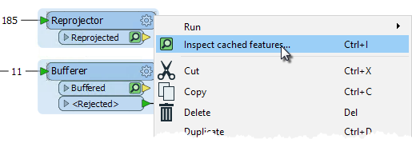 

To check how many blocks the buffer covers we will need to enable background maps. In the Data Inspector go to Tools > FME Options.. > Background Map. Then select Stamen Maps as the Background Format and choose any of the maps in the Map List in the Parameters:

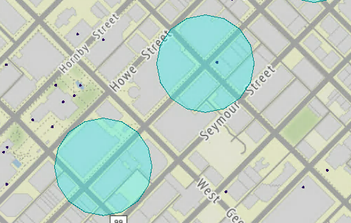
 Map tiles by <a href="http://stamen.com">Stamen Design</a>, under <a href="http://creativecommons.org/licenses/by/3.0">CC-BY-3.0</a>. Data by <a href="http://openstreetmap.org">OpenStreetMap</a>, under <a href="http://creativecommons.org/licenses/by-sa/3.0">CC-BY-SA</a>.

---

<!--Tip Section--> 

<table style="border-spacing: 0px">
<tr>
<td style="vertical-align:middle;background-color:darkorange;border: 2px solid darkorange">
<i class="fa fa-info-circle fa-lg fa-pull-left fa-fw" style="color:white;padding-right: 12px;vertical-align:text-top"></i>
TIP
</td>
</tr>

<tr>
<td style="border: 1px solid darkorange">

If you can't get your background maps working, you can add a roads dataset to the Data Inspector. Go to File > Add Dataset. Then add a Autodesk AutoCAD DWG/DXF Reader and then the CompleteRoads.dwg dataset. 
  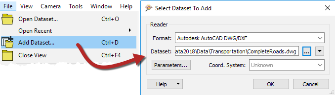
  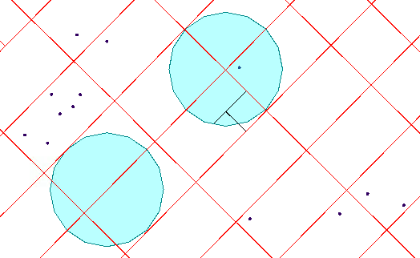

</td>
</tr>
</table>

---

It looks like this buffer only covers 1 block so we will have to update it. Back in FME Workbench, change the parameters of the Buffer Amount in the Bufferer to 250. Then click Run From This on the Bufferer to only run the Bufferer again. Then inspect both the Reprojector and the Bufferer:

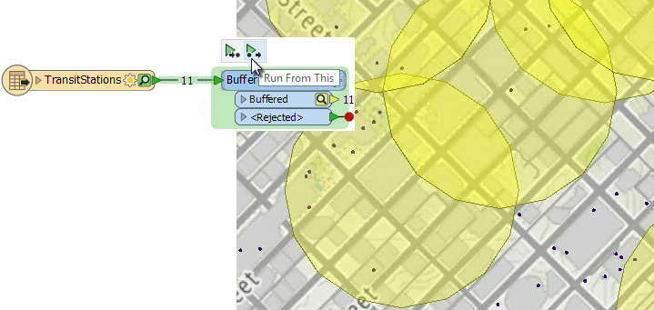
 Map tiles by <a href="http://stamen.com">Stamen Design</a>, under <a href="http://creativecommons.org/licenses/by/3.0">CC-BY-3.0</a>. Data by <a href="http://openstreetmap.org">OpenStreetMap</a>, under <a href="http://creativecommons.org/licenses/by-sa/3.0">CC-BY-SA</a>.

This looks good, now we can move on.

 **5) Filter Public Art**
 Now that the buffer is a good size we can find out which of the public art pieces fall within the buffered area. Add a SpatialFilter transformer to the canvas. Connect the SpatialFilter:Candidate input port to the Reprojector:Reprojected output port and the SpatialFilter:Filter input port to the Bufferer:Buffered output port:

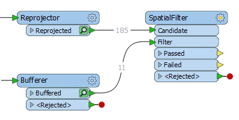

In the SpatialFilter parameters set the Spatial Predicates to Test to Filter Contains Candidate and Filter Touches Candidate.

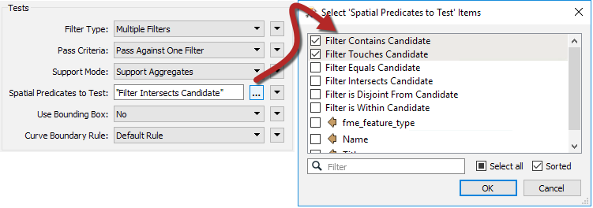

You can run the translation again if you wish and inspect the SpatialFilter:Passed output port. 

 **6) Add Google KML Writer**
 Finally we can write out to Google KML. Add a Google KML Writer to the canvas and enter the following:
<table>
<tr><td><strong>Writer Format:</strong></td><td>Google KML</td></tr>
<tr><td><strong>Writer Dataset:</td><td>C:\FMEData2018\Output\Walkability.kml</td></tr>
<tr><td><strong>Feature Type Definition</strong></td><td>Automatic</td></tr>
</table>

Then change the Feature Type Name to ArtNearTransit in the Feature Type dialog and click OK. Connect it to the SpatialFilter:Passed output port. Also connect the Bufferer:Buffered output port to the ArtNearTransit:Input port:

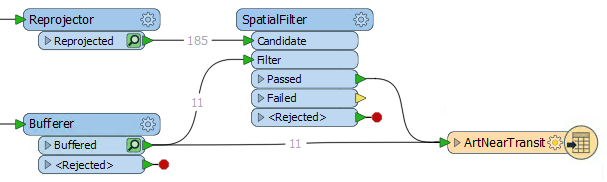

In the ArtNearTransit parameters, go to the User Attributes tab then change the Attribute Definition to Manual. Then remove the attributes OBJECTID and _precicate:

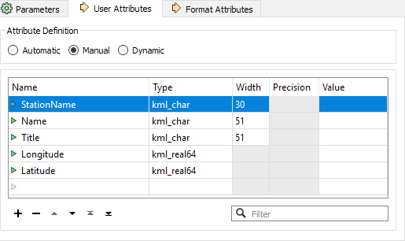

 **7) Save and Run Translation**
 You can now save your workspace then run the translation. Open up the Google KML file in Google Earth or the FME Data Inspector:

---

<!--Advanced Exercise Section-->

<table style="border-spacing: 0px">
<tr>
<td style="vertical-align:middle;background-color:darkorange;border: 2px solid darkorange">
<i class="fa fa-cogs fa-lg fa-pull-left fa-fw" style="color:white;padding-right: 12px;vertical-align:text-top"></i>
Advanced Exercise
</td>
</tr>
<tr>
<td style="border: 1px solid darkorange">

The output of the Google KML isn't the prettiest, it just uses default icons. These output styles can be changed with KMLStyler transformers. 

</td>
</tr>
</table>

---

 **8) Connect TransitStations**
 We also want to add an icon for our TransitStations so the user knows where the station is. Connect the TransitStations Feature Type to the ArtNearTransit Writer:

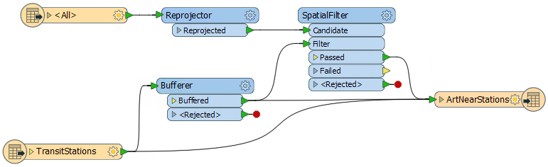

 **8) Style Output KML**
 Add a KMLStyler transformer between the SpatialFilter:Passed output port and the ArtNearTransit Writer. In the parameters under Icon > Name, click the ellipsis then select the icon P5. Then for Label Style set the Opacity to 0. 

Between the Bufferer and the ArtNearTransit Writer add another KMLStyler. In the parameters set the Color to Black and the Fill Color to Yellow. Set both Opacity and Fill Opacity to 0.5. Then for Label Style set the Opacity to 0. 

Finally, add a third KMLStyler to the canvas. This time connect it to the TransitStations:Output port and the ArtNearTransit:Input port. In the parameters Icon > Name, click on the ellipsis then double click on the first folder icon to browse for more icons. Then select the gx_rail icon and click OK. Also, set the Opacity for Label Style to 0. 

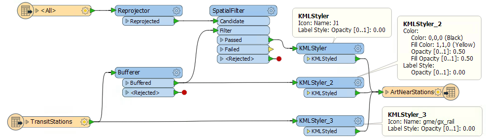

 **9) Save and Run Translation**
 Finally, save and run the translation again to see the updated icons in Google Earth:

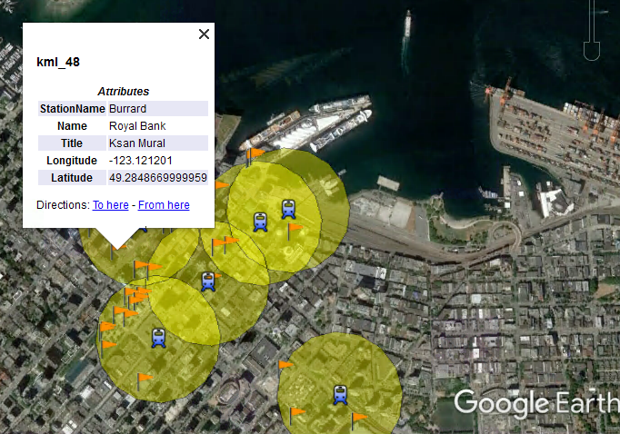

---

<!--Exercise Congratulations Section--> 

<table style="border-spacing: 0px">
<tr>
<td style="vertical-align:middle;background-color:darkorange;border: 2px solid darkorange">
<i class="fa fa-thumbs-o-up fa-lg fa-pull-left fa-fw" style="color:white;padding-right: 12px;vertical-align:text-top"></i>
CONGRATULATIONS
</td>
</tr>

<tr>
<td style="border: 1px solid darkorange">

By completing this exercise you have reviewed the following skills:
 
<ul><li>Add a Reader and Writer</li>
<li>Modify Reader parameters</li>
<li>Different transformer parameters (Bufferer and SpatialFilter)</li>
<li>Use the Data Inspector to inspect data</li>
<li>Add a background map</li>
<li>Use the Data Inspector to inspect data</li>
<li>Modify Writer parameters</li>
<li>Style a KML</li>
</ul>

</td>
</tr>
</table>

