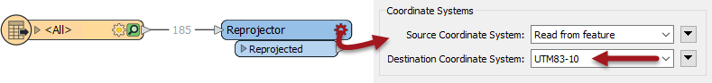
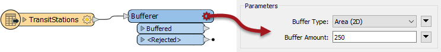
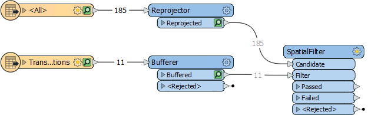
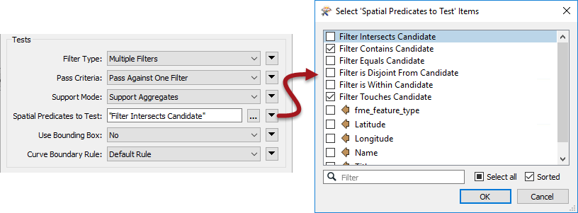
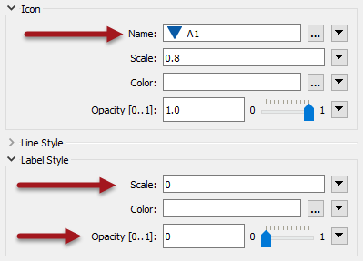
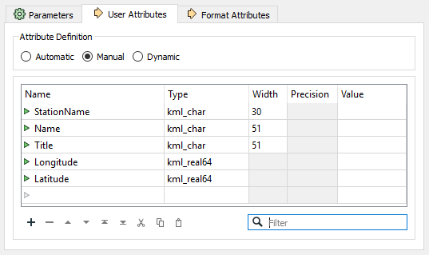
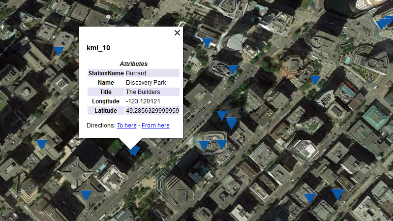

<!--Exercise Section-->

<table style="border-spacing: 0px;border-collapse: collapse;font-family:serif">
<tr>
<td width=25% style="vertical-align:middle;background-color:darkorange;border: 2px solid darkorange">
<i class="fa fa-cogs fa-lg fa-pull-left fa-fw" style="color:white;padding-right: 12px;vertical-align:text-top"></i>
Exercise 1
</td>
<td style="border: 2px solid darkorange;background-color:darkorange;color:white">
Basic FME Skills Review
</td>
</tr>

<tr>
<td style="border: 1px solid darkorange; font-weight: bold">Data</td>
<td style="border: 1px solid darkorange">Public Art (Microsoft Excel) Transit Stations (File Geodatabase)</td>
</tr>

<tr>
<td style="border: 1px solid darkorange; font-weight: bold">Overall Goal</td>
<td style="border: 1px solid darkorange">Review basic FME skills </td>
</tr>

<tr>
<td style="border: 1px solid darkorange; font-weight: bold">Demonstrates</td>
<td style="border: 1px solid darkorange">Reading and writing data with basic transformer use</td>
</tr>

<tr>
<td style="border: 1px solid darkorange; font-weight: bold">Start Workspace</td>
<td style="border: 1px solid darkorange">None</td>
</tr>

<tr>
<td style="border: 1px solid darkorange; font-weight: bold">End Workspace</td>
<td style="border: 1px solid darkorange">C:\FMEData2019\Workspaces\DesktopAdvanced\FMEReview-Ex1-Complete.fmw
</tr>

</table>

You have been hired by a city GIS department. For your first project, you've been asked to create a map that shows the public art within a 5-minute walking radius (2-3 street blocks) of each transit station.

**Project Requirements:**

To carry out this project in FME Workbench you'll need to do the following:

- Read all the sheets from an Excel spreadsheet (PublicArt.xlsx) turning the data into spatial features 
- Reproject the arts data to the UTM83-10 coordinate system
- Read the Transit Stations table from a File Geodatabase (CommunityMapping.gdb)
- Create a buffer around the transit stations set to approximately 3 blocks (250 meters)
- Find artwork features within the station buffer
- Style the data and write it to Google KML format

---

<!--Tip Section--> 

<table style="border-spacing: 0px">
<tr>
<td style="vertical-align:middle;background-color:darkorange;border: 2px solid darkorange">
<i class="fa fa-info-circle fa-lg fa-pull-left fa-fw" style="color:white;padding-right: 12px;vertical-align:text-top"></i>
TIP
</td>
</tr>

<tr>
<td style="border: 1px solid darkorange">

If you struggle with this exercise, it's a good idea to go back and review the FME Desktop Basic Manual before taking this advanced course. 

</td>
</tr>
</table>

---

 **1) Create a New Workspace**
 Open FME Workbench and start with a blank workspace. Add a new reader using the following parameters:
<table>
<tr><td><strong>Reader Format:</strong></td><td>Microsoft Excel</td></tr>
<tr><td><strong>Reader Dataset:</td><td>C:\FMEData2019\Data\Culture\PublicArt.xlsx</td></tr>
<tr><td><strong>Coord. System:</strong></td><td>LL84</td></tr>
<tr><td><strong>Workflow Options:</strong></td><td>Single Merged Feature Type</td></tr>
</table>

Once the Microsoft Excel reader is added, turn on feature caching (or add an Inspector transformer) and run the workspace. Inspect the results in the Visual Preview window, by clicking on the cache if necessary. Check especially the coordinate system of the data.

***Note:*** *Don't use the Inspect pop-up button on the reader feature type. You will not see any geometry.*

---

<!--New Section--> 

<table style="border-spacing: 0px">
<tr>
<td style="vertical-align:middle;background-color:darkorange;border: 2px solid darkorange">
<i class="fa fa-bolt fa-lg fa-pull-left fa-fw" style="color:white;padding-right: 12px;vertical-align:text-top"></i>
NEW
</td>
</tr>

<tr>
<td style="border: 1px solid darkorange">

The Visual Preview window is a new tool for FME2019, that incorporates FME Data Inspector functionality into FME Workbench.

</td>
</tr>
</table>

---

 **2) Add Geodatabase Data**
 Next, add another reader, this time the Transit Stations table from a Geodatabase:

<table>
<tr><td><strong>Reader Format:</strong></td><td>Esri Geodatabase (File Geodb Open API)</td></tr>
<tr><td><strong>Reader Dataset:</td><td>C:\FMEData2019\Data\CommunityMapping\CommunityMap.gdb</td></tr>
<tr><td><strong>Parameters &gt; Table List:</strong></td><td>TransitStations</td></tr>
<tr><td><strong>Workflow Options:</strong></td><td>Individual Feature Types</td></tr>
</table>

Once more, inspect this new dataset paying particular attention to the coordinate system.

 **3) Reproject PublicArt**
 The coordinate system for the transit data is UTM83-10, the artwork features are LL84; therefore one of these datasets must be reprojected to match the other, to test spatial relationships. 

Since the requirement is to buffer features in meters, we'll use UTM83-10. 

Add a Reprojector transformer to the canvas and connect it to the Public Art feature type (&lt;All&gt;). In the parameters set the Destination Coordinate System to UTM83-10:

Inspect both datasets together (with the background maps turned off) to prove that they now inhabit the same coordinate space.

 **4) Buffer the Transit Stations**
 To create a 5-minute walking radius for each transit station, which is about 2-3 city blocks, we will need to create a buffer. To do this, we will use the Bufferer transformer. 

Add a Bufferer transformer to the canvas and connect it to the TransitStations feature type. In the parameters set the Buffer Amount to 250:

Re-run the workspace and inspect the output to ensure that the buffers are correct.

 **5) Filter Public Art**
 Now let's find which of the public art pieces fall within the buffered area. 

Add a SpatialFilter transformer to the canvas. Connect the Reprojector:Reprojected output port to the SpatialFilter:Candidate input port, and the Bufferer:Buffered output port to the SpatialFilter:Filter input port:

Adjust the workspace as necessary to ensure there are no crossed connections. 

Set the SpatialFilter Spatial Predicates to Test parameter to apply both *Filter Contains Candidate* and *Filter Touches Candidate*.

Rerun the translation if you wish, and inspect the SpatialFilter:Passed output port (alongside the Bufferer output) to make sure the results are correct. There should be 52 Passed features.

 **6) Style Output KML**
 Add a KMLStyler transformer to the SpatialFilter:Passed output port. This will be used to style the artwork to be written to the KML output. 

In the parameters under Icon &gt; Name, click the ellipsis then select an icon such as A1. Then for Label Style set the Scale to 0 and the Opacity to 0:

This will allow the icon to show, but hide their labels. 

 **7) Add Google KML Writer**
 Finally, we can write out to Google KML. Add a Google KML Writer using the following parameters:

<table>
<tr><td><strong>Writer Format:</strong></td><td>Google KML</td></tr>
<tr><td><strong>Writer Dataset:</td><td>C:\FMEData2019\Output\Training\Artworks.kml</td></tr>
<tr><td><strong>Feature Type Definition</strong></td><td>Automatic</td></tr>
</table>

Change the name of the newly created feature type to ArtNearTransit. Connect it to the KMLStyler:KMLStyled output port.

Reopen the ArtNearTransit feature type parameters and select the User Attributes tab. Change the Attribute Definition to Manual and remove the attributes OBJECTID, &#95;predicate, and fme&#95;feature&#95;type:

 **8) Save and Run Translation**
 You can now save your workspace then run the translation. Open up the Google KML file in Google Earth to inspect the output.

***Note:*** *Even though we reprojected the data to UTM83-10, Google KML format supports only a Latitude and Longitude coordinate system. Notice that the writer automatically reprojected our data for us.*

---

<!--Exercise Congratulations Section--> 

<table style="border-spacing: 0px">
<tr>
<td style="vertical-align:middle;background-color:darkorange;border: 2px solid darkorange">
<i class="fa fa-thumbs-o-up fa-lg fa-pull-left fa-fw" style="color:white;padding-right: 12px;vertical-align:text-top"></i>
CONGRATULATIONS
</td>
</tr>

<tr>
<td style="border: 1px solid darkorange">

By completing this exercise you have reviewed the following skills:
 
<ul>
<li>Add a reader and modify the reader parameters</li>
<li>Add various transformer and adjust their parameters</li>
<li>Use the Visual Preview window to inspect data</li>
<li>Add a writer and modify the writer output schema</li>
</ul>

</td>
</tr>
</table>