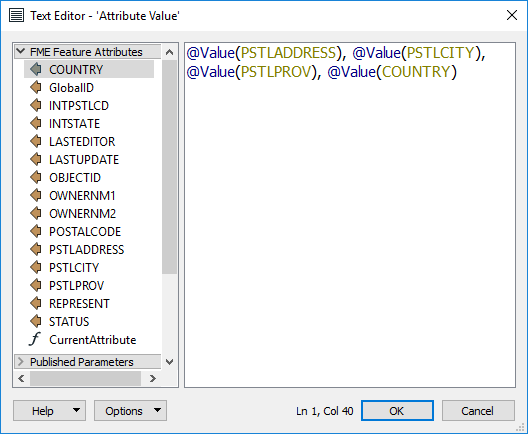
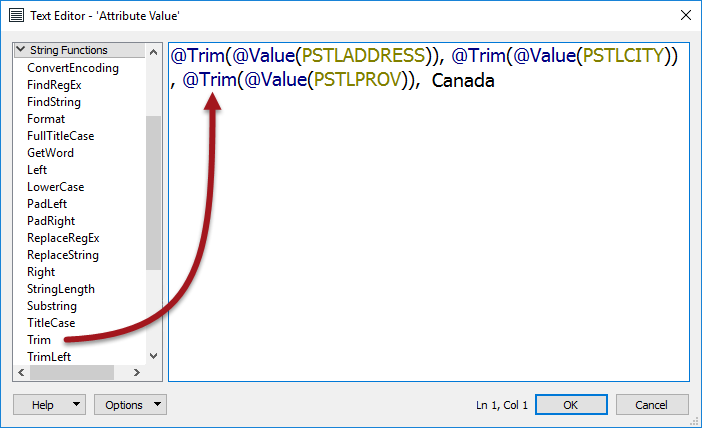
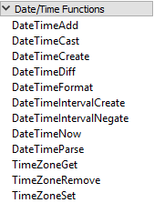
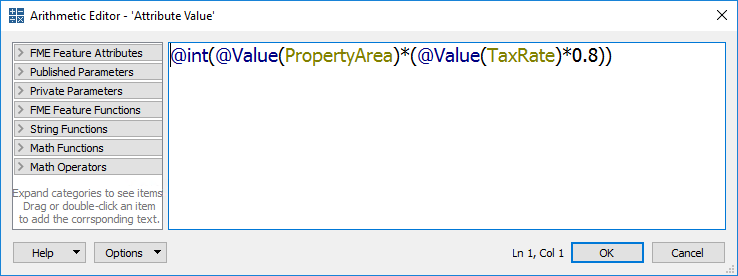

<!--This section is (mostly) a copy of part of the basic manual, used here just as a reminder-->

## Text Editor ##
The text editor - as you would expect - allows you to construct a text value. It includes all the usual string-handling functionality you would need, such as concatenation, trimming, padding, and case changing.

The text editor looks like this:

Here the user is constructing a simple address string by concatenating various existing attributes. Notice the menu on the left-hand side. Existing attributes are listed under the FME Feature Attributes section, and were added to the string by double-clicking them.

The @Value() part is simply an FME function that returns the value of the named attribute. 

The text editor also allows typing any item of text. Notice that the country name is added as a fixed piece of text, along with space characters between attributes.

Also, notice the other menu options. The most important (for a text editor) is the String Functions:

These are the functions that can be used to manipulate the strings being used. For example, here the user makes sure to trim the attributes used to construct a new value, using the @Trim() function.

Other functions allow you to calculate results for various date operations; for example, you can determine the interval between two dates in a number of units, you can add or subtract time from a date, or you can change a date from one structure to another.

 

---

## Arithmetic Editor ##

The arithmetic editor is much the same as the text editor, except that whatever the user enters into the dialog will be evaluated as an arithmetic expression and a numeric result returned:

Here the user is calculating a resident's tax using a simple equation containing property area and a tax code. As with the text editor, existing attributes and arithmetic functions were obtained from the menu on the left-hand side.
