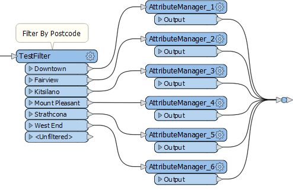
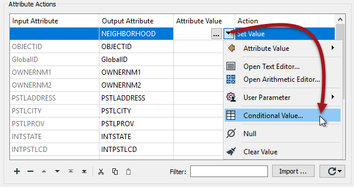
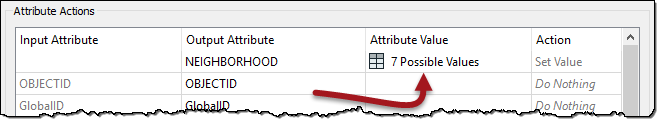
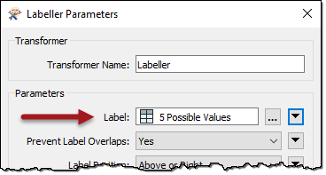

## Conditional Attribute Values ##

Conditional Attribute Values are a tool that can be used to replace many existing transformers of the same type.

## Transformer-Based Attribute Mapping ##

Features can be divided within a workspace using transformers in a process called Conditional Filtering, and attributes can be set or created based on these divisions. Here an author divides data into neighborhoods using a postcode attribute:

However, a large number of AttributeManager transformers like this is not a good idea. It causes the workspace to be bloated; hard to navigate and harder to edit. Also, since each value needs a separate TestFilter port and AttributeManager combination, it's easy to imagine the difficulties involved with - say - more than 50 values! 

One solution is to use a simple AttributeValueMapper transformer. However, that transformer only permits a single, simple condition, such as X=Y. If a more advanced set of conditions is required, then the preferred solution is **Conditional Attribute Values**.

## What are Conditional Attribute Values? ##

Conditional attribute values are when, instead of creating a set of conditions and values as separate objects in a workspace, the author sets both condition and value inside a single transformer.

The option for conditional attributes is found in the drop-down dialog on most transformer parameters. In the AttributeManager, it appears like so:

 

In the above screenshot, a workspace author is creating a new attribute called NEIGHBORHOOD. The values for NEIGHBORHOOD are conditional upon other attribute values and - in this example - are set up like this:

 

---

<table style="border-spacing: 0px">
<tr>
<td style="vertical-align:middle;background-color:darkorange;border: 2px solid darkorange">
<i class="fa fa-quote-left fa-lg fa-pull-left fa-fw" style="color:white;padding-right: 12px;vertical-align:text-top"></i>
FME Lizard says…
</td>
</tr>

<tr>
<td style="border: 1px solid darkorange">

To save time and prevent data entry error, you can copy and paste conditions between transformers of a similar style. For example, the Tester transformer and a Test Condition in the TestFilter transformer. 
</td>
</tr>
</table>

---

Like the AttributeValueMapper, a series of conditions (left) map to different values (right). However, in contrast to the AttributeValueMapper, this dialog allows much more complex conditions than a simple 1:1 mapping. That’s because full test capabilities are built into this dialog.

The conditions are defined by double-clicking in the Test Condition field to open up a Tester-style dialog. Both the condition and the output value can be set within this dialog:

 

When the conditions are set than the original dialog – in this case, an AttributeManager – looks like this, with the number of conditions defining the number of possible values:

 

---

<table style="border-spacing: 0px">
<tr>
<td style="vertical-align:middle;background-color:darkorange;border: 2px solid darkorange">
<i class="fa fa-quote-left fa-lg fa-pull-left fa-fw" style="color:white;padding-right: 12px;vertical-align:text-top"></i>
FME Lizard says…
</td>
</tr>

<tr>
<td style="border: 1px solid darkorange">

Just like attribute construction, conditional values apply not only to attributes but to most FME parameters; for example, I can create labels conditional upon certain tests using the Labeller transformer itself:
  
  So I don't have to create the labels in an AttributeManager and then apply them in the Labeller as a separate task.
</td>
</tr>
</table>

---

## When to use Conditional Attribute Values? ##

Conditional attribute values are great for when you need to map (or set) an attribute in relation to the value of an existing attribute, and when the conditions are more complex than can be handled in a simple AttributeValueMapper (or AttributeRangeMapper) transformer.

In essence, conditional values are like a combination of TestFilter and AttributeCreators in the range of functionality that they include.
 

<table style="border-spacing: 0px">
<tr>
<td style="vertical-align:middle;background-color:darkorange;border: 2px solid darkorange">
<i class="fa fa-quote-left fa-lg fa-pull-left fa-fw" style="color:white;padding-right: 12px;vertical-align:text-top"></i>
FME Lizard says…
</td>
</tr>

<tr>
<td style="border: 1px solid darkorange">

Additionally, if you’re using the ?: operator in an arithmetic editor, then you can stop being such a show-off and use conditional values instead!

</td>
</tr>
</table>

---

<!--Person X Says Section-->

<table style="border-spacing: 0px">
<tr>
<td style="vertical-align:middle;background-color:darkorange;border: 2px solid darkorange">
<i class="fa fa-quote-left fa-lg fa-pull-left fa-fw" style="color:white;padding-right: 12px;vertical-align:text-top"></i>
FME Lizard asks...
</td>
</tr>

<tr>
<td style="border: 1px solid darkorange">

<quiz name="">
  <question multiple>
    

      Q) The output attribute "value" in a conditional setup can be which of these (select all that apply):
    

    <answer correct>A simple value like a string or number</answer> 
    <answer correct>A value constructed from a text or arithmetic editor</answer> 
    <answer correct>No Action (i.e. the value will remain what it was)</answer> 
    <answer correct>A command to FME to cancel the translation</answer> 
     <explanation>A) Yes, <strong>all</strong> of these are valid. You can type in a simple value or construct one with an editor, or even set the value to a user parameter. But the Output Value field also does not need to be a "value" at all! It can be any action on the usual dropdown menu, including Null, No Action, or Stop Translation.
</explanation>
  </question>
</quiz>

</td>
</tr>
</table>
