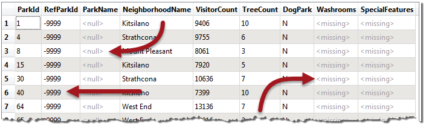

# Null Attributes #

Null attributes are a very important part of FME’s attribute handling. Not every dataset has null values, and not every format supports them; but when they do exist it is important for FME to handle them correctly.

## What is a Null Value? ##

In general, a null attribute value is the equivalent of **nothing**. However, it’s important to be precise in our terminology because there are many ways to represent nothing:

- An attribute has a particular *state* that indicates nothingness (null)
- An attribute has a particular *value* that indicates nothingness (for example, -999)
- An attribute exists but has no value (empty)
- An attribute doesn’t exist (missing)
- A numeric attribute is NaN (Not a Number)
- A numeric attribute has a value of zero
- A raster cell is set to nodata (which is essentially the raster equivalent of null)

In fact, Safe Software’s developers identified fifteen (15) different ways for “nothing” to be represented in spatial and tabular data!

So when we talk about *null*, it has a particular meaning. For us, null is a specific state that is deliberately set to signify that the information does not exist. It tells us that the lack of information is not a mistake, as a missing or empty value might be.

Because there are so many different methods, this section will discuss ways to handle "nothing" attribute values, but with a particular emphasis on Null values.

---

<table style="border-spacing: 0px">
<tr>
<td style="vertical-align:middle;background-color:darkorange;border: 2px solid darkorange">
<i class="fa fa-quote-left fa-lg fa-pull-left fa-fw" style="color:white;padding-right: 12px;vertical-align:text-top"></i>
FME Lizard says…
</td>
</tr>

<tr>
<td style="border: 1px solid darkorange">

FME's three main methods are null, empty, and missing. To clarify with an analogy, let's consider the kitchen of your house. 
  Suppose there is no sink, there is no place to put a sink, and there is no plumbing for the sink. The builder foolishly decided there would be no sink, so the sink is <strong>missing</strong>.
  If there was a place for the sink, and plumbing for the sink, but the sink was not there, then it would be <strong>null</strong>. The builder set aside space for the sink, but hasn't added it yet.  
  If there is a sink, but there is no water in it, then the sink exists, but it is <strong>empty</strong>.
  You can find a more amusing version of this analogy by Googling <a href="http://lmgtfy.com/?q=null+toilet+roll">Null Toilet Roll!</a>

</td>
</tr>
</table>

---

## How does FME Represent Nothing? ##
FME’s internal engine has its own state to represent null. However, when presented to the user, a null value is usually represented as &lt;null&gt;.

For example, this feature in the Logger has &lt;null&gt; for the ParkName attribute:

Similarly, the FME Data Inspector will depict nulls as &lt;null&gt;:

Notice how we have a wide range of "nothing" values here. The ParkName is a true &lt;null&gt;, the RefParkId has a value of -9999, and Washrooms is &lt;missing&gt; (meaning the attribute doesn't exist).

---

<table style="border-spacing: 0px">
<tr>
<td style="vertical-align:middle;background-color:darkorange;border: 2px solid darkorange">
<i class="fa fa-quote-left fa-lg fa-pull-left fa-fw" style="color:white;padding-right: 12px;vertical-align:text-top"></i>
FME Lizard says…
</td>
</tr>

<tr>
<td style="border: 1px solid darkorange">

<strong>&lt;missing&gt;</strong> is an interesting concept. You might be asking, "how do we know when an attribute is missing"? But a better question is "how do we know that the attribute should exist"?
  Using our previous analogy, we know the kitchen sink is missing because the house blueprints specified a sink. The lack of sink in the bedroom is not surprising because bedrooms do not (usually) have a sink.
  In FME we know an attribute should exist because it appears in the reader schema. For example, in the above screenshot, Washrooms appears in the schema, but for some reason certain features do not have that attribute. That makes the attribute &lt;missing&gt;.

</td>
</tr>
</table>