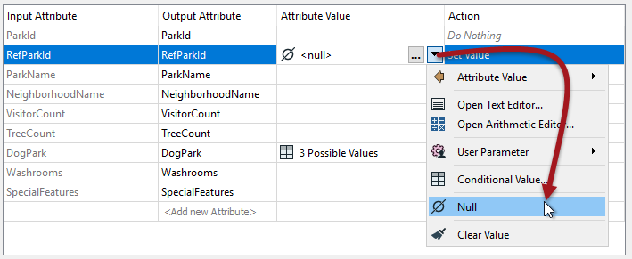
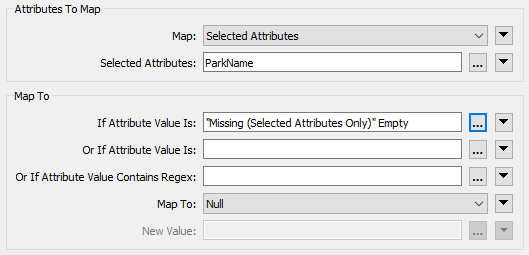
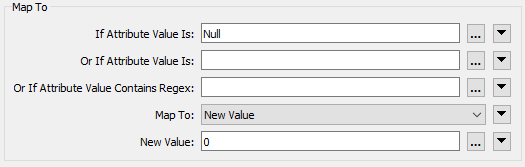

### Setting Null Values ###

The usual way to set an attribute value is with the AttributeCreator or AttributeManager, and these have an option in their drop-down menu to set a value to null:

Conditional Attributes functionality also supports setting &lt;null&gt; values:

 

---

### Bulk Null Updates ###

The way to handle bulk updates of attributes is with the **NullAttributeMapper** transformer.

The NullAttributeMapper transformer allows the author to check values for any or all attributes on a feature, and convert them in bulk to or from null.

For example, here the author is checking for attributes that are either missing or empty and converting them to nulls:

One reason for this might be that the workspace converts data from a format that does not support nulls, to one that does. It's necessary to explicitly map the values here because empty/missing values may be permitted in the output and FME will not automatically map data from empty to null, just because a format supports it.  

In this second example, the author is checking attributes for existing null values. If the value is set to null then it gets replaced with a zero: 

Presumably, this must be a numeric field. If it was a text field perhaps the author would set it to an empty string instead. Unlike before, the author wouldn't need to do this when converting from a format that supports null to a format that doesn't, because FME will map the values automatically when the current state isn't supported.

A better reason for this mapping is that the author wants to carry out a numeric, calculation where zero is a valid number but &lt;null&gt; isn't. 

---

<!--Person X Says Section-->

<table style="border-spacing: 0px">
<tr>
<td style="vertical-align:middle;background-color:darkorange;border: 2px solid darkorange">
<i class="fa fa-quote-left fa-lg fa-pull-left fa-fw" style="color:white;padding-right: 12px;vertical-align:text-top"></i>
FME Lizard asks...
</td>
</tr>

<tr>
<td style="border: 1px solid darkorange">

<quiz name="">
  <question>
    

      Q) My reader format supports nulls and includes known null values in the data. My writer format is a simple text format that does not support nulls. What must I do to get my workspace to work correctly? 
    

    <answer>Delete the attributes with the AttributeRemover</answer>
    <answer>Set the advanced reader parameter "Read Nulls as Empty" to Yes</answer>
    <answer>Use the NullAttributeMapper to convert all &lt;null&gt; values to &lt;empty&gt;</answer>
    <answer correct>Nothing, the writer will convert the values as necessary</answer>
      <explanation>A) If a format doesn't support nulls then the writer will write the data in a format as close to null as possible for that format. Sometimes it will be an empty value, other formats have a specific value for null (like -9999).</explanation>
  </question>
</quiz>

</td>
</tr>
</table>
