<!--Exercise Section-->

<table style="border-spacing: 0px;border-collapse: collapse;font-family:serif">
<tr>
<td style="vertical-align:middle;background-color:darkorange;border: 2px solid darkorange">
<i class="fa fa-cogs fa-lg fa-pull-left fa-fw" style="color:white;padding-right: 12px;vertical-align:text-top"></i>
Exercise 1
</td>
<td style="border: 2px solid darkorange;background-color:darkorange;color:white">
Taxation Report Project
</td>
</tr>

<tr>
<td style="border: 1px solid darkorange; font-weight: bold">Data</td>
<td style="border: 1px solid darkorange">Building Footprints (AutoCAD DWG) Zoning Data (MapInfo TAB) Tax Report (HTML)</td>
</tr>

<tr>
<td style="border: 1px solid darkorange; font-weight: bold">Overall Goal</td>
<td style="border: 1px solid darkorange">Create a taxation report for buildings in the city</td>
</tr>

<tr>
<td style="border: 1px solid darkorange; font-weight: bold">Demonstrates</td>
<td style="border: 1px solid darkorange">Constructing attribute values</td>
</tr>

<tr>
<td style="border: 1px solid darkorange; font-weight: bold">Start Workspace</td>
<td style="border: 1px solid darkorange">C:\FMEData2019\Workspaces\DesktopAdvanced\Attributes-Ex1-Begin.fmw</td>
</tr>

<tr>
<td style="border: 1px solid darkorange; font-weight: bold">End Workspace</td>
<td style="border: 1px solid darkorange">C:\FMEData2019\Workspaces\DesktopAdvanced\Attributes-Ex1-Complete.fmw</td>
</tr>

</table>

The annual property tax reports are due to be calculated, and it is decided to use FME to carry out the processing. A partial workspace already exists; you must finish it by calculating tax values for each building (based on size and zoning) and creating a report of the results.

 **1) Open Workspace**
 Open the workspace C:\FMEData2019\Workspaces\DesktopAdvanced\Attributes-Ex1-Begin.fmw. The first section of the workspace looks like this:

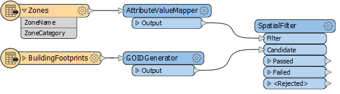

In particular, notice that the AttributeValueMapper is creating a TaxMultiplier value, based on zoning type.

Ensure feature caching is turned on and then run the workspace. Inspect each cache in turn to view the source data and the results of each transformer:

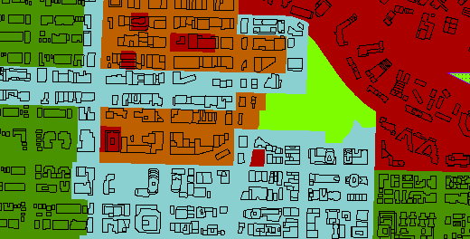

Also inspect the transformer caches to ensure they are carrying out the action you expect.

---

<table style="border-spacing: 0px">
<tr>
<td style="vertical-align:middle;background-color:darkorange;border: 2px solid darkorange">
<i class="fa fa-quote-left fa-lg fa-pull-left fa-fw" style="color:white;padding-right: 12px;vertical-align:text-top"></i>
FME Lizard says…
</td>
</tr>

<tr>
<td style="border: 1px solid darkorange">

The simplest way to inspect each cache is to use the Visual Preview window. Simply open the preview window (if it is not already open) and click on each workspace object in turn. The preview window will update with the results of each object.
  To stop this automatic updating of the preview window, you can click the button in the top-left of the Preview Window. Its tooltip is "Toggle Automatic Inspect on Selection". Once deactivated, you must click the green cache icon on each object to view its cache.
</td>
</tr>
</table>

---

 **2) Add AttributeManager**
 To carry out our tax calculations, we'll use an AttributeManager transformer. So place an AttributeManager and connect it to the SpatialFilter:Passed output port.

The first task is to create a numeric value for the taxation rate. Create a new attribute called TaxRate. Set it to a fixed value of 0.2

Add a second new attribute, this one called TaxAmount. Instead of setting a fixed value, click the drop-down arrow to the right and choose the option for Open Arithmetic Editor:

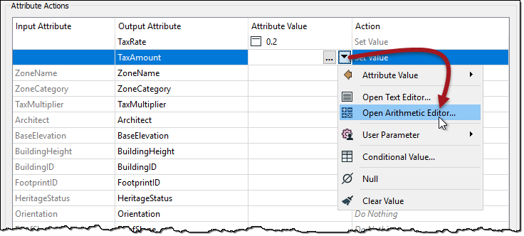 

 **3) Calculate Tax Amount**
 The calculation for the tax amount is:

<pre>
Building Footprint x Tax Multiplier x Tax Rate = Tax Amount
</pre>

...where Building Footprint is the area of the building in square meters, Tax Multiplier is the value relating to the Zone Type, and Tax Rate is the fixed value we entered previously.

The result should also be rounded off to two decimal places.

So, start out by locating Area under FME Feature Functions and double-clicking it to add the area of the building footprint to the equation:

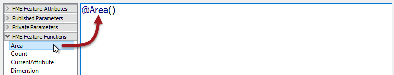

Add a multiplication symbol. It can be found under Math Operators, but it's easier to just type it. Next, locate the TaxMultiplier attribute and double-click it to add it to the equation:

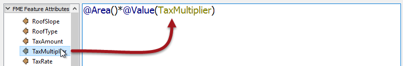 

Add another multiplication symbol. Now locate the TaxRate attribute and double-click it to add it to the equation:

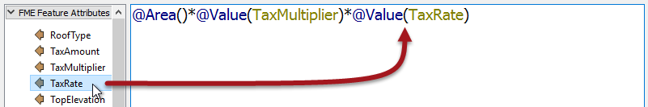

Finally, we need to round the result to two decimal places. Add the round() function to the equation. Like the multiplication sign, it can be found under the Math Functions section, but is often easier to type manually.

The function should be @round(&lt;Existing Equation&gt;,2), like this:

<pre>
@round(@Area()*@Value(TaxMultiplier)*@Value(TaxRate),2)
</pre>

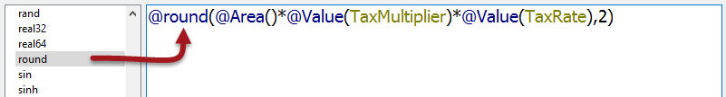

Click OK to close this dialog. Run this transformer if you wish, to ensure the results look correct.

 **4) Generate Report**
 The final task is to create a report. The latter section of workspace already contains a partially edited HTMLReportGenerator transformer and HTML writer, so our task is simply to write a footer for the report.

Connect the AttributeManager to the HTMLReportGenerator's input port. Open the parameters dialog for the HTMLReportGenerator. Under Page Contents, create a new entry for Custom HTML below the Table entry:

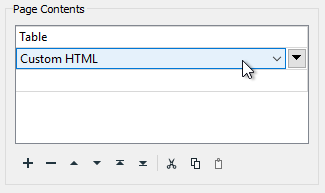

Click on the right-hand side of the dialog in the Content Settings. Click on the drop-down arrown for the Custom HTML setting and select Open Text Editor: 

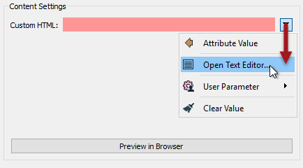

Using a combination of manual text entry, FME Feature Functions, and FME Parameters, enter the following text:

<pre>
&lt;br&gt;Property Taxation Report
&lt;br&gt;Generated: @DateTimeNow()
&lt;br&gt;By: FME Lizard
&lt;br&gt;Using: $(FME_PRODUCT_NAME) build $(FME_BUILD_NUM) on $(FME_OS)
</pre>

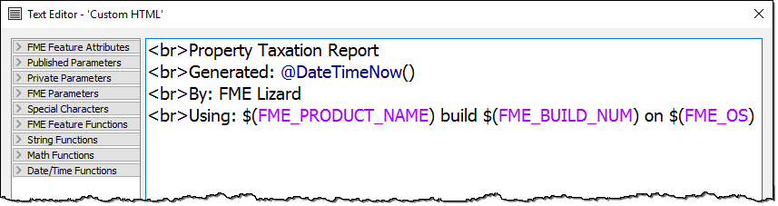

***Note:*** *&lt;br&gt; is a HTML tag that represents the HTML equivalent of a newline character.*

 **5) Run Workspace**
 Run the workspace. Open the HTML file that is created in a web browser. The report should look like this:

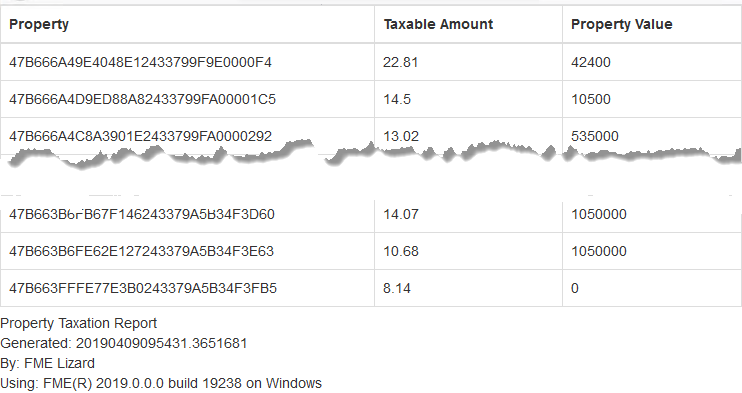

---

<!--Exercise Congratulations Section--> 

<table style="border-spacing: 0px">
<tr>
<td style="vertical-align:middle;background-color:darkorange;border: 2px solid darkorange">
<i class="fa fa-thumbs-o-up fa-lg fa-pull-left fa-fw" style="color:white;padding-right: 12px;vertical-align:text-top"></i>
CONGRATULATIONS
</td>
</tr>

<tr>
<td style="border: 1px solid darkorange">

By completing this exercise you have learned how to:
<ul><li>Construct numeric values with the arithmetic editor</li>
<li>Construct strings with the text editor</li>
<li>Generate an HTML report and write it to an output file</li></ul>

</td>
</tr>
</table>