<!--Exercise Section-->

<table style="border-spacing: 0px;border-collapse: collapse;font-family:serif">
<tr>
<td style="vertical-align:middle;background-color:darkorange;border: 2px solid darkorange">
<i class="fa fa-cogs fa-lg fa-pull-left fa-fw" style="color:white;padding-right: 12px;vertical-align:text-top"></i>
Exercise 1
</td>
<td style="border: 2px solid darkorange;background-color:darkorange;color:white">
Taxation Report Project
</td>
</tr>

<tr>
<td style="border: 1px solid darkorange; font-weight: bold">Data</td>
<td style="border: 1px solid darkorange">Building Footprints (AutoCAD DWG) Zoning Data (MapInfo TAB) Tax Report (CSV (Comma Separated Value))</td>
</tr>

<tr>
<td style="border: 1px solid darkorange; font-weight: bold">Overall Goal</td>
<td style="border: 1px solid darkorange">Create a taxation report for each building</td>
</tr>

<tr>
<td style="border: 1px solid darkorange; font-weight: bold">Demonstrates</td>
<td style="border: 1px solid darkorange">Constructing attribute values</td>
</tr>

<tr>
<td style="border: 1px solid darkorange; font-weight: bold">Start Workspace</td>
<td style="border: 1px solid darkorange">C:\FMEData2018\Workspaces\DesktopAdvanced\Attributes-Ex1-Begin.fmw</td>
</tr>

<tr>
<td style="border: 1px solid darkorange; font-weight: bold">End Workspace</td>
<td style="border: 1px solid darkorange">C:\FMEData2018\Workspaces\DesktopAdvanced\Attributes-Ex1-Complete.fmw</td>
</tr>

</table>

The annual property tax reports are due to be calculated and it is decided to use FME to carry out the processing. You must set up a workspace that calculates tax values for each building (based on size and zoning) and creates a text file containing the results.

 **1) Inspect Source Data**
 Inspect the two source datasets you will be working with. They are:

<table style="border: 0px">

<tr>
<td style="font-weight: bold">Reader Format</td>
<td style="">MapInfo TAB (MITAB)</td>
</tr>

<tr>
<td style="font-weight: bold">Reader Dataset</td>
<td style="">C:\FMEData2018\Data\Zoning\Zones.tab</td>
</tr>

</table>

<table style="border: 0px">

<tr>
<td style="font-weight: bold">Reader Format</td>
<td style="">Autodesk AutoCAD DWG/DXF</td>
</tr>

<tr>
<td style="font-weight: bold">Reader Dataset</td>
<td style="">C:\FMEData2018\Data\Parcels\BuildingFootprints.dwg</td>
</tr>

<tr>
<td style="font-weight: bold">Reader Parameters</td>
<td style="">Group Entities By: Attribute Schema</td>
</tr>

</table>

 **2) Open Workspace**
 Open the workspace C:\FMEData2018\Workspaces\DesktopAdvanced\Attributes-Ex1-Begin.fmw. This is what you have created so far in order to set up readers and writers and a couple of preparatory transformations:

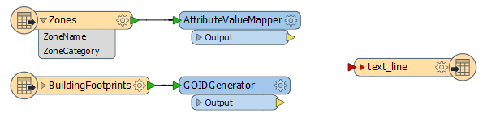

Inspect the parameters for each transformer in turn. Notice that the AttributeValueMapper is mapping from zone category to a TaxMultiplier value:

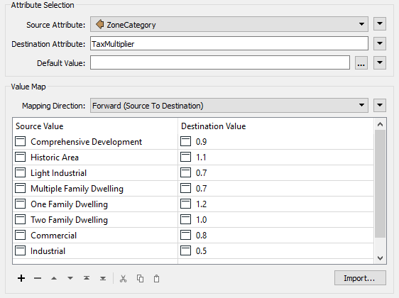 <!-- *** Update screenshot -->

The GOIDGenerator is merely creating a unique ID for each building footprint.

 **3) Add SpatialFilter**
 The first thing to do is transfer zoning information onto the building footprints. Add a SpatialFilter transformer to the workspace, with the zones as the Filter features and the buildings as the Candidates:

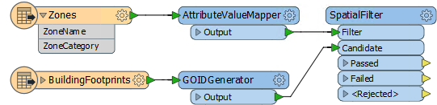

Inspect the parameters. Set (or ensure are set) the following:

<table>
<tr><td style="font-weight: bold">Filter Type</td><td>Multiple Filters</td></tr>
<tr><td style="font-weight: bold">Pass Criteria</td><td>Pass Against One Filter</td></tr>
<tr><td style="font-weight: bold">Spatial Predicates to Test</td><td>"Filter Intersects Candidate" and "Filter Contains Candidate"</td></tr>
</table>

You may want to add an Inspector and run the workspace to ensure that the building features do - as expected - emerge from the SpatialFilter:Passed output port and possess three new attributes (ZoneName, ZoneCategory, and TaxMultiplier).

 **4) Add AttributeManager**
 Add an AttributeManager connected to the SpatialFilter:Passed output port and inspect its parameters.

The first task is to create a numeric value for the taxation amount. To add a new attribute called TaxAmount, click the drop-down arrow to the right and choose the option for Open Arithmetic Editor:

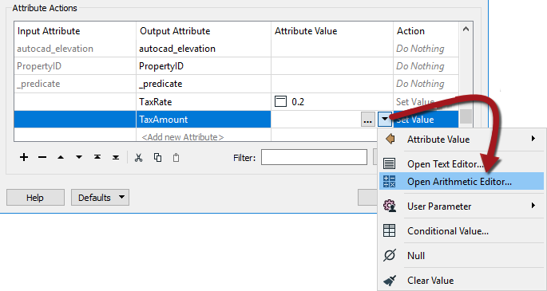 <!--  ***Update screenshot-->

 **5) Calculate Tax Amount**
 The calculation for the tax amount is:

<pre>
Building Footprint x Tax Multiplier x Tax Rate = Tax Amount
</pre>

...where Building Footprint is the area in square meters, Tax Multiplier is the value relating to the Zone Type, and Tax Rate is a value that changes each year and so should be provided by the user.

The result should also be rounded off to two decimal places.

So... start out by locating Area under FME Feature Functions and double-clicking it to add the area of the building footprint to the equation:

Next add a multiplication symbol, and locate the TaxMultiplier attribute and double-click it to add it to the equation:

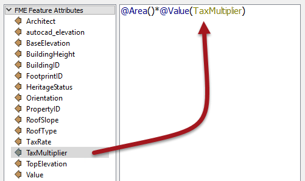 <!-- *** Update Screenshot -->

Add another multiplication symbol. Now we need a user parameter to accept input from the user. We haven't defined it yet, but we can still do that inside the editor dialog.

Locate the published parameters section and click on &lt;Create Published Parameter&gt;

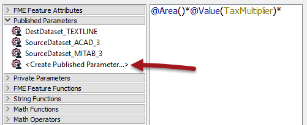

When prompted create a new parameter called TaxRate of type Number. The configuration should specify 1 decimal place of precision (i.e. not an integer). Enter a default value of 0.2 and ensure the Optional checkbox is **not** checked:

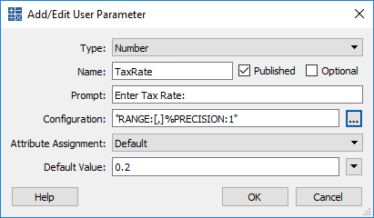

Click OK and the parameter is added to the calculation:

Now we just need to round the result to two decimal places. Unfortunately, the round function in this editor rounds only to an integer, so we must multiply the result by 100 first, then divide by 100 after.

So, add a multiplication symbol and the fixed value 100:

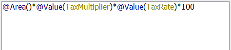

Now enclose all of the current statement inside a round function:

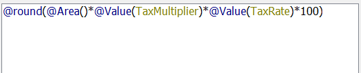

Finally, add a division symbol and divide the whole statement by 100:

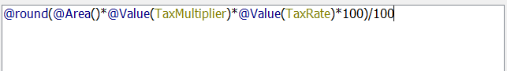

Click OK to close this dialog, but keep the AttributeManager parameters on display...

 **6) Create Tax Report String**
 The final task is to create a string of text that we can write to a report file. In this case the end-users of the information wish to receive a plain text file in the following structure:

<pre>
Property: &lt;PropertyID&gt;
Tax Value: &lt;TaxValue&gt;
&lt;Current Date and Time&gt;
</pre>

So, inside the AttributeManager create a new attribute called *text&#95;line&#95;data* - this will match the output schema. Then click the drop-down arrow and open the text editor dialog.

Enter fixed values and add the attributes in the appropriate places to get the correct output:

Then use the DateTimeNow() function to create a date/time stamp:

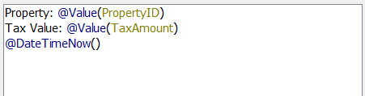

To get carriage returns in the output we need to specifically add those characters to the editor. To see such characters, select Options &gt; Show Spaces/Tabs

Then locate Carriage Return (\r) in the Special Characters menu and add one for each line:

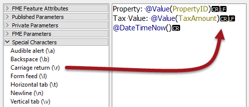

Now click OK to close the dialog and then accept the changes to the AttributeManager.

 **7) Connect Schema, Run Workspace**
 Connect the AttributeManager:Output port to the Text File writer feature type:

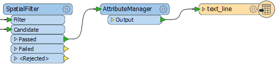

Save and then run the workspace. The result should be a text file that looks like this:

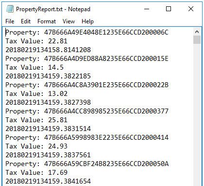 <!-- **** Update Screenshot --> 

---

<!--Exercise Congratulations Section--> 

<table style="border-spacing: 0px">
<tr>
<td style="vertical-align:middle;background-color:darkorange;border: 2px solid darkorange">
<i class="fa fa-thumbs-o-up fa-lg fa-pull-left fa-fw" style="color:white;padding-right: 12px;vertical-align:text-top"></i>
CONGRATULATIONS
</td>
</tr>

<tr>
<td style="border: 1px solid darkorange">

By completing this exercise you have learned how to:
<ul><li>Construct numeric values with the arithmetic editor</li>
<li>Construct strings with the text editor</li>
<li>Write data to a plain text file</li></ul>

</td>
</tr>
</table>