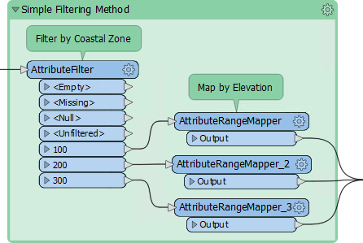
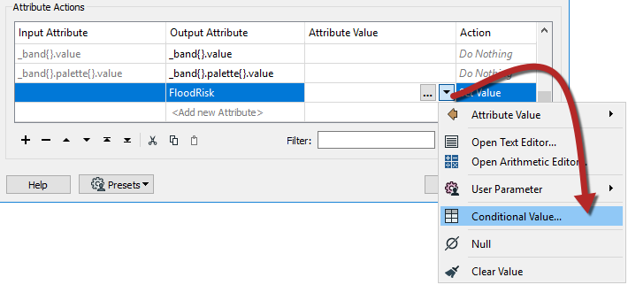
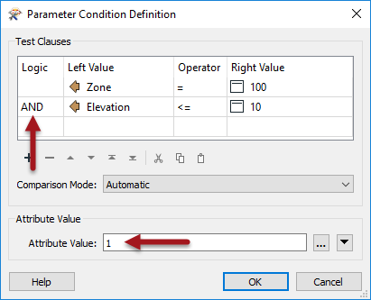
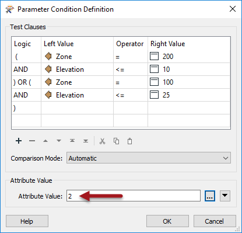
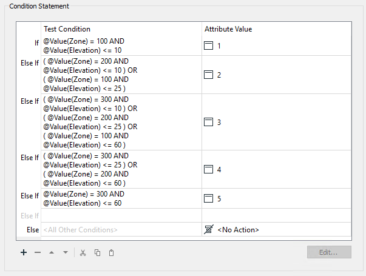
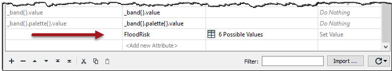
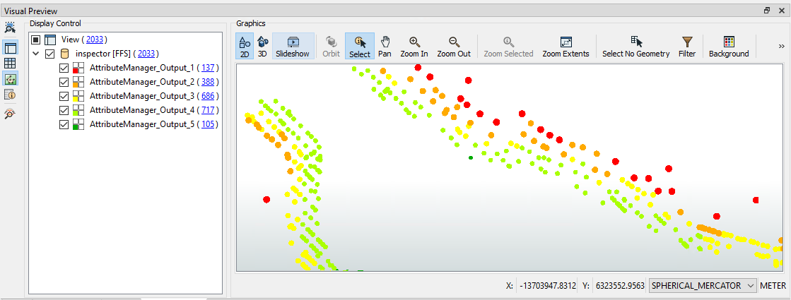

<!--Exercise Section-->

<table style="border-spacing: 0px;border-collapse: collapse;font-family:serif">
<tr>
<td style="vertical-align:middle;background-color:darkorange;border: 2px solid darkorange">
<i class="fa fa-cogs fa-lg fa-pull-left fa-fw" style="color:white;padding-right: 12px;vertical-align:text-top"></i>
Exercise 2
</td>
<td style="border: 2px solid darkorange;background-color:darkorange;color:white">
Flood Risk Project
</td>
</tr>

<tr>
<td style="border: 1px solid darkorange; font-weight: bold">Data</td>
<td style="border: 1px solid darkorange">Parks (MapInfo TAB)</td>
</tr>

<tr>
<td style="border: 1px solid darkorange; font-weight: bold">Overall Goal</td>
<td style="border: 1px solid darkorange">Assess flood risk for addresses based on elevation and distance from shore</td>
</tr>

<tr>
<td style="border: 1px solid darkorange; font-weight: bold">Demonstrates</td>
<td style="border: 1px solid darkorange">Conditional attribute values</td>
</tr>

<tr>
<td style="border: 1px solid darkorange; font-weight: bold">Start Workspace</td>
<td style="border: 1px solid darkorange">C:\FMEData2019\Workspaces\DesktopAdvanced\Attributes-Ex2-Begin.fmw</td>
</tr>

<tr>
<td style="border: 1px solid darkorange; font-weight: bold">End Workspace</td>
<td style="border: 1px solid darkorange">C:\FMEData2019\Workspaces\DesktopAdvanced\Attributes-Ex2-Complete.fmw</td>
</tr>

</table>

A colleague is working on a workspace to calculate the tsunami flood risk for all addresses in the city. The risk is adjudged to be a combination of closeness to the shoreline and elevation above sea level. It is on a scale from one to five (1-5) and is calculated using this table:

<table>
<tr><td></td><td></td><td colspan="3">Elevation (meters above sea level)</td></tr>
<tr><td></td><td></td><td align="center">0-10m</td><td align="center">10-25m</td><td align="center">25-60m</td></tr>
<tr><td rowspan="3">Distance from Shoreline (meters)</td><td align="center">100m</td><td align="center">1</td><td align="center">2</td><td align="center">3</td></tr>
<tr><td align="center">200m</td><td align="center">2</td><td align="center">3</td><td align="center">4</td></tr>
<tr><td align="center">300m</td><td align="center">3</td><td align="center">4</td><td align="center">5</td></tr>
</table>

Your colleague has created the workspace up until the point at which each address has an elevation and distance from the shoreline. Now the calculations need to start, and he has asked for your assistance in finishing the project.

 **1) Start Workbench**
 Open the workspace C:\FMEData2019\Workspaces\DesktopAdvanced\Attributes-Ex2-Begin.fmw. This is the workspace as your colleague has created it so far.

Turn on feature caching and run the workspace. Inspect the results at various parts to find what sort of data we are dealing with.

This colored screenshot shows how the addresses fall within (and are assigned) a zone denoting their distance from the shoreline. They also possess an elevation value. We must now use this information to assign a flood risk to each address.

---

<!--Person X Says Section-->

<table style="border-spacing: 0px">
<tr>
<td style="vertical-align:middle;background-color:darkorange;border: 2px solid darkorange">
<i class="fa fa-quote-left fa-lg fa-pull-left fa-fw" style="color:white;padding-right: 12px;vertical-align:text-top"></i>
FME Lizard says...
</td>
</tr>

<tr>
<td style="border: 1px solid darkorange">

As with most FME projects, there are multiple ways to carry out this task. The two basic techniques are <strong>conditional filtering</strong> and <strong>data mapping</strong>.

  Conditional filtering means we would separate the data according to the elevation and shoreline zone. 
 Data mapping means we set an attribute value (flood risk) according to the value of other attributes. 

  Here is an example of how we might mix filtering data by coastal zone with mapping data by elevation:
  

  However, we can avoid filtering data by using Conditional Values. The filter conditions are incorporated as the conditions for our Conditional Values. 

</td>
</tr>
</table>

---

 **2) Place AttributeManager**
 Place an AttributeManager transformer and connect it to the AttributeRenamer.

Inspect the AttributeManager parameters. Ignoring all of the existing attributes, scroll to the bottom of the dialog and in the &lt;Add New Attribute&gt; field enter FloodRisk.

In the Attribute Value field click the drop-down arrow and choose Conditional Value:

 

This opens a new dialog very similar to a Tester/TestFilter transformer. There are fields for Test Condition and Output Value. Double-click the first Test Condition field and a Tester-like dialog will open:

Let's set this up to map the conditions for where FloodRisk=1 (the highest). According to the table of calculations, this can occur only when Zone=100 and Elevation <= 10. So, set up the conditions to test for Zone = 100 AND Elevation <= 10. Notice that the logic (AND) is set in the left-hand side Logic column.

Enter 1 into the Attribute Value parameter at the foot of the dialog:

Now click OK to close this part of the dialog.

The main Conditional Definition dialog now looks like this:

 **3) Set Second AttributeManager Condition**
 Now double-click the next Test Condition (Else If) to set up the condition for FloodRisk=2

According to the table, there are two conditions for FloodRisk=2. They are when:

- Zone = 200 AND Elevation <= 10
- Zone = 100 AND Elevation <= 25

So, enter four clauses (one each for Zone=100, Zone=200, Elevation<=10, Elevation<=25) in the correct order, with the logic columns to match. Enter 2 into the Attribute Value parameter:

The order of the clauses is important, compared to the logic. The location of the brackets in the log column is also important to get right.

Click OK to close this dialog. The main Conditional Definition dialog now looks like this:

 **4) Set Remaining TestFilter Conditions**
 Now repeat the above steps for each of the other flood risk values. There will be five conditions in all (one for each flood risk). 

It may seem complicated, but it should be easy to get into a routine. Additionally, make use of the Copy and Paste buttons or keyboard shortcuts in these dialogs to speed up the process.

The final dialog will look like this:

It is essential to keep these in the correct order; otherwise, a feature may pass the tests in the wrong order and receive a lesser risk than expected.

Accept the changes and the main AttributeManager dialog now looks like this:

 **5) Add Inspector**
 Inspecting cached data doesn't allow you to separate that data out for easier inspection, unless you use an Inspector transformer. So place a single Inspector transformer and connect the AttributeManager output to it.

Open the Inspector parameters dialog and under Group-By select the newly created attribute called FloodRisk.

Save and run the workspace. You should see each address colored to match its flood risk. You can adjust the feature symbology to produce a clearer result, like so:

You can also turn off each zone, in turn, to see which addresses are most/least at risk.

---

<!--Exercise Congratulations Section--> 

<table style="border-spacing: 0px">
<tr>
<td style="vertical-align:middle;background-color:darkorange;border: 2px solid darkorange">
<i class="fa fa-thumbs-o-up fa-lg fa-pull-left fa-fw" style="color:white;padding-right: 12px;vertical-align:text-top"></i>
CONGRATULATIONS
</td>
</tr>

<tr>
<td style="border: 1px solid darkorange">

By completing this exercise you have learned how to:
<ul><li>Use Conditional Attributes to map data according to a set of complex conditions</li></ul>

</td>
</tr>
</table>

---

<!--Tip Section--> 

<table style="border-spacing: 0px">
<tr>
<td style="vertical-align:middle;background-color:darkorange;border: 2px solid darkorange">
<i class="fa fa-info-circle fa-lg fa-pull-left fa-fw" style="color:white;padding-right: 12px;vertical-align:text-top"></i>
TIP
</td>
</tr>

<tr>
<td style="border: 1px solid darkorange">

Best Practice should always play a part in any workspace. In this case there are fewer transformers, but does this make the workspace better? Is it a more aesthetic (good-looking) workspace? The decision on which method to use may depend on who will maintain the workspace.

</td>
</tr>
</table>
