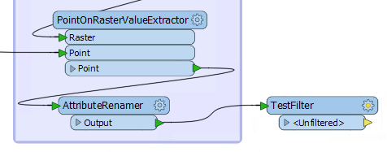
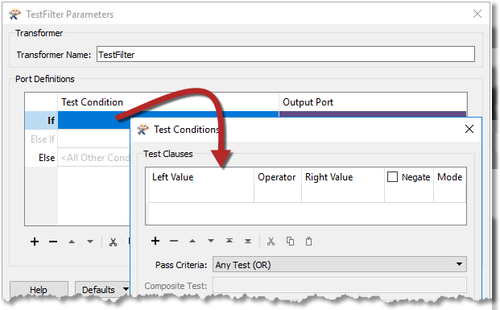
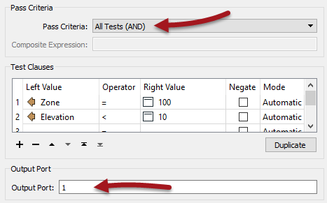
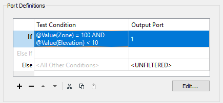
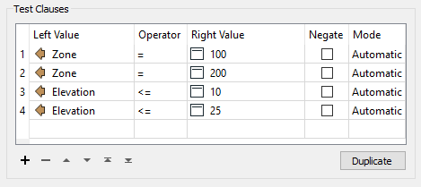
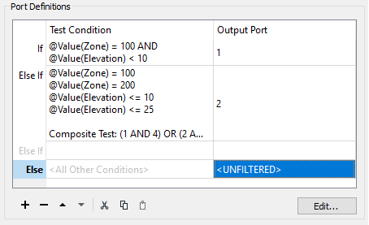
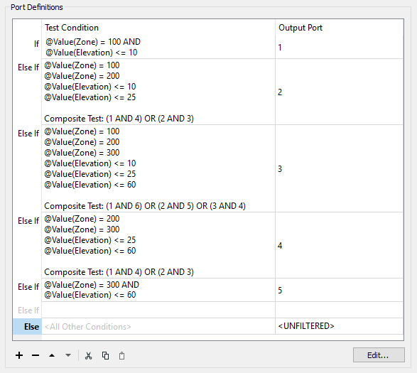

<!--Exercise Section-->

<table style="border-spacing: 0px;border-collapse: collapse;font-family:serif">
<tr>
<td style="vertical-align:middle;background-color:darkorange;border: 2px solid darkorange">
<i class="fa fa-cogs fa-lg fa-pull-left fa-fw" style="color:white;padding-right: 12px;vertical-align:text-top"></i>
Exercise 2b
</td>
<td style="border: 2px solid darkorange;background-color:darkorange;color:white">
Flood Risk Project: Complex Filtering Method
</td>
</tr>

<tr>
<td style="border: 1px solid darkorange; font-weight: bold">Start Workspace</td>
<td style="border: 1px solid darkorange">C:\FMEData2018\Workspaces\DesktopAdvanced\Attributes-Ex2-Begin.fmw</td>
</tr>

<tr>
<td style="border: 1px solid darkorange; font-weight: bold">End Workspace</td>
<td style="border: 1px solid darkorange">C:\FMEData2018\Workspaces\DesktopAdvanced\Attributes-Ex2b-Complete.fmw</td>
</tr>

</table>

This slightly more complex method is also is a filtering process, but the filtering is all done in a single step - for both zones and elevation - with a TestFilter.

 **1) Place TestFilter**
 Place a TestFilter connected to the AttributeRenamer:

What we want to get here is a separate output port for each flood risk value. So we’ll need to incorporate all of the tests into this one transformer.

 **2) Set First TestFilter Condition**
 Inspect the parameters either in the parameters dialog or Parameter Editor window. See that there are fields for Test Condition and Output Port. Double-click the first Test Condition field and a Tester-like dialog will open:

 

This can be the test for FloodRisk=1 (the highest). According to the table of calculations, this can occur only when Zone=100 and Elevation <= 10. So, set up the conditions to test for Zone = 100 AND Elevation <= 10. The important part here is to set up the test as an AND (i.e. both clauses must be true).

Enter 1 into the Output Port parameter at the foot of the dialog:

 

Now click OK to close this part of the dialog.

The main TestFilter dialog now looks like this:

 

 **3) Set Second TestFilter Condition**
 Now double-click the next Test Condition (Else If) to set up the condition for FloodRisk=2

According to the table, there are two conditions for FloodRisk=2. They are when:

- Zone = 200 AND Elevation <= 10
- Zone = 100 AND Elevation <= 25

So, enter four clauses; one each for Zone=100, Zone=200, Elevation<=10, Elevation<=25. You can use the Copy and Paste buttons or the keyboard shortcuts in this dialog to help speed up the process. 

 

Then change the test type to Composite. In the Composite Expression field, enter:

- (1 AND 4) OR (2 AND 3)

Of course, the composite expression field depends on the order in which you entered the clauses. If you entered them in a different order, then you will need to adjust this field.

Enter 2 into the Output Port parameter and click OK to close this dialog. The main TestFilter dialog now looks like this:

 

 **4) Set Remaining TestFilter Conditions**
 Now repeat the above steps for each of the other flood risk values. There will be five conditions in all (one for each flood risk). 

It may seem complicated, but it should be easy to get into a routine. Additionally, make use of the Copy and Paste buttons in these dialogs to speed up the process.

The final dialog will look like this:

  

The final test will be similar to the very first, with only two conditions so that it will be an AND rather than a Composite test.

It is essential to keep these in the correct order; otherwise, a feature may pass the tests in the wrong order and receive a lesser risk than expected. You can change the order by highlighting a line and then clicking on the arrow buttons to move the condition up or down. 

Apply the changes to the parameters.

 **5) Add AttributeCreator**
 So far we've filtered the data, but not set an attribute with the result. 

To do so, add an AttributeCreator (or AttributeManager) connected to each TestFilter output port. Use the AttributeCreator to create the correct FloodRisk attribute (and value) for each output port (i.e. Port 1: FloodRisk = 1):

It’s easiest to place one AttributeCreator and duplicate it for each port, editing the FloodRisk value each time.

 **6) Inspect Results**
 Run the workspace, using your preferred method of data inspection. For inspecting cached data, you can simply select all of the AttributeCreator transformers and inspect them all.

For Inspector transformers, place a single Inspector transformer and connect each AttributeCreator/Manager output to it. Open the Inspector parameters dialog and under Group-By select the newly created attribute called FloodRisk.

---

<!--Tip Section--> 

<table style="border-spacing: 0px">
<tr>
<td style="vertical-align:middle;background-color:darkorange;border: 2px solid darkorange">
<i class="fa fa-info-circle fa-lg fa-pull-left fa-fw" style="color:white;padding-right: 12px;vertical-align:text-top"></i>
TIP
</td>
</tr>

<tr>
<td style="border: 1px solid darkorange">

The quickest way to place a new Inspector transformer in this scenario is to select all of the AttributeCreator/Manager transformers and then add an Inspector using Quick Add. This will automatically connect all three transformers. You'll still need to manually set the group-by setting on the Inspector.

</td>
</tr>
</table>

---

The workspace will now look like this:

 **7) Save and Run Workspace**
 Save your workspace as a new file to preserve the starting workspace and then run it. You should see each address colored to match its flood risk. You can also turn off each zone, in turn, to see which addresses are most/least at risk.

---

<!--Exercise Congratulations Section--> 

<table style="border-spacing: 0px">
<tr>
<td style="vertical-align:middle;background-color:darkorange;border: 2px solid darkorange">
<i class="fa fa-thumbs-o-up fa-lg fa-pull-left fa-fw" style="color:white;padding-right: 12px;vertical-align:text-top"></i>
CONGRATULATIONS
</td>
</tr>

<tr>
<td style="border: 1px solid darkorange">

By completing this exercise you have learned how to:
<ul><li>Filter data with a complex test in order to subdivide it for attribute mapping</li></ul>

</td>
</tr>
</table>