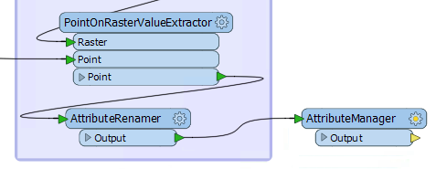
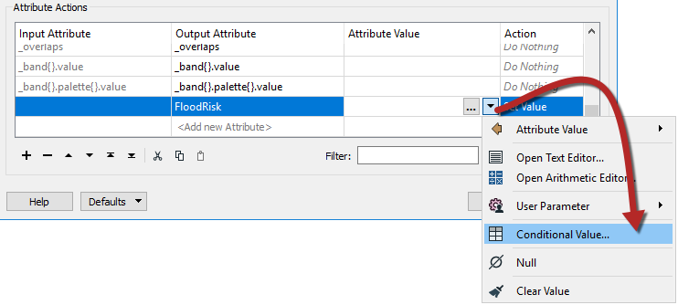
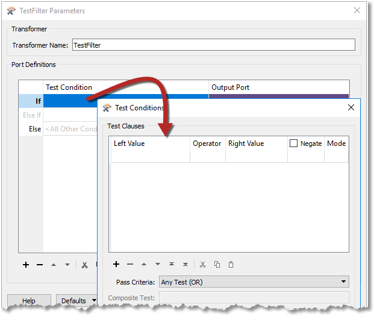
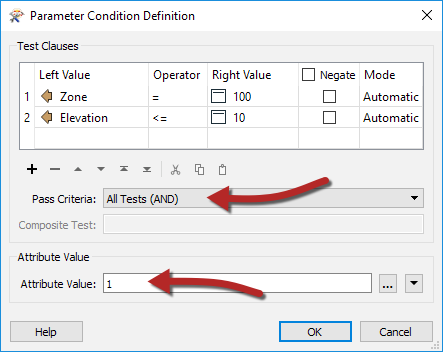
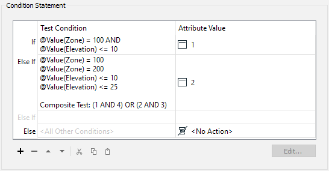
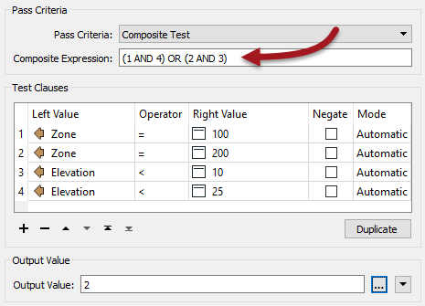
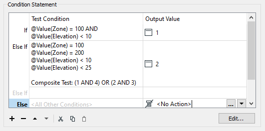
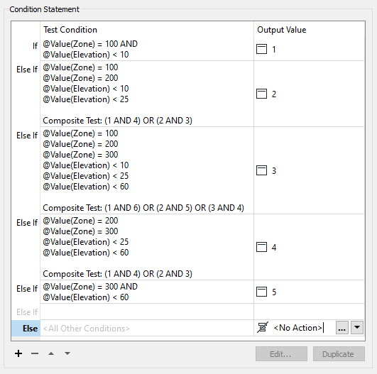
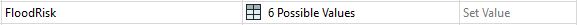

<!--Exercise Section-->

<table style="border-spacing: 0px;border-collapse: collapse;font-family:serif">
<tr>
<td style="vertical-align:middle;background-color:darkorange;border: 2px solid darkorange">
<i class="fa fa-cogs fa-lg fa-pull-left fa-fw" style="color:white;padding-right: 12px;vertical-align:text-top"></i>
Exercise 2c
</td>
<td style="border: 2px solid darkorange;background-color:darkorange;color:white">
Flood Risk Project: Conditional Values Method
</td>
</tr>

<tr>
<td style="border: 1px solid darkorange; font-weight: bold">Start Workspace</td>
<td style="border: 1px solid darkorange">C:\FMEData2018\Workspaces\DesktopAdvanced\Attributes-Ex2-Begin.fmw</td>
</tr>

<tr>
<td style="border: 1px solid darkorange; font-weight: bold">End Workspace</td>
<td style="border: 1px solid darkorange">C:\FMEData2018\Workspaces\DesktopAdvanced\Attributes-Ex2c-Complete.fmw</td>
</tr>

</table>

This is a one-step process involving an AttributeManager transformer.

 **1) Place AttributeManager**
 Place an AttributeManager transformer and connect it to the AttributeRenamer:

 **2) Set First AttributeManager Condition**
 Inspect the parameters either in the parameters dialog or the Parameter Editor window. Ignoring all of the existing attributes, scroll to the bottom of the dialog and in the &lt;Add New Attribute&gt; field enter FloodRisk.

In the Attribute Value field click the drop-down arrow and choose Conditional Value:

 

This opens a new dialog very similar to a Tester/TestFilter transformer. There are fields for Test Condition and Output Value. Double-click the first Test Condition field and a Tester-like dialog will open:

This can be the test for FloodRisk=1 (the highest). According to the table of calculations, this can occur only when Zone=100 and Elevation <= 10. So, set up the conditions to test for Zone = 100 AND Elevation <= 10. The important part here is to set up the test as an AND (i.e. both clauses) must be true.

Enter 1 into the Attribute Value parameter at the foot of the dialog:

Now click OK to close this part of the dialog.

The main Conditional Definition dialog now looks like this:

 **3) Set Second AttributeManager Condition**
 Now double-click the next Test Condition (Else If) to set up the condition for FloodRisk=2

According to the table, there are two conditions for FloodRisk=2. They are when:

- Zone = 200 AND Elevation <= 10
- Zone = 100 AND Elevation <= 25

So, enter four clauses; one each for Zone=100, Zone=200, Elevation<=10, Elevation<=25.

Also, change the test type to Composite. In the Composite Expression field, enter:

- (1 AND 4) OR (2 AND 3)

Of course, the composite expression field will depend on the order you entered the clauses in. If you entered them in a different order, then you will need to adjust this field.

Enter 2 into the Attribute Value parameter and click OK to close this dialog. The main Conditional Definition dialog now looks like this:

 **4) Set Remaining TestFilter Conditions**
 Now repeat the above steps for each of the other flood risk values. There will be five conditions in all (one for each flood risk). 

It may seem complicated, but it should be easy to get into a routine. Additionally, make use of the Copy and Paste buttons or keyboard shortcuts in these dialogs to speed up the process.

The final dialog will look like this:

It is very important to keep these in the correct order; otherwise, a feature may pass the tests in the wrong order and be given a lesser risk than expected.

Accept the changes and the main AttributeManager dialog now looks like this:

 **5) Add Inspector**
 Place a single Inspector transformer connected to the AttributeManager.
Open the Inspector parameters dialog and under Group-By select the newly created attribute called FloodRisk.

 **6) Save and Run Workspace**
 Save and run the workspace. You should see each address colored to match its flood risk. You can also turn off each zone, in turn, to see which addresses are most/least at risk.

---

<!--Exercise Congratulations Section--> 

<table style="border-spacing: 0px">
<tr>
<td style="vertical-align:middle;background-color:darkorange;border: 2px solid darkorange">
<i class="fa fa-thumbs-o-up fa-lg fa-pull-left fa-fw" style="color:white;padding-right: 12px;vertical-align:text-top"></i>
CONGRATULATIONS
</td>
</tr>

<tr>
<td style="border: 1px solid darkorange">

By completing this exercise you have learned how to:
<ul><li>Use Conditional Attributes to map data according to a set of complex conditions</li></ul>

</td>
</tr>
</table>