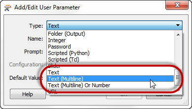
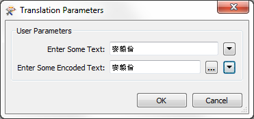
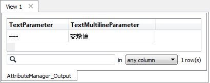
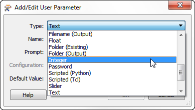
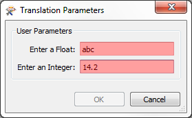
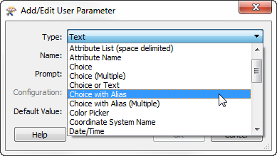
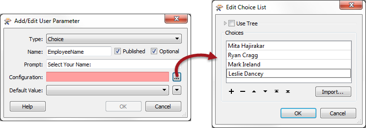
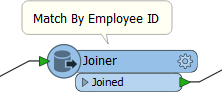
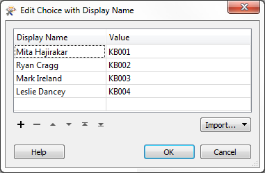

## Types of User Parameters ##

There are many different types of user parameters and many different ways to make use of them. The most common parameter types can be grouped as:

- Text Parameters
- Numeric Parameters
- Choice Parameters

---

### Text Parameters ###

Text parameters are a simple way to accept plain text values into a workspace. A Text parameter allows a single line of text, while Text (Multiline) parameters allow the user to enter text broken over a number of lines.

There is no limitation on the characters that can be entered. However, if you want the user to enter encoded characters, then you must use type Text (Multiline), like so:

That way FME will retain and use the actual value, here shown in the Data Inspector:

<table style="border-spacing: 0px">
<tr>
<td style="vertical-align:middle;background-color:darkorange;border: 2px solid darkorange">
<i class="fa fa-quote-left fa-lg fa-pull-left fa-fw" style="color:white;padding-right: 12px;vertical-align:text-top"></i>
Ms. Analyst says…
</td>
</tr>

<tr>
<td style="border: 1px solid darkorange">

It's worth being aware that not every transformer and format in FME will handle encoded text. If you are unsure, then it’s safer to use a Text parameter – that everything will support – rather than a Text (Multiline) parameter that is not universally supported. Encoded text will not be handled, but the translation should not cause an error.

</td>
</tr>
</table>

---

### Numeric Parameters ###

There are two types of numeric parameters: Float and Integer. As their names suggest, these are simply ways for a user to enter a floating point number or an integer number.

These parameters are good examples of how FME will parse the input to ensure it matches the parameter type:

This image shows how non-numeric characters in either type, or a decimal point in the integer type, will be detected and rejected with a red-colored field.

---

<!--Person X Says Section-->

<table style="border-spacing: 0px">
<tr>
<td style="vertical-align:middle;background-color:darkorange;border: 2px solid darkorange">
<i class="fa fa-quote-left fa-lg fa-pull-left fa-fw" style="color:white;padding-right: 12px;vertical-align:text-top"></i>
Sister Intuitive says...
</td>
</tr>

<tr>
<td style="border: 1px solid darkorange">

The Slider is another numeric parameter type but - instead of manually entering a number - the user gets the pick the value from a sliding scale widget.

</td>
</tr>
</table>

---

### Choice Parameters ###

A choice parameter is when the user is presented with a fixed list of options and selects one of them. Different choice type parameters allow the user to pick from a list, pick multiple entries from a list, or type in text as an alternative to a list:

Here is a similar example to before. The user is being asked to enter their name. However, the names of all users are already known – presumably this is for a particular company’s staff – so a list of them is created:

That way, the user is prompted to select their name from a list. They don’t have to type it in manually.

A Choice with Alias parameter is the same as a Choice parameter in that the end-user gets to pick a value from a list. However, a lookup table maps the chosen entry to a value that gets provided to FME.

For example, this workspace takes incoming features and matches them to a database using an EmployeeID.

EmployeeID is provided by the end-user, but they can’t always remember their own ID number. So, the author creates a Choice with Alias user parameter.

The parameter is configured like so:

Notice that there are two fields in this configuration dialog; the display name and the actual value.

When a user selects their name from the list, then the value provided to the workspace is actually their employee ID. That way employee ID can be used as a match in the Joiner, without the end-user having to remember it!

---

<table style="border-spacing: 0px">
<tr>
<td style="vertical-align:middle;background-color:darkorange;border: 2px solid darkorange">
<i class="fa fa-quote-left fa-lg fa-pull-left fa-fw" style="color:white;padding-right: 12px;vertical-align:text-top"></i>
Mr Statistics-Calculator says…
</td>
</tr>

<tr>
<td style="border: 1px solid darkorange">

Choice (Multiple) and Choice with Alias (Multiple) are very similar parameters (to Choice and Choice-with-Alias), but let the enduser select multiple values. For example, if a manager wanted to run reports on several employees, this is what they could use. Multiple values are returned space-delimited.

</td>
</tr>
</table>
