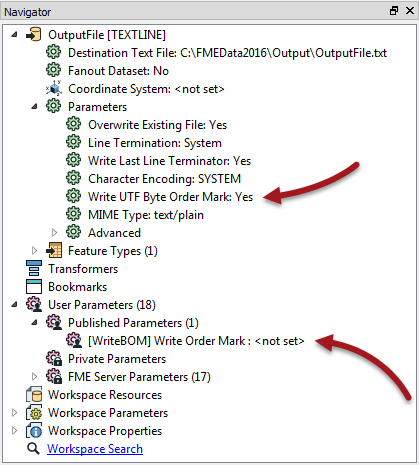
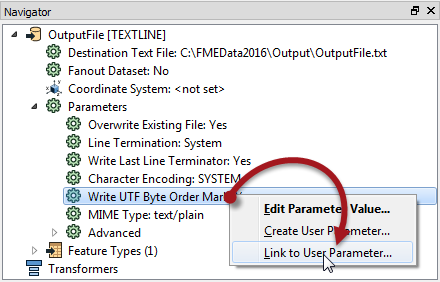
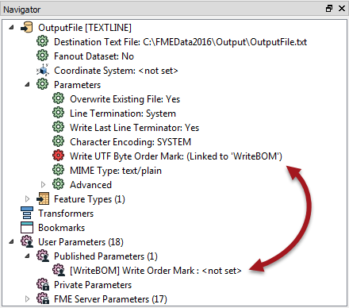
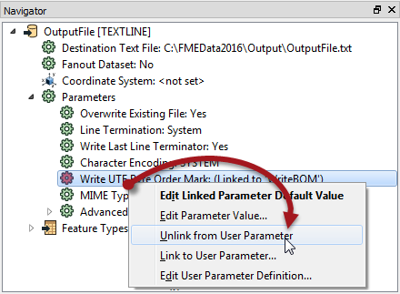
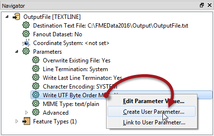
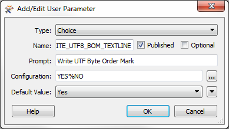
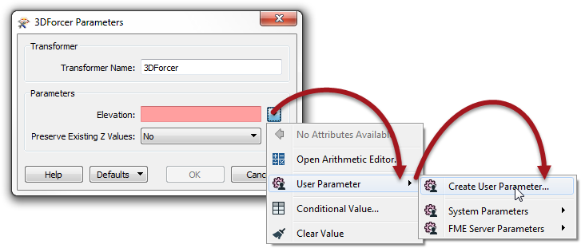

## Linking Parameters ##

As we know, there are FME parameters that control FME directly, and user parameters that allow input from a user.

Sometimes a workspace author needs the user's input to apply directly to an FME parameter, and this is done by linking the user parameter to the FME parameter.

For example, an FME author has a workspace that writes to a textfile. There is a textfile parameter to "Write UTF Byte Order Mark". The author wishes for the end-user to control whether that marker is created, but doesn't want them to have to search for that parameter.

So, besides the FME parameter, they create a user parameters:

Their user parameter has Yes and No choices, but as yet it does not do anything. It must be linked to the FME parameter.

The author does this by right-clicking the FME parameter and choosing Link to User Parameter:

Then they select their user parameter to link to. Alternatively they can do the reverse; right-click the User parameter and choose Apply To [FME Parameter].

Now the FME parameter is linked to the User Parameter, so whatever the user chooses will be applied directly to the Write UTF Byte Order Mark parameter:

If the author changes their mind, there is always an option to unlink the user parameter and return to direct author control:

---

### Creating Direct Links ###

In the previous example, a user parameter was created separately and then linked to the FME parameter. However, there is a shortcut to this, where it is possible to both create and link a parameter simultaneously.

In the Navigator window, simply right-click an existing FME parameter and choose the option to "Create User Parameter".

This opens a dialog and automatically fills in a definition to create a new user parameter.

Click OK and the user parameter is created and automatically linked to the FME parameter.

---

<!--Person X Says Section-->

<table style="border-spacing: 0px">
<tr>
<td style="vertical-align:middle;background-color:darkorange;border: 2px solid darkorange">
<i class="fa fa-quote-left fa-lg fa-pull-left fa-fw" style="color:white;padding-right: 12px;vertical-align:text-top"></i>
Dr. Workbench says...
</td>
</tr>

<tr>
<td style="border: 1px solid darkorange">

You can do the same one-step action inside a transformer dialog too, like so:
  
  Here the workspace author is creating a user parameter linked to the Elevation FME parameter in a 3DForcer transformer. 

</td>
</tr>
</table>

---

### Advantages and Disadvantages of Direct Links ###

You might be wondering why you would ever link a user parameter separately, or why we showed that process first. It's because there are advantages and disadvantages to both methods.

#### Advantages ####
Creating a linked FME parameter directly has the obvious advantage that it is a single-step process. The creation and linking of the user parameter is done in a single action.

Additionally, a user parameter created from an FME parameter automatically gets the correct data type.

For example, if the 3DForcer parameter requires a floating point number, any user parameter created from it will automatically be of type float, and can't be changed.

#### Disadvantages ####
The automatic setting of data type can, however, be a limitation too. Say, for example, the author wanted to provide a list of permitted elevations; 0.0, 10.0, 50.0, etc. A float parameter does not allow that. They would have to create a choice user parameter separately and then link it to the FME parameter as discussed.

Of course, the author needs to take care that the values provided by his user parameter were of a type that matched those expected by the FME parameter. FME isn't able to parse the input from a user parameter to ensure it matches the FME parameter it is linked to. 

The other disadvantage is one of persistence of the user parameter. 

It's like this: if a user parameter is created directly from an FME parameter on a transformer, then it is forever tied to that transformer. If the transformer is deleted, then the FME parameter will be deleted too.

However, if a user parameter is created separately, and linked manually to a transformer’s FME parameter, then it will remain in the workspace, even if the transformer is deleted.

This could be seen as either an advantage or disadvantage, depending on whether you would like this behavior or not!