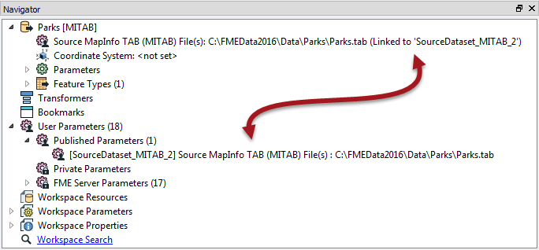

### Pre-linked Parameters ###

In some scenarios, user parameters are automatically created and linked to an FME parameter, without any sort of manual action by the workspace author.

For example, any time a Reader or Writer is added to a workspace, their source/destination dataset parameters are automatically turned into user parameters.

Here, a Source MapInfo TAB parameter is automatically linked to a user parameter called SourceDataset_MITAB:

This automatically occurs for parameters that are important to the end-user and that appear in nearly all workspaces.

---

<!--Person X Says Section-->

<table style="border-spacing: 0px">
<tr>
<td style="vertical-align:middle;background-color:darkorange;border: 2px solid darkorange">
<i class="fa fa-quote-left fa-lg fa-pull-left fa-fw" style="color:white;padding-right: 12px;vertical-align:text-top"></i>
Miss Vector says...
</td>
</tr>

<tr>
<td style="border: 1px solid darkorange">

If you – as the workspace author – don’t want or require the end-user to have access to pre-linked parameters, then what can you do?
  1. Delete the Reader/Writer
 2. Unlink the user parameter
 3. Delete the FME parameter
 4. Delete the user parameter

</td>
</tr>
</table>

