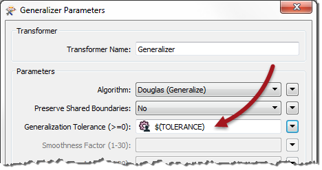
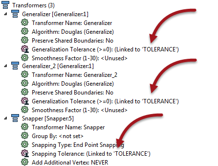
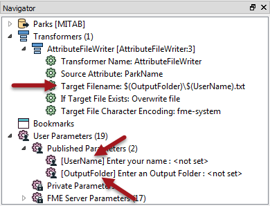

## Shared and Embedded Parameters ##

Shared and Embedded parameters are not specific types of parameters, instead they refer to two different ways in which parameters might be used.

### Shared Parameters ###
There is no limit on the number of times a user parameter can be used or linked to an FME parameter. The value obtained from a user parameter can be used as many times as is required.

When a parameter is used in two or more places it can be described as a *shared parameter*.

For example, a workspace has a user parameter called TOLERANCE (here being used inside a Generalizer):

 However, the workspace author has decides to apply the same parameter in three places in total; two Generalizers and a Snapper:

The advantage is that the same value can be used without the user having to enter it multiple times.

---

### Embedded Parameters ###
Sometimes in FME, string values need to be constructed from multiple components. When a string is constructed in such a way as to use multiple user parameters, we call it *Embedding Parameters*.  

For example, here a file being written is constructed from two user parameters: one is a fixed output path and the other is a user's name:

Basically a user parameter is created to accept the user's name (UserName) and a second parameter (OutputFolder) accepts a folder to write output. The FME parameter on an AttributeFileWriter transformer constructs a single value from these two user parameters. 

Similarly, the value from one user parameter can be embedded inside the definition of another! You might call this scenario *nested user parameters*. 

---

<!--Person X Says Section-->

<table style="border-spacing: 0px">
<tr>
<td style="vertical-align:middle;background-color:darkorange;border: 2px solid darkorange">
<i class="fa fa-quote-left fa-lg fa-pull-left fa-fw" style="color:white;padding-right: 12px;vertical-align:text-top"></i>
Dr. Workbench says...
</td>
</tr>

<tr>
<td style="border: 1px solid darkorange">

For another example of embedded/nested user parameters, see the next section on Private Parameters

</td>
</tr>
</table>

---