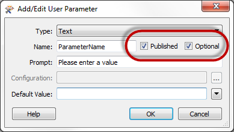
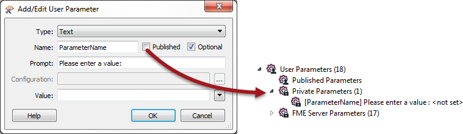
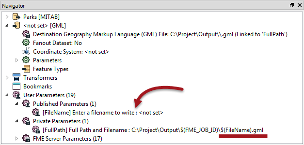
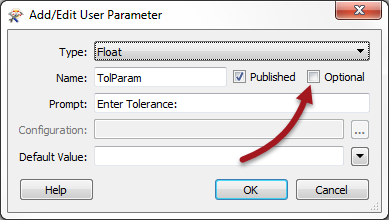

## Parameter Settings ##

When a user parameter is created two checkbox options exist; one is labelled Published and the other Optional.

### Published Parameters ###
The purpose of this option is to expose or hide the parameter from the end user. If the Published box is checked, then the user will be prompted to enter a value. If the box is unchecked then they will not be prompted, and the parameter will be treated as "private".

Private Parameters have two uses. 

Firstly a private parameter is a way for a workspace author to create a shared parameter without having it exposed to the user.

For example, if they want to supply the same tolerance value to several Snapper transformers – but that value is set by the author, not the user – then a private parameter is used. 

A second use of a private parameter is to embed a user's partial input into a larger parameter.

For example, here the workspace author wants the user to enter a filename to be written as output, but the name of the folder to write it in is determined by the author (here as a mix of fixed path and a job ID):

---

<!--Person X Says Section-->

<table style="border-spacing: 0px">
<tr>
<td style="vertical-align:middle;background-color:darkorange;border: 2px solid darkorange">
<i class="fa fa-quote-left fa-lg fa-pull-left fa-fw" style="color:white;padding-right: 12px;vertical-align:text-top"></i>
Police Chief Webb-Mapp says...
</td>
</tr>

<tr>
<td style="border: 1px solid darkorange">

You might have noticed that there are a number of FME Server Parameters available to workspace authors who intend to deploy their creation on an enterprise scale.
  In fact, if you look at the above screenshot, you might notice that a Server parameter (FME_JOB_ID) has been embedded into the FullPath private parameter!

</td>
</tr>
</table>

---

### Optional Parameters ###

The Optional checkbox tells FME whether the user parameter is compulsory or optional. 

If, for example, the user parameter provides a tolerance value to a Generalizer transformer, the author will want to turn off this checkbox and make the parameter compulsory. A Generalizer that is not given a tolerance value will usually fail and making tolerance compulsory is one way to prevent that happening:

Alternatively, a parameter might exist for the user to set the color of a set of features. In this case the checkbox might be left checked so that it is optional and the user does not have to select a color. In that scenario the translation will not fail; the features will simply retain their original color.

---

<!--Person X Says Section-->

<table style="border-spacing: 0px">
<tr>
<td style="vertical-align:middle;background-color:darkorange;border: 2px solid darkorange">
<i class="fa fa-quote-left fa-lg fa-pull-left fa-fw" style="color:white;padding-right: 12px;vertical-align:text-top"></i>
Miss Vector says...
</td>
</tr>

<tr>
<td style="border: 1px solid darkorange">

Tell me, is it possible to have a compulsory, private parameter? (i.e. both settings boxes are unchecked)
  1. Yes
 2. No
 3. Yes, but you need to set a value immediately
 4. Yes, but only for text or numeric parameters

</td>
</tr>
</table>
