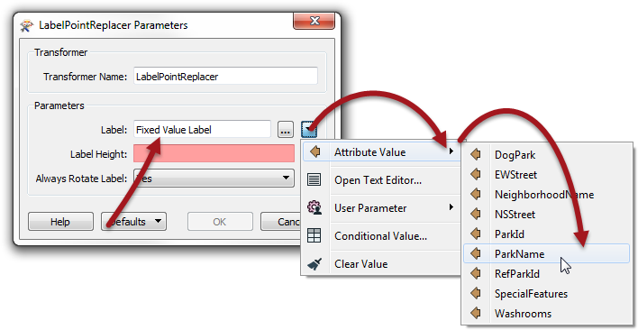

## Parameters and Attributes ##

<!--New Section--> 

<table style="border-spacing: 0px">
<tr>
<td style="vertical-align:middle;background-color:darkorange;border: 2px solid darkorange">
<i class="fa fa-bolt fa-lg fa-pull-left fa-fw" style="color:white;padding-right: 12px;vertical-align:text-top"></i>
NEW
</td>
</tr>

<tr>
<td style="border: 1px solid darkorange">

ATTRIBUTE ASSIGNMENT

</td>
</tr>
</table>

---

---

### Attribute Name Parameter ###

Sometimes an FME parameter is designed to accept either a fixed value or the value of an attribute. We call these parameters \_OR_ATTR parameters, because they allow a value **OR** an attribute.

For example, this LabelPointReplacer allows the label to come from a fixed value, or an attribute:

When the end-user is required to set this FME parameter, then it’s simply a case of turning it into a linked user parameter. When the workspace is run, FME will scan the workspace to find what attributes are available to that transformer, and allow the user to select one or enter a fixed value.

*However!* 

Perhaps the workspace author does not want the user to be able to enter a fixed value. They want the user to only be able to select an attribute.

In this scenario we need to create a user parameter with a special type called Attribute Name:

Now when the workspace is run, the user is permitted to select an attribute, and ONLY an attribute:

*However (again)!*

There is a catch to this operation. The user parameter – as the type suggests – is simply returning an attribute name; it does not return the attribute value.

If the workspace is run in this state then the LabelPointReplacer is supplied with the attribute name (not value) and uses it as the label, like so:

What the author must do is open the parameters dialog and change the parameter (either directly in the FME parameter, or via the Text Editor window) to be: **@Value($(UserAttrSelection))**

The @Value() function replaces the name of the attribute with its actual value:

Now when the workspace is run the output will be correct:

