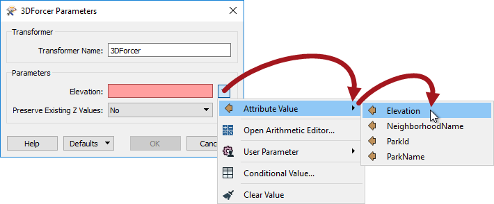
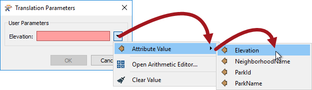
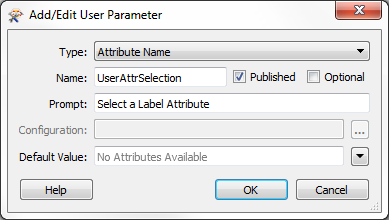
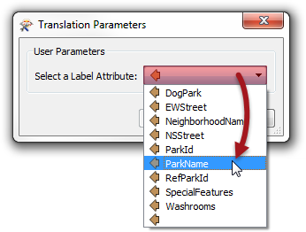
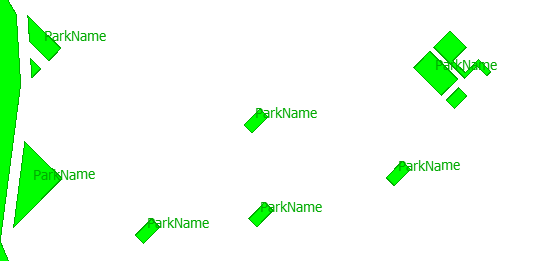
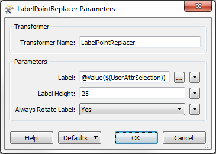

## Parameters and Attributes ##

Sometimes an FME parameter is designed to accept either a fixed value or the value of an attribute. We call these parameters \_OR_ATTR parameters, because they allow a value **OR** an attribute.

For workspace authors it's also possible to define a user parameter to allow this. Specifically a user parameter can allow either:

- A fixed value only
- A fixed value or an attribute
- An attribute only 

The first two of these capabilities are controlled by a setting in the user parameter called Attribute Assignment.

---

### FME Parameters and Attributes ###

Some FME parameters - but not all - allow an attribute to be used in place of a fixed value. We call this Attribute Assignment:
 

When a user parameter is created or linked to one of these, then it too picks up that capability:

So, this allows the end user to enter either a fixed value, or to select an attribute that supplies the value.

However, some FME parameters do not allow an attribute to be used in place of a fixed value, and a user parameter created from them will not allow the user to select an attribute either. The Elevation parameter in a RubberSheeter transformer is an example:
 

So... different parameters have different defaults; some allow attribute assignment, some do not.

---

### Attribute Assignment ###

When creating a user parameter from scratch, one of the settings available is called Attribute Assignment:

SCREENSHOT

etc etc
 

---

<!--New Section--> 

<table style="border-spacing: 0px">
<tr>
<td style="vertical-align:middle;background-color:darkorange;border: 2px solid darkorange">
<i class="fa fa-bolt fa-lg fa-pull-left fa-fw" style="color:white;padding-right: 12px;vertical-align:text-top"></i>
NEW
</td>
</tr>

<tr>
<td style="border: 1px solid darkorange">

The Attribute Assignment setting is new for FME 2017

</td>
</tr>
</table>

---

<!--Person X Says Section-->

<table style="border-spacing: 0px">
<tr>
<td style="vertical-align:middle;background-color:darkorange;border: 2px solid darkorange">
<i class="fa fa-quote-left fa-lg fa-pull-left fa-fw" style="color:white;padding-right: 12px;vertical-align:text-top"></i>
Ms Analyst says...
</td>
</tr>

<tr>
<td style="border: 1px solid darkorange">

You might be wondering why some FME parameters allow Attribute Assignment, and some don't.
  The key to this difference is that by selecting an attribute you allow each feature to provide a different value. For example, in the 3DForcer each feature can be set to a different elevation and one feature does not affect the other.
  However, in an operation where the parameter <strong>must</strong> have the same value for each feature, then Attribute Assignemnt is not allowed. For example, the Tolerance parameter in a Snapper transformer cannot be different for each feature, because what would happen if two features were 1.5 metres apart and one feature had a tolerance of 1.0 and the other had a tolerance of 2.0?!

</td>
</tr>
</table>

---

### Attribute Name Parameter ###

So Attribute Assignment handles the case where you want the user to enter a fixed value, and you may also give them the option to select an attribute.

However, the reverse case must also be handled: you don't want the user to be able to enter a fixed value, you *only* want them to be able to select an attribute.

In this scenario we need to create a user parameter with a special type called Attribute Name:

Now when the workspace is run, the user is permitted to select an attribute, and ONLY an attribute:

*However (again)!*

There is a catch to this operation. The user parameter – as the type suggests – is simply returning an attribute name; it does not return the attribute value.

If the workspace is run in this state then the LabelPointReplacer is supplied with the attribute name (not value) and uses it as the label, like so:

What the author must do is open the parameters dialog and change the parameter (either directly in the FME parameter, or via the Text Editor window) to be: **@Value($(UserAttrSelection))**

The @Value() function replaces the name of the attribute with its actual value:

Now when the workspace is run the output will be correct:

