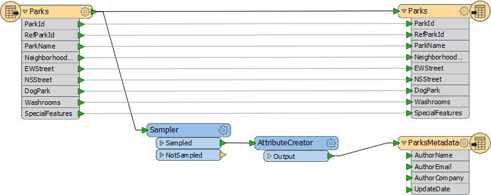
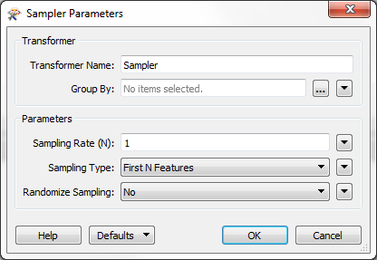
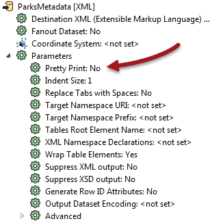
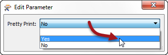
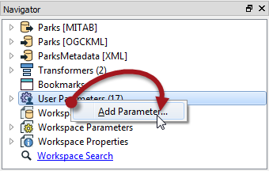
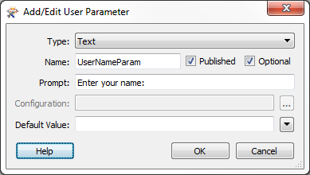
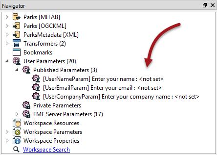

<!--Exercise Section-->
<!--NB: In GitBook world we don't give a number to exercises-->

<table style="border-spacing: 0px;border-collapse: collapse;font-family:serif">
<tr>
<td style="vertical-align:middle;background-color:darkorange;border: 2px solid darkorange">
<i class="fa fa-cogs fa-lg fa-pull-left fa-fw" style="color:white;padding-right: 12px;vertical-align:text-top"></i>
Exercise
</td>
<td style="border: 2px solid darkorange;background-color:darkorange;color:white">
Parameterize a Metadata Writer
</td>
</tr>

<tr>
<td style="border: 1px solid darkorange; font-weight: bold">Data</td>
<td style="border: 1px solid darkorange">Parks (MapInfo TAB)</td>
</tr>

<tr>
<td style="border: 1px solid darkorange; font-weight: bold">Overall Goal</td>
<td style="border: 1px solid darkorange">Allow user input to metadata fields</td>
</tr>

<tr>
<td style="border: 1px solid darkorange; font-weight: bold">Demonstrates</td>
<td style="border: 1px solid darkorange">Use of FME parameters. Creation and use of User Parameters</td>
</tr>

<tr>
<td style="border: 1px solid darkorange; font-weight: bold">Start Workspace</td>
<td style="border: 1px solid darkorange">C:\FMEData2016\Workspaces\DesktopAdvanced\Parameters-Ex1-Begin.fmw</td>
</tr>

<tr>
<td style="border: 1px solid darkorange; font-weight: bold">End Workspace</td>
<td style="border: 1px solid darkorange">C:\FMEData2016\Workspaces\DesktopAdvanced\Parameters-Ex1-Complete.fmw</td>
</tr>

</table>

In this example, imagine that you are a GIS technician working for a city planning department.

The team responsible for maintaining parks has a workspace that translates their data from the source MapInfo TAB format to Google KML. It also writes a file of XML metadata to show who translated the data and when.

At the moment there are a number of problems they face.

- The XML output is not particularly well formatted
- The date attribute is being rejected by an online XML validator 
- All of the XML metadata fields are hard-coded in an AttributeCreator transformer. This is quite inconvenient (especially when they want to run the workspace on FME Server!)  

Your have been assigned to help solve these problems. At least one of these requires you to create user parameters to take the place of hard-coded values.

 **1) Start Workbench**
 Start Workbench and open the workspace C:\FMEData2016\Workspaces\DesktopAdvanced\Parameters-Ex1-Begin.fmw

The metadata part of the translation consists of the three transformers and XML Writer feature type. 

The Sampler transformer ensures that only one record is written to the output metadata, by discarding all but one feature, and the AttributeCreator creates a set of attributes to write to the metadata.

Open the parameters dialog for each transformer in turn. These are FME parameters, set by the workspace author and not available to the end-user. Here, for example, are the parameters for the Sampler transformer:

You can also find the same parameters in the Navigator window.

 **2) Change XML Writer Parameter**
 The style of the XML file being written is controlled by an FME parameter called Pretty Print:

 

To ensure the output is always well-formatted, we should set this parameter to Yes - but we won't create a user parameter from it, because we don't want the end-user to change it.

In the Navigator window locate the XML Writer, expand the parameters list, and locate the parameter labelled Pretty Print. Double-click on it.

In the dialog that opens, change the value to Yes and then click OK to close the dialog. 

We have now - as a workspace author - changed an FME parameter.

 **3) Create User Parameter**
 The output schema has three variable attributes: username, user company (organization), and user email. We should create a user parameter for each of these to allow the end-user to enter that information.

Firstly, locate the User Parameters section of the Navigator window, right-click on it, and choose the option to Add Parameter:

In the new dialog, select Text as the type of parameter to create (there will be more on parameter types in the next section). Each parameter needs a name, so call this one UserNameParam. Now enter a prompt, such as "Enter your name."

Click OK to close the dialog and create the parameter, which will now appear in the Navigator window.

 **4) Create Remaining User Parameters**
 Repeat the previous step twice more, this time creating parameters called *UserEmailParam* and *UserCompanyParam*.

The prompts should be “Enter your email address” and "Enter your company name."

When done the Navigator window looks like this:

 **5) Use User Parameter – Method 1**
 There are a number of ways to extract the value from a user parameter into a workspace. We’ll use a different way for each parameter, just to illustrate the different methods.

So, firstly open the parameters dialog for the AttributeCreator. This transformer is what currently creates the attributes for the output.

Click in the Value field for the AuthorName attribute. Click on the drop-down arrow, then select User Parameter > UserNameParam.

Once done the value field will change to a special icon and show the parameter that was chosen:

While in this dialog, click on the AuthorEmail and AuthorCompany fields, and press the minus button to delete them. That's just so we can demonstrate dealing with these a different way:

<table style="border-spacing: 0px">
<tr>
<td style="vertical-align:middle;background-color:darkorange;border: 2px solid darkorange">
<i class="fa fa-quote-left fa-lg fa-pull-left fa-fw" style="color:white;padding-right: 12px;vertical-align:text-top"></i>
Ms. Analyst says…
</td>
</tr>

<tr>
<td style="border: 1px solid darkorange">

“Did you notice the UpdateDate attribute is set to a value of “TODAY”?
When processed by the DateFormatter it will be turned into whatever the
current date is.
Similar relative date values can also be used, such as “Yesterday,” “Tomorrow,” or “Last
Thursday”

</td>
</tr>
</table>

**6)** Use User Parameter – Method 2

A second way to extract the value from a user parameter is with a ParameterFetcher transformer.

Place a ParameterFetcher transformer (after the DateFormatter is fine). Open the parameters dialog.

Select UserEmailParam as the parameter to fetch. Enter AuthorEmail as the name of the target attribute:

<table style="border-spacing: 0px">
<tr>
<td style="vertical-align:middle;background-color:darkorange;border: 2px solid darkorange">
<i class="fa fa-quote-left fa-lg fa-pull-left fa-fw" style="color:white;padding-right: 12px;vertical-align:text-top"></i>
Ms. Analyst says…
</td>
</tr>

<tr>
<td style="border: 1px solid darkorange">

“Did you notice that the list of parameters includes
many FME-related system parameters?
These are particularly useful for use on FME Server.”

</td>
</tr>
</table>

**7)** Use User Parameter – Method 3

The final method to extract the value from a user parameter is with a schema attribute value.

To achieve this, locate the metadata feature type on the canvas and right-click the AuthorCompany attribute.

Then select the Edit Value option.

In the dialog that opens, you can enter a fixed (constant) value, but in our case we’ll click on the drop-down arrow, select User Parameters, and then select UserCompanyParam:

Click OK to close the dialog and the feature type should look like this. Notice how the attribute that has had its value set is now highlighted with a specific icon:

**8)** Save and Run Workspace

Save the workspace and then – as if you were the end-user – run it using Run > Prompt and Run.

When prompted enter your details into the fields that have been newly created:

Locate and open the XML file to ensure the contents have been inserted as expected:
