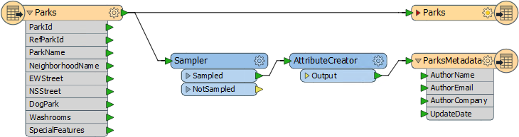
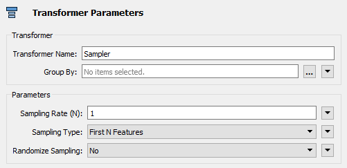
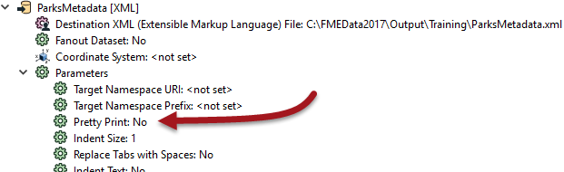
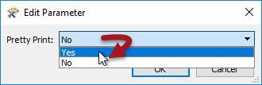
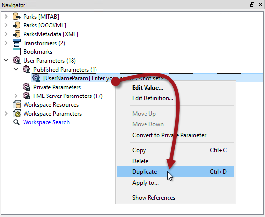
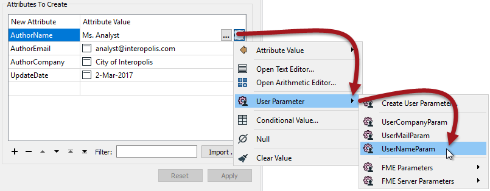
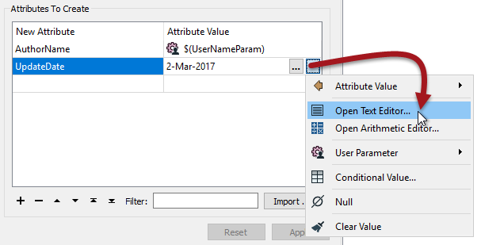
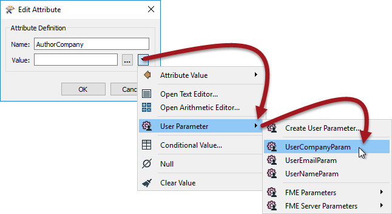
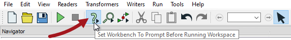
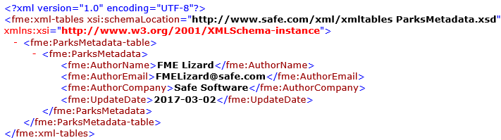

<!--Exercise Section-->

<table style="border-spacing: 0px;border-collapse: collapse;font-family:serif">
<tr>
<td style="vertical-align:middle;background-color:darkorange;border: 2px solid darkorange">
<i class="fa fa-cogs fa-lg fa-pull-left fa-fw" style="color:white;padding-right: 12px;vertical-align:text-top"></i>
Exercise 1
</td>
<td style="border: 2px solid darkorange;background-color:darkorange;color:white">
Parameterize a Metadata Writer
</td>
</tr>

<tr>
<td style="border: 1px solid darkorange; font-weight: bold">Data</td>
<td style="border: 1px solid darkorange">Parks (MapInfo TAB)</td>
</tr>

<tr>
<td style="border: 1px solid darkorange; font-weight: bold">Overall Goal</td>
<td style="border: 1px solid darkorange">Allow user input to metadata fields</td>
</tr>

<tr>
<td style="border: 1px solid darkorange; font-weight: bold">Demonstrates</td>
<td style="border: 1px solid darkorange">Use of FME parameters. Creation and use of User Parameters</td>
</tr>

<tr>
<td style="border: 1px solid darkorange; font-weight: bold">Start Workspace</td>
<td style="border: 1px solid darkorange">C:\FMEData2017\Workspaces\DesktopAdvanced\Parameters-Ex1-Begin.fmw</td>
</tr>

<tr>
<td style="border: 1px solid darkorange; font-weight: bold">End Workspace</td>
<td style="border: 1px solid darkorange">C:\FMEData2017\Workspaces\DesktopAdvanced\Parameters-Ex1-Complete.fmw</td>
</tr>

</table>

<!--NB: In the begin workspace ensure date attr is set to DATE type, not DATETIME-->

In this example, imagine that you are a GIS technician working for a city planning department.

The team responsible for maintaining parks has a workspace that translates their data from the source MapInfo TAB format to Google KML. It also writes a file of XML metadata to show who translated the data and when.

At the moment there are a number of problems they face.

- The XML output is not particularly well formatted
- The date attribute is being rejected by an online XML validator 
- All of the XML metadata fields are hard-coded in an AttributeCreator transformer. This is quite inconvenient (especially when they want to run the workspace on FME Server!)  

You have been assigned to help solve these problems. At least one of these requires you to create user parameters to take the place of hard-coded values.

 **1) Start Workbench**
 Start Workbench and open the workspace C:\FMEData2017\Workspaces\DesktopAdvanced\Parameters-Ex1-Begin.fmw

The metadata part of the translation consists of the two transformers and XML Writer feature type. 

The Sampler transformer ensures that only one record is written to the output metadata, by discarding all but one feature, and the AttributeCreator creates a set of attributes to write to the metadata.

Check the parameters for each transformer in turn. These are FME parameters, set by the workspace author and not available to the end-user. Here, for example, are the parameters for the Sampler transformer:

You can find these parameters in the Parmeter Editor window, the transformers' Parameters Dialog, and under the Transformers section of the Navigator window.

 **2) Change XML Writer Parameter**
 The style of the XML file being written is controlled by an FME parameter called Pretty Print:

 

To ensure the output is always well-formatted, we should set this parameter to Yes - but we won't create a user parameter from it, because we don't want the end-user to change it.

In the Navigator window locate the XML Writer, expand the parameters list, and locate the parameter labelled Pretty Print. Double-click on it.

In the dialog that opens, change the value to Yes and then click OK to close the dialog. 

We have now - as a workspace author - changed an FME parameter.

 **3) Create User Parameter**
 The output schema has three variable attributes: username, user company (organization), and user email. We should create a user parameter for each of these to allow the end-user to enter that information.

Firstly, locate the User Parameters section of the Navigator window, right-click on it, and choose the option to Add Parameter:

In the new dialog, select Text as the type of parameter to create (there will be more on parameter types in the next section). Each parameter needs a name, so call this one UserNameParam. Now enter a prompt, such as "Enter your name."

Click OK to close the dialog and create the parameter, which will now appear in the Navigator window.

 **4) Create Remaining User Parameters**
 The quickest way to create the other two required parameters (*UserEmailParam* and *UserCompanyParam*) is to duplicate the *UserNameParam* parameter.

So, right-click on the *UserNameParam* parameter and choose the option to Duplicate:

A settings dialog for the duplicate parameter will open. Call it *UserMailParam* and set the prompt to “Enter your email address”.

Repeat the duplication process, this time creating a parameter called *UserCompanyParam* with the prompt "Enter your company name."

When done the Navigator window looks like this:

 **5) Use User Parameter – Method 1**
 Each of the user parameters we've just defined provide values that need to go into attributes in the Writer schema. There are a number of ways to extract the value for such a purpose and we’ll use a different way for each parameter, just to illustrate the different methods.

So, firstly locate the parameters for the AttributeCreator (either the Parameter Editor window or AttributeCreator Parameters dialog). This transformer is what currently creates the attributes for the output.

Click in the Attribute Value field for the AuthorName attribute. Click on the drop-down arrow, then select User Parameter &gt; UserNameParam.

Once done the value field will change to a special icon and show the parameter that was chosen:

While here, click on the AuthorEmail and AuthorCompany fields, and press the minus button to delete them. That's just so we can demonstrate dealing with these a different way.

 **6) Fix Date Attribute**
 Looking at the AttributeCreator we can see that the date field is being entered as a fixed value. Although not a user parameter as such, it's obvious that the user must be setting this manually at run time.

Additionally, the date is not structured to an ISO standard, which is why the output fails XML validation. 

Let's fix these issues. First click on the drop-down arrow next to the UpdateDate Attribute Value field, then choose Open Text Editor:

In the text editor remove any existing content and replace it with:

<pre>
@DateTimeFormat(@DateTimeNow(),%Y-%m-%d)
</pre>

This uses (new for 2017) FME Date/Time functions to return today's date in a structure matching the ISO date standard.

---

<!--Person X Says Section-->

<table style="border-spacing: 0px">
<tr>
<td style="vertical-align:middle;background-color:darkorange;border: 2px solid darkorange">
<i class="fa fa-quote-left fa-lg fa-pull-left fa-fw" style="color:white;padding-right: 12px;vertical-align:text-top"></i>
Firefighter Mapp says...
</td>
</tr>

<tr>
<td style="border: 1px solid darkorange">

An alternative method is to simply set the date value to "TODAY" and using the DateFormatter transformer to convert it to a real date in an ISO standard.

</td>
</tr>
</table>

---

 **7) Use User Parameter – Method 2**
 A second way to extract the value from a user parameter is with a ParameterFetcher transformer.

Place a ParameterFetcher transformer (after the AttributeCreator is fine). Inspect the parameters.

Select *UserEmailParam* as the parameter to fetch. Enter AuthorEmail as the name of the target attribute:

<table style="border-spacing: 0px">
<tr>
<td style="vertical-align:middle;background-color:darkorange;border: 2px solid darkorange">
<i class="fa fa-quote-left fa-lg fa-pull-left fa-fw" style="color:white;padding-right: 12px;vertical-align:text-top"></i>
Ms. Analyst says…
</td>
</tr>

<tr>
<td style="border: 1px solid darkorange">

Did you notice that the list of parameters available includes many FME-related system parameters? These are particularly useful for use with FME Server.

</td>
</tr>
</table>

 **8) Use User Parameter – Method 3**
 The final method to extract the value from a user parameter is with a schema attribute value.

To achieve this, locate the metadata feature type on the canvas and right-click the AuthorCompany attribute. Then select the Edit Value option:

In the dialog that opens, you can enter a fixed (constant) value, but in our case we’ll click on the drop-down arrow, select User Parameters, and then select UserCompanyParam:

Click OK to close the dialog and the feature type should look like this. Notice how the attribute that has had its value set is now highlighted with a specific icon:

 **9) Save and Run Workspace**
 Save the workspace and then – as if you were the end-user – run it. Be sure to set the Prompt option on the toolbar first:

When prompted enter your details into the fields that have been newly created:

Locate and open the XML file to ensure the contents have been inserted as expected:

---

<!--Exercise Congratulations Section--> 

<table style="border-spacing: 0px">
<tr>
<td style="vertical-align:middle;background-color:darkorange;border: 2px solid darkorange">
<i class="fa fa-thumbs-o-up fa-lg fa-pull-left fa-fw" style="color:white;padding-right: 12px;vertical-align:text-top"></i>
CONGRATULATIONS
</td>
</tr>

<tr>
<td style="border: 1px solid darkorange">

By completing this exercise you have learned how to:
<ul><li>Set an FME parameter (on the XML Writer)</li>
<li>Create a text type user parameter</li>
<li>Duplicate an existing parameter</li>
<li>Use a user parameter in a regular transformer</li>
<li>Use a user parameter in a ParameterFetcher transformer</li>
<li>Use a user parameter in a Edit Value dialog</li>
<li>Use the DateTimeNow and DateTimeFormat functions in a text editor to create an XML-valid date</li></ul>

</td>
</tr>
</table>
