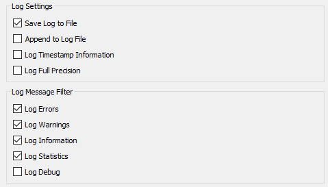

# Log File Interpretation

The FME log file is your best friend for assessing performance. It tells you how long a translation took, where the time went, and how well FME was able to use the available system resources.

## Log Messages ##

The first thing to notice is that the log is made up of a number of messages, each of which consists of a number of fields:

- Absolute Date [Optional]
- Absolute Time [Optional]
- Cumulative Time (for translation)
- Elapsed Time (for this message)
- Message Type
- Message

The Message Type field tells us the nature of the information. It will be one of the following:

- ERROR: An error in the translation that usually requires FME to terminate processing.
- WARN: A warning that signifies a problem that is not sufficient to terminate processing.
- INFORM: An information message relating a non-error item.
- STAT: A message on translation statistics such as the number of features processed.

## Configuring the Log Window ##

There are a number of options to adjust the log file and what is displayed. To access these select Tools &gt; FME Options &gt; Translation within FME Workbench. 

These are the options and their default setting:

Some of the most important options are as follows...

### Log Timestamps ###

With this option turned on each message in the log **window** gets stamped with the time and date it occurred. Timestamps are an invaluable aid to assessing performance and should be kept on in most cases.

***NB:*** *The log **file** always contains timestamps, regardless of this setting.*

### Log Full Precision ###

Logging full precision means any coordinates that are reported will be listed to their full precision. This is only of real use when trying to compare coordinates between different features.

### Log Message Filters ###

Filtering options allow each type of message to be turned on or off in the log window. It can be particularly useful to turn off INFORM and STAT messages in order to make it easier to spot ERRORs and WARNs; however it does appear strange at first to run a translation and not see the usual stream of information!

### Log Debug ###

The Log Debug option turns on a series of extra log messages that are usually hidden from the user. Not only will a lot of the underlying mapping file be exposed, there will also be a number of ERROR messages labelled BADNEWS.

---

<table style="border-spacing: 0px">
<tr>
<td style="vertical-align:middle;background-color:darkorange;border: 2px solid darkorange">
<i class="fa fa-quote-left fa-lg fa-pull-left fa-fw" style="color:white;padding-right: 12px;vertical-align:text-top"></i>
Jake Speedie says…
</td>
</tr>

<tr>
<td style="border: 1px solid darkorange">

Debug messages can help during debugging, but it’s very unlikely you’ll want to keep them turned on in general FME use. Many of the BADNEWS messages are “errors” that FME has trapped and kept to itself (like an end-of-file message). 

</td>
</tr>
</table>
