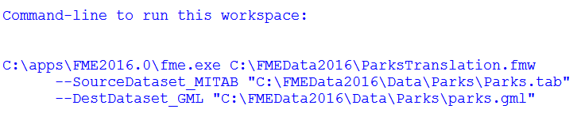

# Deconstructing the Log File #

This section looks in more detail at each part of an FME log.

---

<!--Person X Says Section-->

<table style="border-spacing: 0px">
<tr>
<td style="vertical-align:middle;background-color:darkorange;border: 2px solid darkorange">
<i class="fa fa-quote-left fa-lg fa-pull-left fa-fw" style="color:white;padding-right: 12px;vertical-align:text-top"></i>
Miss Vector says...
</td>
</tr>

<tr>
<td style="border: 1px solid darkorange">

Being able to interpret a log file is vital for performance tuning. If you can’t understand what FME is doing then there isn’t much chance you’ll be able to improve upon it!

</td>
</tr>
</table>

---

The overall structure of an FME log is basically four different sections.

- Command-line statement
- Configuration and setup information
- The translation and transformation itself
- A summary of the translation

---

## Command Line Statement ##

At the very top of a log file appears the command line statement. This is the command that FME Workbench is using to run the translation:

In terms of performance, this section doesn’t tell us much. However, it is useful to confirm what version and which instance of FME is running, particularly when you have several versions installed. 

This section also tells us what published parameters are in the workspace and what their values are. 

Perhaps the most useful part of this section is that you can just copy and paste this statement to run the workspace through a command line, or using a batch file.

