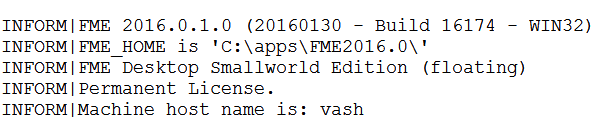
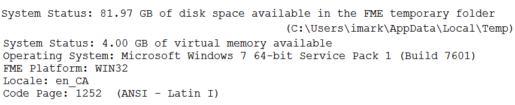
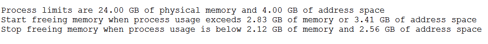

## Configuration and Setup Information ##

Configuration and setup messages in the FME log tell us vital information about FME's version and configuration, the system resources and how FME intends to use them, and what system paths are being used.

For example, here you can see which version of FME is being used, its license type, and the machine name. If you do have multiple FME versions installed, here’s where you can check to ensure the correct one is running.

Further on we can see that the system has nearly 108GB of free space and 4 GB of virtual memory (the maximum possible on 32-bit). We can also see what operating system we are running FME on and what the current language and encoding settings are:

Later in the log is important information about the system resources and FME’s memory management:

In this case there is a limit of 4GB memory per process, indicative of 32-bit processing, out of 24GB of total memory for the machine. The following numbers indicate how FME will manage memory resources. It will use nearly 3GB of memory and then it will start to release memory by caching features to disk. This caching will stop once memory use is less than about 2GB.

This way FME will perform to its potential automatically, while not taking so much memory that the system may fail or other processes on the system would suffer.

Of course, when run on 64-bit FME, the numbers will be slightly different, illustrating the benefits of this platform:

Here FME will not have to start caching data to disk until nearly 72GB of memory has been used!

---

### Temporary Folder ###

For performance tuning one of the most important parts of the log reports the temporary folder being used. When memory resources become low and FME starts to cache to disk, the temporary folder is where it will write data to.

Firstly it's important to ensure this folder does have enough temporary disk space for the translation being carried out. Depending on the workspace and the transformations being carried out, this may be many times greater than the size of the original dataset.

Secondly it's useful if the disk being written to is both fast and unused by any other process. It will not, for example, help performance to share the temporary disk with the operating system.