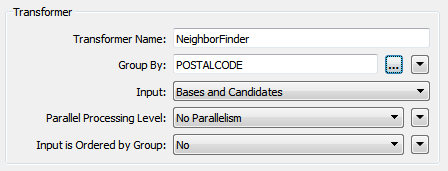
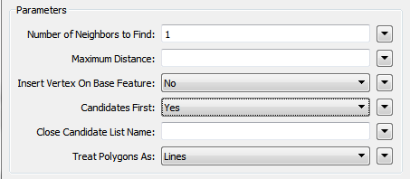

## Improving Transformation Performance ##

In most cases, slow, memory-consuming translations are caused by group-based transformers.

Remember that in feature-based transformation a transformer performs an operation on a feature-by-feature basis where a single feature at a time is processed. Such a transformation only takes as much memory as is necessary to store a single feature.

However, a group-based transformer performs an operation on a group or collection of features and it takes as much memory as is necessary to store all features of the group!

It is this grouping of data that causes performance degradation. 

---

<table style="border-spacing: 0px">
<tr>
<td style="vertical-align:middle;background-color:darkorange;border: 2px solid darkorange">
<i class="fa fa-quote-left fa-lg fa-pull-left fa-fw" style="color:white;padding-right: 12px;vertical-align:text-top"></i>
Jake Speedie says….
</td>
</tr>

<tr>
<td style="border: 1px solid darkorange">

You’ll get better performance when you put the least amount of data into a group-based transformer as possible.
For example, put feature-based filter transformers BEFORE the group-based process, not after it (see following exercise). Another technique is to turn group-based transformers into feature-based...

</td>
</tr>
</table>

---

### Turning Group-based Transformers into Feature-based Transformers ###

Obviously, when a group-based transformer is needed, then it must be used. That is inevitable and we have to live with that. However, many group-based transformers have a parameter that, in effect, turns them into feature-based.

The usual parameter is called "Input is Ordered by Group" and appears near the Group By parameter in most transformer dialogs:

The condition for applying these is that the groups of features are pre-sorted into their groups. When this is the case, and I can set this parameter to Yes, then FME is able to process the data more efficiently. 

For example, in the above screenshot the user is using postal code as a group-by parameter (i.e. each address looks for it's nearest neighbor *in the same postcode*). If the incoming data is already sorted in order of postcode then the user can set the Input Is Ordered parameter to yes and allow FME to treat this more like a feature-based transformer.

---

<table style="border-spacing: 0px">
<tr>
<td style="vertical-align:middle;background-color:darkorange;border: 2px solid darkorange">
<i class="fa fa-quote-left fa-lg fa-pull-left fa-fw" style="color:white;padding-right: 12px;vertical-align:text-top"></i>
Jake Speedie says...
</td>
</tr>

<tr>
<td style="border: 1px solid darkorange">

Let's think back to the airport departure gate boarding passengers. Most airlines first call passengers who require assistance boarding, then passengers with children, business-class passengers, and finally economy passengers (starting with passengers at the front). That's because it's easier to board passengers when they are sorted into similar groups, and the same applies to FME. When passengers (or spatial features) arrive in a random order it's not as simple to handle them.

</td>
</tr>
</table>

---

Besides the "Input is Ordered by Group" parameter, some transformers have their own, unique, parameters for performance improvements.

For example, the NeighborFinder expects two sets of data: Bases and Candidates. By default FME caches all incoming Bases and Candidates because it needs to be sure it has ALL of the candidates before it can process any bases.

But, if it knows the candidate features will arrive first (i.e. the first Base feature signifies the end of the Candidates) then it doesn’t need to cache Base features. It can process them immediately because it knows there are no more candidates that it could match against.

The user specifies that this is true using the parameter Candidates First:

Look at this log file for a workspace that uses a NeighborFinder. By default it looks like this:

<pre>
Translation was SUCCESSFUL with 0 warning(s) (13597 feature(s) output)
FME Session Duration: 29.6 seconds. (CPU: 27.7s user, 1.5s system)
END - ProcessID: 28540, peak process memory usage: 231756 kb
</pre>

With Candidates First turned on it looks like this:

<pre>
Translation was SUCCESSFUL with 0 warning(s) (13597 feature(s) output)
FME Session Duration: 28.4 seconds. (CPU: 27.4s user, 0.8s system)
END - ProcessID: 26429, peak process memory usage: 178412 kb
</pre>

It’s about 5% faster than before, but more importantly it’s used nearly 25% less memory!

But how does a user ensure the Candidate features arrive first? Well, like Writers you can change the order of Readers in the Navigator, so that the Reader at the top of the list is read first.

It doesn’t improve performance per se, but it does let you apply performance-improving parameters like this.

