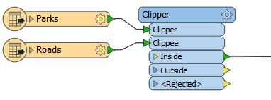
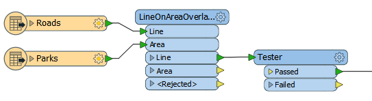
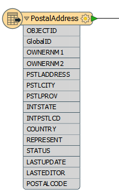
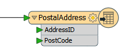
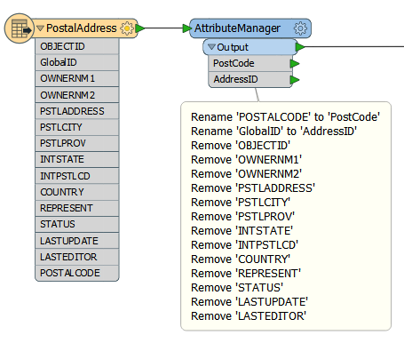

### Transformer Selection ###

If you’ve used FME for any length of time, you’ll know that it’s possible to do almost any task in several different ways.

For example, if you were isolating all road features that pass through a park you could use either the Clipper, like so:

Or the LineOnAreaOverlayer, with a test for _overlaps => 1, like so:

The performance for the LineOnAreaOverlayer would be this:

<pre>
Translation was SUCCESSFUL with 0 warning(s) (134 feature(s) output)
FME Session Duration: 3 minutes 57.6 seconds. (CPU: 196.2s user, 37.6s system)
END - ProcessID: 38036, peak process memory usage: 3129576 kB
</pre>

While the Clipper (in Multiple Clippers mode) would be this:

<pre>
Translation was SUCCESSFUL with 0 warning(s) (134 feature(s) output)
FME Session Duration: 23.5 seconds. (CPU: 22.2s user, 0.8s system)
END - ProcessID: 14236, peak process memory usage: 1471896 kB
</pre>

And in Clippers First mode would be this:

<pre>
Translation was SUCCESSFUL with 0 warning(s) (134 feature(s) output)
FME Session Duration: 21.4 seconds. (CPU: 20.4s user, 0.6s system)
END - ProcessID: 30123, peak process memory usage: 183344 kB
</pre>

So the result is the same, but the performance vastly different.

Obviously in the above example the Clipper is the fastest (and be sure to note how the Clippers First mode has reduced memory use by nearly 90%).

But each transformer has different functionality, and if you wanted to output park features with a list of roads or a count of the roads passing through the park, then the LineOnAreaOverlayer would be the transformer of choice, because it has a specific list parameter.

Basically, each transformer works in a different way, has subtle variances in functionality, and will have different performance for any given task. Therefore a translation will benefit in performance if the author is careful in their choice of transformers, and maybe carries out some performance testing first.

---

### Attributes and Transformation ###

As mentioned (in Reader Performance) reducing data helps performance because it saves FME from either holding it in memory or caching it to a disk.

However, this isn’t just helped by reducing the number of features; it is also helped by reducing the size of each individual feature.

One aspect of this is attributes. Carrying attributes through a translation impacts performance, so if the attributes are not required in the output, it’s best to remove them *as early as possible* in the translation.

For example, the incoming schema looks like this:

But the outgoing schema looks like this:

Since so many of the source attributes are not required in the output, it makes sense to remove them from the translation, and as early as possible by using a transformer (AttributeManager, AttributeRemover, or AttributeKeeper) directly after the source feature type:

This ensures that none of the extra attributes become a drain on resources by being processed by any further transformers.

#### Lists ####

One specific type of attribute to beware of is a *List*. A list in FME is an attribute that can have multiple values. Because of this it can be a big drain on resources.

For example, use a Joiner to join a feature to 1000 records and the list for that feature will have 1,000 sets of records. This is bad enough, but if the list is exploded and all of the original attributes kept, then there will be 1,000 features each with 1,000 sets of attributes!

In general, beware of creating lists unnecessarily and of keeping them in a workspace beyond the point at which they are still of use.

---

### Geometry and Transformation ###

Like attributes, geometry can be removed from a feature, in this case using the GeometryRemover transformer.

Many FME users create translations that handle tabular – non-spatial – data. If you are reading a spatial dataset, then writing it to a tabular format, be sure to remove the geometry early in the workspace, just as you would an attribute.

Another particular problem is carrying around spatial data as attributes. Spatial database formats - for example Oracle or GeoMedia - usually store geometry within a field in the database; for example GEOM. When FME reads the data it converts the GEOM field into FME geometry and drops the field from the data.

However, if you read a geometry table with a non-geometry Reader, the translation could end up with the geometry stored as an FME attribute. A similar thing could happen when a workspace reads only one geometry column of a multiple geometry table.

Geometry will create *very* large and complex attributes, which take up a great deal of resources. If you don’t need them, then it’s worth removing them.

Basically, you should only carry through the translation any geometry and attributes you need for the output of your workspace. If the data is not required, then it can and should be removed as early in the workspace as possible.

---

### General Optimizations ###

Here are a few general suggestions that can be used to improve the performance of a workspace. These come straight from the developers at Safe Software.

---

<table style="border-spacing: 0px">
<tr>
<td style="vertical-align:middle;background-color:darkorange;border: 2px solid darkorange">
<i class="fa fa-quote-left fa-lg fa-pull-left fa-fw" style="color:white;padding-right: 12px;vertical-align:text-top"></i>
Jake Speedie says…
</td>
</tr>

<tr>
<td style="border: 1px solid darkorange">

It's said that race driver Michael Schumacher would tilt his head slightly when racing, to allow more air into the engine intake. If, like him, you measure performance down to the millisecond, then these tips are for
you!

</td>
</tr>
</table>

---

**Avoid Run with Full Inspection**

If you aren’t debugging a translation, then avoid using the Run with Full Inspection option. It stashes all data for every connection in the workspace, meaning performance is significantly reduced.

**Remove (or Disable) Excess Loggers and Inspectors**

Similarly, if you aren’t debugging a translation there’s no need for Logger or Inspector transformers. Remove – or disable – them and your workspace will run more efficiently.

**Use Inspectors, not Loggers**

If you are intending to inspect a large number of features, then use the Inspector and not the Logger transformer. Logging speeds have improved greatly in the last few versions of FME, but it is still a relatively slow process compared to sending features to the Inspector.

**Use the Command Line**

Once you have constructed your workspace, run it from the command line instead of from Workbench. It may operate slightly faster.

**License Type**

It might only be a tiny amount, but an FME with a floating (concurrent) license has to query the license server and so is very marginally slower than fixed licenses.