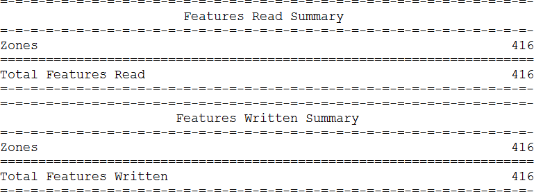

## Translation Summary ##

The final part of a log file includes a report of the number of features read and written:

More importantly, from a performance point of view, it includes a brief report of the time taken by the translation and the amount of memory used:

Peak memory usage is an important statistic. It signifies how hard FME is having to work. If this number can be reduced performance will often improve

---

### Written Features ###

One of the most misinterpreted statistics in an FME log is the number of features written.

What this really means is “the number of features sent to the Writer”. It doesn’t always mean the same number of features actually gets written to the output dataset, or that the output dataset will contain only that number of features.

For example, in the above screenshot 416 features are reported as sent to a writer. But, for example, if it were an (Esri Shape) writer a warning earlier in the log might appear:

So in reality, the writer rejected all of these features, in this case because their geometry was invalid. The writer was set up to write line features, yet these are polygons.

Similarly, a format may have geometry limitations that cause the output dataset to be slightly different to the numbers logged.

For example, MicroStation DGN format has a limit on vertex numbers for each element (feature). If the MicroStation writer receives a feature with too many vertices it will split that feature into multiple MicroStation features (*elements* in MicroStation speak) to avoid going over the vertex limit.

Thus, the number of features that actually appear in the dataset can be different to the number of features logged as being sent to the writer!

---

<!--Warning Section--> 

<table style="border-spacing: 0px">
<tr>
<td style="vertical-align:middle;background-color:darkorange;border: 2px solid darkorange">
<i class="fa fa-exclamation-triangle fa-lg fa-pull-left fa-fw" style="color:white;padding-right: 12px;vertical-align:text-top"></i>
WARNING
</td>
</tr>

<tr>
<td style="border: 1px solid darkorange">

Currently, features read or written by the FeatureReader/FeatureWriter transformers are not included in the summary at the end of the log. To find this information you would need to examine the feature counts displayed on the connections in or out of those transformers. 

</td>
</tr>
</table>
