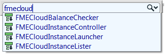

# Performance, FME Server, and FME Cloud #

FME Server adds an extra dimension to FME performance, that of scalability. In terms of performance the item most easily scalable is the number of FME engines.

Increasing the number of engines supports a higher volume of jobs and the FME Server Core contains a Software Load Balancer (SLB) to distribute jobs to the FME engines in a balanced way.

In this scenario, FME Server is used not for its web-based abilities, but rather for its potential in processing large amounts of data in relatively less time.

## Using Server for Bulk Translations ##

By default, utilizing multiple engines is only possible when you have multiple workspaces that can be run. When you have only a single workspace, and wish to process it more efficiently on FME Server, then you need to divide that workspace into multiple jobs.

To do so I can create a master workspace that divides my source data into separate parts and sends each to a different job using the FMEServerJobSubmitter transformer.

For example, I can calculate the bounds of tiles to be created and share the load over multiple server engines by running the workspace once for each tile.

## FME Cloud ##

FME Cloud is an installation of FME Server hosted by Safe Software on Amazon Web Services technology and used on a pay-as-you-go basis. The benefit is that you don’t have to purchase FME Server, simply make use of it whenever you have a job that can take advantage of its power.

The key to automating this for performance benefits are the FME Cloud custom transformers available on the FME Store:

With the FMECloudInstanceLauncher transformer I can run my master workspace (as in the example above) and have it automatically start an FME Cloud instance and run the job on it.

This way I can start a new instance for each job, or run several jobs on one instance, depending on the type of instance and how many engines it has running on it.