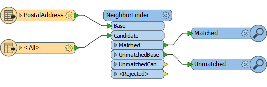
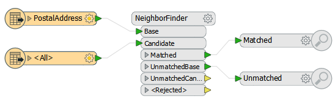

# Reader and Writer Optimization

Reading and writing data is obviously a major part of most workspaces and so being able to optimize those steps can improve performance greatly. 

But before optimizing reading and writing, we have to be able to assess what the current level of performance is.

---

## Assessing Reader Performance ##

To be able to improve the efficiency of a Reader requires an estimate of how well it is working in the first instance; yet this can be hard to separate out in a workspace that is also transforming data.

The key message that signifies reading is complete is “Emptying Factory Pipeline”. Here, for example, reading of the data finished after 144 seconds of processing (of course the actual elapsed time might be longer if FME was waiting for a database or the file system to respond):

<pre>
2014-12-08 10:46:52| 144.1| 0.0|INFORM|Emptying factory pipeline
</pre>

### Example ###

Sometimes the time for that message can be misleading. Take this workspace that reads a set of address points and finds their nearest neighbor in a second dataset:

According to the log file the data took 27.5 seconds to read:

<pre>
2014-12-08 13:13:52| 27.5| 0.0|INFORM|Emptying factory pipeline
</pre>

And in total the whole workspace took 27.6 seconds to run:

<pre>
INFORM|Translation was SUCCESSFUL with 0 warning(s)
FME Session Duration: 27.6 seconds. (CPU: 26.8 user, 0.7 system)
</pre>

But that doesn’t seem right. How could it be that the data took 27.5 seconds to read but only 0.1 seconds to process?

In fact, this is because FME was processing the data at the same time as it was reading it. It won’t read the entire dataset before processing, because that would be inefficient. So although reading didn’t finish for 27.5 seconds, during that time FME was already processing the features it had read and the 0.1 seconds is the time it took to handle the final feature and end the process.

### True Reader Performance ###

So, how can we assess the true amount of time taken to read the data? The answer is to disable all transformation and simply run the reading part of the workspace:

Now when the workspace is run it is reading the data only, with no transformation, and the factory pipeline message appears after a mere 5.4 seconds:

<pre>
2014-12-08 13:15:12| 5.4| 0.0|INFORM|Emptying factory pipeline
</pre>

So from this we can assess that the data reading takes only 5.4 seconds out of the 27.6 total.

This is also important to know *during* processing, because the log window can also give the impression that the workspace is still reading (and is therefore yet to process) data.

<pre>
2016-03-08 13:24:54| 4213.3| 1904.1| INFORM| Reading source feature #5000
2016-03-08 14:04:58| 6617.3| 2404.4| INFORM| Reading source feature #10000
2016-03-08 14:52:03| 9501.4| 2884.9| INFORM| Reading source feature #15000
</pre>

Here a very complex workspace is taking hours to complete. At first glance you might mistakenly believe the data was still being read in preparation for processing, because “Reading source feature” messages were still appearing. In fact, data is being processed simultaneously with the reading.

---

<table style="border-spacing: 0px">
<tr>
<td style="vertical-align:middle;background-color:darkorange;border: 2px solid darkorange">
<i class="fa fa-quote-left fa-lg fa-pull-left fa-fw" style="color:white;padding-right: 12px;vertical-align:text-top"></i>
Jake Speedie says…
</td>
</tr>

<tr>
<td style="border: 1px solid darkorange">

Remember the exact structure of the log will depend greatly on whether the transformers being used are feature-based or group-based. A group-based transformer will hoard features until it is ready to process them all, and this will look very different in the log to a feature-based transformer that processes features one at a time.

</td>
</tr>
</table>

