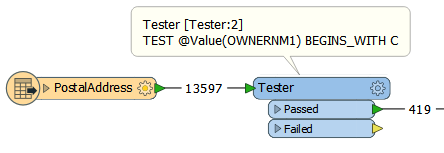
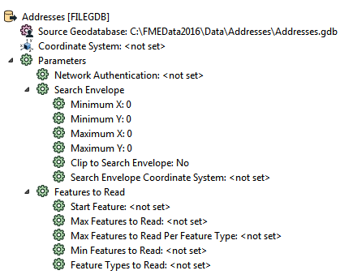
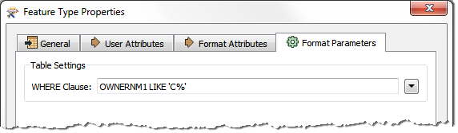
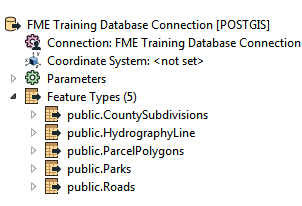
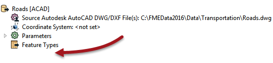

## Improving Reader Performance ##

The most important method to improve reading performance is to minimize the amount of data that is being read. As already mentioned, reading excess features counts as unnecessary work and is therefore inefficient.

---

<table style="border-spacing: 0px">
<tr>
<td style="vertical-align:middle;background-color:darkorange;border: 2px solid darkorange">
<i class="fa fa-quote-left fa-lg fa-pull-left fa-fw" style="color:white;padding-right: 12px;vertical-align:text-top"></i>
Jake Speedie says…
</td>
</tr>

<tr>
<td style="border: 1px solid darkorange">

I walk into a restaurant and - without even looking at the menu - say to the waiter: "I'll have one of everything". It certainly makes ordering quicker, but my food takes much longer to be delivered, and is very much more expensive!
  If that sounds ridiculous, consider that FME is much the same as a restaurant. If you read the entire contents of a dataset, when you only need a part of that data, then you’re wasting resources and slowing down the process. Not to mention putting stress on the CPU (Chef Processing Unit)

</td>
</tr>
</table>

---

### Filtering Input ###

For example, this workspace reads nearly 14,000 features, but immediately discards all except 400 of them (ones where the owner's name begins with "C":

In this scenario, if possible, it would be much more efficient to simply just read those 400 features. All formats have various sets of parameters that speed up feature reading by filtering the amount of data being read. 

The first of these – search envelope – defines the data to read as a geographic area. Then only that area of data needs to be read. These parameters are available on every spatial data Reader, but have the most effect when the source data is spatially indexed. Then the query is being carried out at its most efficient.

Similarly, there are a number of parameters designed to let the user define how many features to read. These parameters include the ability to define a maximum number of features to read, and what feature to start at. There is also a parameter that defines which feature types (layers or tables) should be read.

By using these judiciously, the amount of data being read can be reduced and the translation sped up.

Other formats – particularly databases – have additional clauses that can help reduce the data flow:

Here, for example, this Geodatabase Reader has a ‘WHERE Clause’ parameter that applies the "owner name begins with 'C' test" in a way that is more efficient than reading the entire contents of a large table and using a Tester transformer.

In short, when you want to filter source data, and can use a specific Reader parameter to do so, it is more efficient than reading all of the source data and then filtering it with a transformer.

---

<table style="border-spacing: 0px">
<tr>
<td style="vertical-align:middle;background-color:darkorange;border: 2px solid darkorange">
<i class="fa fa-quote-left fa-lg fa-pull-left fa-fw" style="color:white;padding-right: 12px;vertical-align:text-top"></i>
Jake Speedie says…
</td>
</tr>

<tr>
<td style="border: 1px solid darkorange">

Quick reading tip for CSV data. Use the PointCloud XYZ format to read CSV data, then the PointCloudCoercer transformer to turn it into points. It works way faster than just using the CSV format! But look out for the same sort of performance improvements for CSV in FME2017.

</td>
</tr>
</table>

---

### Excess Feature Types ###

Another potential bottleneck - specifically for formats with a table list – is the case where you have more feature types than are necessary.

Here the user has added a number of tables to their PostGIS database Reader:

However, if you look at the workspace, many of these tables are not even connected to anything. The unconnected tables are still being read but the data is being ignored:

Presumably the user added the tables for some reason, but then decided they did not need them, In that case they should delete the feature type from the FME workspace. Then the table will not be read and performance will improve.

---

### Dangling Readers ###

Another problem scenario - this time for file-based datasets - is a dangling Reader. This is where a user deletes all of the feature types, but not the underlying Reader:

Here the user added a Reader to read an AutoCAD dataset. The feature type (layer) definitions were deleted from the workspace, but the Reader remains.

In this case, when the workspace is run, all the data is still read from the file, but then immediately discarded as "unexpected input."

Remember, any extra data that is read – of whatever amount – takes time and resources to read, and impacts performance. In this case the user should have deleted the Reader too.

---

<!--Tip Section--> 

<table style="border-spacing: 0px">
<tr>
<td style="vertical-align:middle;background-color:darkorange;border: 2px solid darkorange">
<i class="fa fa-info-circle fa-lg fa-pull-left fa-fw" style="color:white;padding-right: 12px;vertical-align:text-top"></i>
TIP
</td>
</tr>

<tr>
<td style="border: 1px solid darkorange">

One other obvious way to improve reading performance is to upgrade the underlying system to minimize the amount of time FME spends waiting for a response.
  For example, tune your database so that it responds to queries quicker, and use a solid-state hard drive so that file datasets can be read quicker.

</td>
</tr>
</table>
