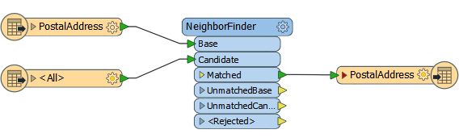
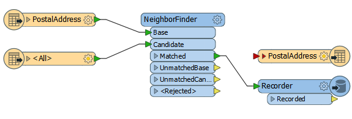
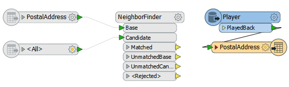

## Assessing Writer Performance ##

As with Readers, you can't improve the performance of a Writer unless you can first assess how well it is already performing. But assessing the speed of writing has the same complexity as reading: FME starts writing data as soon as it becomes available, and doesn’t necessarily wait until processing is done.

### False Writer Performance ###

Take the previous workspace, which read a set of address points and found their nearest neighbor, but now has a Writer too:

According to the log file, we find that the output dataset is open for writing before the source dataset has even finished being read!

<pre>
Opened Shape File C:\FMEData2015\Output\PostalAddress.shp for output
Opened DBF File 'C:\FMEData2015\Output\PostalAddress.dbf' for output
DBF Writer: Writing DBF File using character encoding 'ANSI'
Reading source feature # 5000
Reading source feature # 7500
Reading source feature # 10000
Reading source feature # 12500
</pre>

If you examined this log you would get quite a false representation of how well the Writer is performing.

### True Writer Performance ###

So, how can we assess Writer performance? Plainly this is different to Readers. If you isolate the Writers by disabling everything else, there won't be any data to write! 

However, it can be done with a two-step process. Firstly you would add a Recorder transformer – after all other transformation has taken place – to preserve the data in FFS format at the moment it is about to be written:

Now replace the Recorder with a Player transformer – to re-read the preserved FFS data – and disable everything else up to that point:

Now the data will be played back into the workspace, and is followed up by being written to the output.

In this example the "Emptying Factory Pipeline" message appeared after 7.2 seconds and the translation took 8.9 seconds in total, indicating 1.7 seconds was spent writing data.

---

<table style="border-spacing: 0px">
<tr>
<td style="vertical-align:middle;background-color:darkorange;border: 2px solid darkorange">
<i class="fa fa-quote-left fa-lg fa-pull-left fa-fw" style="color:white;padding-right: 12px;vertical-align:text-top"></i>
Jake Speedie says…
</td>
</tr>

<tr>
<td style="border: 1px solid darkorange">

Be aware that fanouts will complicate your view of the log, not to mention slow the process somewhat.
  For example, if I do a Dataset Fanout on the above workspace, FME creates a separate Writer for each fanned-out dataset. Firstly this causes a performance hit – because FME has to cache all the output data and
create multiple Writers – and additionally I get a section of log for each output dataset.

</td>
</tr>
</table>

