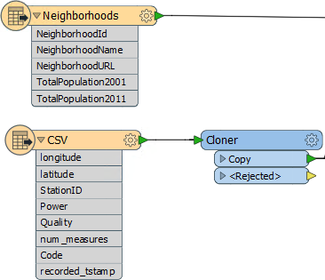
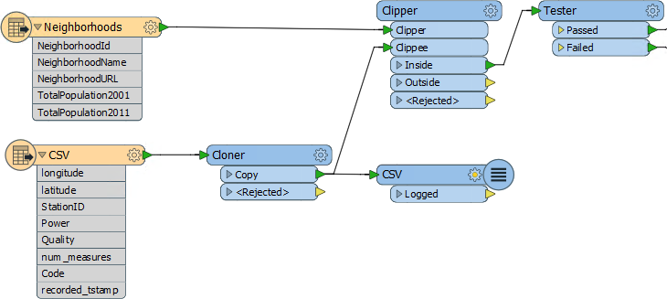
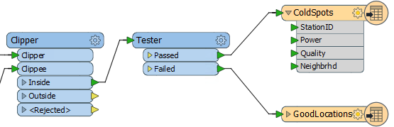

<!--Exercise Section-->

<table style="border-spacing: 0px;border-collapse: collapse;font-family:serif">
<tr>
<td style="vertical-align:middle;background-color:darkorange;border: 2px solid darkorange">
<i class="fa fa-cogs fa-lg fa-pull-left fa-fw" style="color:white;padding-right: 12px;vertical-align:text-top"></i>
Exercise 1
</td>
<!--AKA What Does the Log Say?-->
<td style="border: 2px solid darkorange;background-color:darkorange;color:white">
Cell Phone Signal Processing - Log File
</td>
</tr>

<tr>
<td style="border: 1px solid darkorange; font-weight: bold">Data</td>
<td style="border: 1px solid darkorange">City Neighborhoods (Google KML) Cell Phone Signals (CSV)</td>
</tr>

<tr>
<td style="border: 1px solid darkorange; font-weight: bold">Overall Goal</td>
<td style="border: 1px solid darkorange">Analyze and improve the workspace performance</td>
</tr>

<tr>
<td style="border: 1px solid darkorange; font-weight: bold">Demonstrates</td>
<td style="border: 1px solid darkorange">Interpreting an FME log file</td>
</tr>

<tr>
<td style="border: 1px solid darkorange; font-weight: bold">Start Workspace</td>
<td style="border: 1px solid darkorange">C:\FMEData2017\Workspaces\DesktopAdvanced\Performance-Ex1-Begin.fmw C:\FMEData2017\Workspaces\DesktopAdvanced\Performance-Ex1-Begin-Logfile.log</td>
</tr>

<tr>
<td style="border: 1px solid darkorange; font-weight: bold">End Workspace</td>
<td style="border: 1px solid darkorange">None</td>
</tr>

</table>

A close friend and fellow FME user works for a cell phone company. His current FME project is to analyze cell phone signals. 

His source dataset contains a series of recordings that show how strong the cell signal is at different locations.

The project is to filter out locations that receive a really poor signal, tag them with the neighborhood they belong to – to show which neighborhoods have poor coverage – and write the rest of the data out as a series of attribute-less data points.

He has created a prototype workspace that processes the data and produces the correct results. 

However, the workspace runs perhaps a little slower than it could, which is bad news when this is just the prototype and he wishes to eventually run it on the entire country’s cell data. 

He asks for our help and sends us his workspace, the log file, and the source datasets. First of all let’s check the workspace and deconstruct its log to find out what is happening.

---

 **1) Start Workbench**
 Open the workspace C:\FMEData2017\Workspaces\DesktopAdvanced\Performance-Ex1-Begin.fmw

Notice there are two key feature types: one for the cell signals in CSV format, the other for the Neighborhood boundaries in KML format. They each have their own set of attributes:

---

<table style="border-spacing: 0px">
<tr>
<td style="vertical-align:middle;background-color:darkorange;border: 2px solid darkorange">
<i class="fa fa-quote-left fa-lg fa-pull-left fa-fw" style="color:white;padding-right: 12px;vertical-align:text-top"></i>
Jake Speedie says…
</td>
</tr>

<tr>
<td style="border: 1px solid darkorange">

The Cloner transformer is there to increase the amount of data so that improvements to the workspace are more visible. You can also use the Number of Copies parameter to increase/reduce the amount of data to suit your computer, which may be faster/slower than the one used here. Otherwise, just pretend it isn't there!

</td>
</tr>
</table>

---

There are three additional transformers:

The Clipper is used to copy the neighborhood name onto each reading, and the Tester is used to filter out cell signals that are below strength. The Logger is recording cell signals to the log window/file.

Finally there are two Writers, each with a single feature type:

Don’t run the workspace yet – we don’t know how long it might take!

 **2) Open Log File**
 Besides the workspace we also have a copy of the log file, so start up a text editor and open up the log for inspection. You can find it at: C:\FMEData2017\Workspaces\DesktopAdvanced\Performance-Ex1-Begin-Logfile.log

Let’s look for some of the indicators as to how this workspace is performing.

Firstly the configuration section tells us that the user is working with FME2017 with a floating license, Smallworld Edition.

<pre>
INFORM|FME 2017.0.0.0 (20170228 - Build 17259 - WIN32)
INFORM|FME_HOME is 'C:\apps\FME\'
INFORM|FME Desktop Smallworld Edition (floating)
</pre>

This is the release build of FME2017.0. Looking on the [Safe web site](http://www.safe.com/support/support-resources/fme-downloads/) I can see there is a newer update to that (FME 2017.0.0.1, build 17271). There might be a performance improvement in there - we could check the [What's New file](https://downloads.safe.com/fme/2017/whatsnew.txt) to see - but there's unlikely to be much advantage to upgrading; certainly not as much as if the user was using FME2011, for example.

Now look for the more important performance indicators:

<pre>
INFORM|System Status: 170.71 GB of disk space available in the FME temporary folder (C:\Users\mireland\AppData\Local\Temp\2)
INFORM|System Status: 4.00 GB of virtual memory available
INFORM|Operating System: Microsoft Windows Server 10 Server 4.0, Enterprise Edition 64-bit  (Build 14393)
INFORM|FME Platform: WIN32
INFORM|Locale: en_US
INFORM|Code Page: 1252  (ANSI - Latin I)
INFORM|FME Configuration: Process limits are 8.00 GB of physical memory and 4.00 GB of address space
INFORM|FME Configuration: Start freeing memory when process usage exceeds 2.83 GB of memory or 3.41 GB of address space
INFORM|FME Configuration: Stop freeing memory when process usage is below 2.12 GB of memory and 2.56 GB of address space
</pre>

There is adequate of disk space and sufficient memory. The workspace is being run on a 64-bit platform but only using 32-bit FME, which is a bit disappointing as there is up to 8GB of memory that it could use.

Note that FME will start reorganizing memory when it uses 2.83GB.

Let’s skip to the foot of the log now and see how long it took to run and how much memory was consumed at the peak:

<pre>
INFORM|FME Session Duration: 6 minutes 38.7 seconds. (CPU: 274.1s user, 93.1s system)
INFORM|END - ProcessID: 2916, peak process memory usage: 2966832 kB, current process memory usage: 88072 kB
</pre>

It's not bad. One concern is that the translation took 400 seconds but CPU processing is only 274 seconds. We're obviously losing time somewhere to processes outside the CPU.

The peak memory is also worrying. It’s close to – if not above – the amount required for FME to start releasing memory and reorganizing data. In fact if we scan the log content we can find many messages of this type:

<pre>
INFORM|Finished clipping 647300 / 1586910 clippees against all clippers
INFORM|ResourceManager: Optimizing Memory Usage.  Please wait...
INFORM|Finished clipping 675550 / 1586910 clippees against all clippers
</pre>

So FME had to start optimizing memory usage at multiple points. It probably resulted in some disk caching, and that might be the cause of the time spent outside the CPU.

 **3) Run Workspace**
 If you would like to do so, run the workspace. Obviously you can expect that it will take approximately six minutes to complete on the average 32-bit machine. Do your results match what occurred in the above log file?

---

<table style="border-spacing: 0px">
<tr>
<td style="vertical-align:middle;background-color:darkorange;border: 2px solid darkorange">
<i class="fa fa-quote-left fa-lg fa-pull-left fa-fw" style="color:white;padding-right: 12px;vertical-align:text-top"></i>
Jake Speedie says…
</td>
</tr>

<tr>
<td style="border: 1px solid darkorange">

It's <strong>very important</strong> to note that, because of different machine specifications, you may get vastly different results to this log. That's fine; the important part is the techniques used, not the exact timings. Remember you can adjust the Cloner transformer to account for differences.

</td>
</tr>
</table>

---

If you have access to 64-bit FME, then why not try it to see if the performance improves. Notice that there’s no problem in opening the same workspace in 32-bit and 64-bit FME. Workbench is the same; it’s just how the workspace is run that is different.

On my machine the use of 64-bit FME improves the performance somewhat:

<pre>
INFORM|FME Session Duration: 5 minutes 9.5 seconds. (CPU: 255.9s user, 27.6s system)
INFORM|END - ProcessID: 496, peak process memory usage: 7084720 kB, current process memory usage: 94116 kB
</pre>

Notice how the time used is reduced, as is the time lost to writing to the file system. Peak memory usage has increased, indicating that 32-bit FME was being restricted by a lack of available memory.  

---

<table style="border-spacing: 0px">
<tr>
<td style="vertical-align:middle;background-color:darkorange;border: 2px solid darkorange">
<i class="fa fa-quote-left fa-lg fa-pull-left fa-fw" style="color:white;padding-right: 12px;vertical-align:text-top"></i>
Jake Speedie says…
</td>
</tr>

<tr>
<td style="border: 1px solid darkorange">

In case you’re interested, the cell phone power values appear to be in dBm units – which is Decibel-Milliwatts. So now you know!

</td>
</tr>
</table>

---

<!--Exercise Congratulations Section--> 

<table style="border-spacing: 0px">
<tr>
<td style="vertical-align:middle;background-color:darkorange;border: 2px solid darkorange">
<i class="fa fa-thumbs-o-up fa-lg fa-pull-left fa-fw" style="color:white;padding-right: 12px;vertical-align:text-top"></i>
CONGRATULATIONS
</td>
</tr>

<tr>
<td style="border: 1px solid darkorange">

By completing this exercise you have learned how to:
<ul><li>Inspect a workspace to find out what it does</li>
<li>Deconstruct a log file to assess performance</li></ul>

</td>
</tr>
</table>
