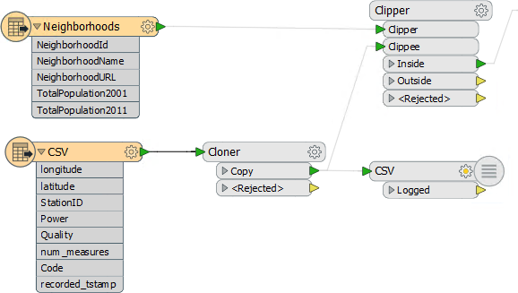
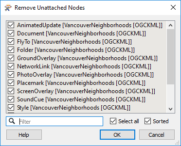
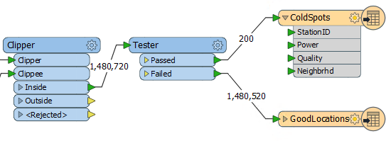
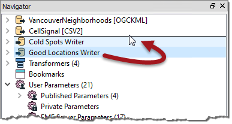

<!--Exercise Section-->

<table style="border-spacing: 0px;border-collapse: collapse;font-family:serif">
<tr>
<td style="vertical-align:middle;background-color:darkorange;border: 2px solid darkorange">
<i class="fa fa-cogs fa-lg fa-pull-left fa-fw" style="color:white;padding-right: 12px;vertical-align:text-top"></i>
Exercise 2
</td>
<td style="border: 2px solid darkorange;background-color:darkorange;color:white">
Cell Phone Signal Processing
</td>
</tr>

<tr>
<td style="border: 1px solid darkorange; font-weight: bold">Data</td>
<td style="border: 1px solid darkorange">City Neighborhoods (Google KML) Cell Phone Signals (CSV)</td>
</tr>

<tr>
<td style="border: 1px solid darkorange; font-weight: bold">Overall Goal</td>
<td style="border: 1px solid darkorange">Analyze and improve the workspace performance</td>
</tr>

<tr>
<td style="border: 1px solid darkorange; font-weight: bold">Demonstrates</td>
<td style="border: 1px solid darkorange">Improving Reader/Writer Performance</td>
</tr>

<tr>
<td style="border: 1px solid darkorange; font-weight: bold">Start Workspace</td>
<td style="border: 1px solid darkorange">C:\FMEData2017\Workspaces\DesktopAdvanced\Performance-Ex2-Begin.fmw</td>
</tr>

<tr>
<td style="border: 1px solid darkorange; font-weight: bold">End Workspace</td>
<td style="border: 1px solid darkorange">C:\FMEData2017\Workspaces\DesktopAdvanced\Performance-Ex2-Complete.fmw</td>
</tr>

</table>

If you recall, a close friend who works for a cell phone company has asked for your help in improving his FME workspace's performance. His project is to analyze cell phone signals; to filter out locations that receive a really poor signal, tag them with the neighborhood they belong to – to show which neighborhoods have poor coverage.

Now we’ve deconstructed the log and uncovered which areas are of concern, let’s start to clean up any performance issues with the Readers and Writers.

 **1) Start Workbench**
 Start Workbench and open the workspace C:\FMEData2017\Workspaces\DesktopAdvanced\Performance-Ex2-Begin.fmw
(or stick with Performance-Ex1-Begin.fmw if you have it open – it’s the same workspace).

The first thing we should do is ensure we’re logging all the required timestamps. So select Tools &gt; FME Options from the menubar in Workbench.

Click on the Translation icon (a green "play" button). Ensure that the Log File Defaults has “Log timestamp information” turned on.

Since the workspace doesn’t fail – it’s just a little slow – we aren’t debugging anything so make sure Log Debug is turned off. 

 **2) Assess Reader Performance**
 Let’s first assess how well the Readers are doing their job. It might be that they aren’t really the bottleneck in our workspace.

First check the original log file for the Emptying Factory Pipeline message.

<pre>
2017-03-21 09:37:30|  43.4|  0.0|INFORM|Emptying factory pipeline
</pre>

It occurs after 43.4 seconds, but let’s see if that’s accurate.

Select all of the objects after the feature types (i.e. transformers and Writer feature types). Press Ctrl+E to disable them (Ctrl+E is a toggle to Enable/Disable):

Run the workspace. The data will be read, but not processed or written.

Check the time taken to do this. On my machine the result is this:

<pre>
2017-03-21 12:51:33|   1.2|  0.0|INFORM|FME Session Duration: 2.3 seconds. (CPU: 0.8s user, 0.3s system)
2017-03-21 12:51:33|   1.2|  0.0|INFORM|END - ProcessID: 4492, peak process memory usage: 84192 kB...
</pre>

So it’s actually reading the data very quickly - only 2.3 seconds. So the figure in the original log is showing how FME is processing the data as it is being read. Still, as a matter of best practice we should check to see if we can find any improvements to be made.

---

<!--New Section--> 

<table style="border-spacing: 0px">
<tr>
<td style="vertical-align:middle;background-color:darkorange;border: 2px solid darkorange">
<i class="fa fa-bolt fa-lg fa-pull-left fa-fw" style="color:white;padding-right: 12px;vertical-align:text-top"></i>
NEW
</td>
</tr>

<tr>
<td style="border: 1px solid darkorange">

So, part of the extremely fast data reading is probably due to the Feature Tables functionality in 2017.  
  When all transformers support Feature Tables then processing data could be equally quick! But for now it looks like the data is being read as a Feature Table and then dropped back to normal features because the transformers used here do not yet support those capabilities.

</td>
</tr>
</table>

---

 **3) Check Data Filtering**
 The workspace is filtering data with a Tester. Is there any way that we could improve on our reading time by carrying out this test directly on the source data?

Firstly, we want all the data spatially, so there’s no use in setting any Search Envelope parameters (which don't exist on a CSV reader anyway).

Secondly, could we apply that test to the data as it is being read? Well, neither reader has a WHERE clause field, as neither is a database. So there really is not any way to speed up the reading of data by pre-filtering data.

 **4) Check Other Reader Issues**
 Are there any other issues with the readers that might be slowing performance? Yes, there are!

Firstly, notice that the KML reader that is reading the neighborhood data also includes a whole number of feature types that we aren’t interested in.

The only feature type we need is Neighborhoods, and that’s already connected into the Clipper transformer.

All the other feature types are producing data we don’t need. They might not be slowing us much, but they certainly won’t be speeding up the translation.

So, we should select all unconnected feature types on the canvas and delete them. The quickest way to do this is select Tools &gt; Remove &gt; Unattached from the menubar:

...and click OK to accept the removal of all unattached feature types.

Running this now I get:

<pre>
2017-03-21 13:02:08|   1.2|  0.0|INFORM|FME Session Duration: 1.3 seconds. (CPU: 0.9s user, 0.2s system)
2017-03-21 13:02:08|   1.2|  0.0|INFORM|END - ProcessID: 2788, peak process memory usage: 84084 kB...
</pre>

In this execise it's not a big difference, but it was never likely to be. It's always worth checking though.

 **5) Assess Writer Performance**
 You can - if you like - check the writer performance using the suggested technique in the content. For me the result without writing is this:

<pre>
2017-03-21 13:06:43| 161.6|  0.0|INFORM|FME Session Duration: 2 minutes 43.5 seconds. (CPU: 159.6s user, 1.9s system)
2017-03-21 13:06:43| 161.6|  0.0|INFORM|END - ProcessID: 2696, peak process memory usage: 1598560 kB...

</pre>

Compared to the full workspace we can say it's taking nearly four minutes to write the data. It's not quick, so let's look for the most obvious improvement: the order of the writers.

 **6) Set Writer Order**
 As mentioned, the best way to improve writer performance is to ensure the writer receiving the largest amount of data appears first in the Navigator window.

In this workspace there are two writers. One writes the problem (ColdSpot) locations. The other writes the good locations:

It's obvious which writer is handling the most data, and it is not currently the first to be processed, so let’s fix that. Click on the GoodLocations writer in the Navigator window and drag it above the Cold Spots writer:

Also make sure the workspace parameter *Translation &gt; Order Writers By* is set to *Position in Workbench Navigator*.

Re-enable any components of the workspace that were disabled, and run the full translation again. Remember, the original log reported the following results:

<pre>
INFORM|FME Session Duration: 6 minutes 38.7 seconds. (CPU: 274.1s user, 93.1s system)
INFORM|END - ProcessID: 2916, peak process memory usage: 2966832 kB, current process memory usage: 88072 kB
</pre>

Now, on my computer, I get the following:

<pre>
INFORM|FME Session Duration: 3 minutes 53.2 seconds. (CPU: 219.2s user, 11.7s system)
INFORM|END - ProcessID: 8452, peak process memory usage: 1598548 kB, current process memory usage: 81596 kB
</pre>

That’s way better. I’ve reduced the time taken by 30%+ from the original. Additionally, peak memory use has dropped by nearly 50% and system time is down 85%! If you look carefully at the log you will (probably) find that the message "Optimizing Memory Usage" is no longer present, meaning FME is no longer starved of enough memory.

---

<!--Exercise Congratulations Section--> 

<table style="border-spacing: 0px">
<tr>
<td style="vertical-align:middle;background-color:darkorange;border: 2px solid darkorange">
<i class="fa fa-thumbs-o-up fa-lg fa-pull-left fa-fw" style="color:white;padding-right: 12px;vertical-align:text-top"></i>
CONGRATULATIONS
</td>
</tr>

<tr>
<td style="border: 1px solid darkorange">

By completing this exercise you have learned how to:
<ul><li>Assess Reader performance</li>
<li>Check Readers for performance-improving parameters</li>
<li>Check Readers for performance-impacting issues</li>
<li>Assess Writer performance</li>
<li>Improve Writer performance by ordering Writers</li></ul>

</td>
</tr>
</table>
