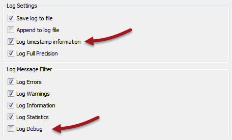
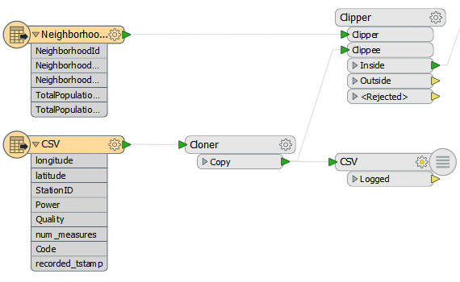
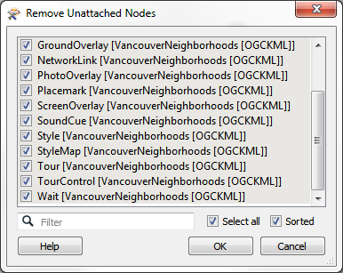
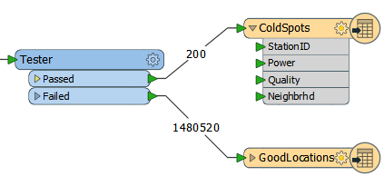

<!--Exercise Section-->
<!--NB: In GitBook world we don't give a number to exercises-->

<table style="border-spacing: 0px;border-collapse: collapse;font-family:serif">
<tr>
<td style="vertical-align:middle;background-color:darkorange;border: 2px solid darkorange">
<i class="fa fa-cogs fa-lg fa-pull-left fa-fw" style="color:white;padding-right: 12px;vertical-align:text-top"></i>
Exercise 2
</td>
<td style="border: 2px solid darkorange;background-color:darkorange;color:white">
Cell Phone Signal Processing
</td>
</tr>

<tr>
<td style="border: 1px solid darkorange; font-weight: bold">Data</td>
<td style="border: 1px solid darkorange">City Neighborhoods (Google KML) Cell Phone Signals (CSV)</td>
</tr>

<tr>
<td style="border: 1px solid darkorange; font-weight: bold">Overall Goal</td>
<td style="border: 1px solid darkorange">Analyze and improve the workspace performance</td>
</tr>

<tr>
<td style="border: 1px solid darkorange; font-weight: bold">Demonstrates</td>
<td style="border: 1px solid darkorange">Improving Reader/Writer Performance</td>
</tr>

<tr>
<td style="border: 1px solid darkorange; font-weight: bold">Start Workspace</td>
<td style="border: 1px solid darkorange">C:\FMEData2016\Workspaces\DesktopAdvanced\Performance-Ex2-Begin.fmw</td>
</tr>

<tr>
<td style="border: 1px solid darkorange; font-weight: bold">End Workspace</td>
<td style="border: 1px solid darkorange">C:\FMEData2016\Workspaces\DesktopAdvanced\Performance-Ex2-Complete.fmw</td>
</tr>

</table>

If you recall, a close friend who works for a cell phone company has asked for your help in improving his FME workspace's performance. His project is to analyze cell phone signals; to filter out locations that receive a really poor signal, tag them with the neighborhood they belong to – to show which neighborhoods have poor coverage.

Now we’ve deconstructed the log and uncovered which areas are of concern, let’s start to clean up any performance issues with the Readers and Writers.

 **1) Start Workbench**
 Start Workbench and open the workspace C:\FMEData2016\Workspaces\DesktopAdvanced\Performance-Ex2-Begin.fmw
(or stick with Performance-Ex1-Begin.fmw if you have it open – it’s the same workspace).

The first thing we should do is ensure we’re logging all the required timestamps. So select Tools > FME Options from the menubar in Workbench.

Click on the Runtime icon. Ensure that the Log File Defaults has “Log timestamp information” turned on.

Since the workspace doesn’t fail – it’s just a little slow – we aren’t debugging anything so make sure Log Debug is turned off. 

 **2) Assess Reader Performance**
 Let’s first assess how well the Readers are doing their job. It might be that they aren’t really the bottleneck in our workspace.

First check the original log file for the Emptying Factory Pipeline message.

<pre>
2016-03-16 12:00:01|  42.3|  0.0|INFORM|Emptying factory pipeline
</pre>

It occurs after 42.3 seconds, but let’s see if that’s accurate.

Select all of the objects after the feature types (i.e. transformers and Writer feature types). Press Ctrl+E to disable them (Ctrl+E is a toggle to Enable/Disable):

Run the workspace. The data will be read, but not processed or written.

Check the time taken to do this. On my machine the result is this:

<pre>
2016-03-16 14:25:01|   3.7|  0.0|INFORM|FME Session Duration: 4.1 seconds. (CPU: 3.4s user, 0.2s system)
2016-03-16 14:25:01|   3.7|  0.0|INFORM|END - ProcessID: 51976, peak process memory usage: 73304 kB
</pre>

So it’s actually reading the data very quickly - only 4.1 seconds. So the figure in the original log is showing how FME is processing the data as it is being read. Still, as a matter of best practice we should check to see if we can find any improvements to be made. 

 **3) Check Data Filtering**
 The workspace is filtering data with a Tester. Is there any way that we could improve on our reading time by carrying out this test directly on the source data?

Firstly, we want all the data spatially, so there’s no use in setting any Search Envelope parameters. In any case the CSV data is not – initially – spatial and has no such parameters.

Secondly, could we apply that test to the data as it is being read? Well, neither Reader has a WHERE clause field, as neither is a database. The CSV Reader does have filter parameters:

...but a glance at the Readers and Writers Manual shows this is a regular expression, not really suitable for filtering by an arithmetic expression.

 **4) Check Other Reader Issues**
 Are there any other issues with the Readers that might be slowing performance? Yes, there are!

Firstly, notice that the KML Reader that is reading the neighborhood data also includes a whole number of feature types that we aren’t interested in.

The only feature type we need is Neighborhoods, and that’s already connected into the Clipper transformer.

All the other feature types are producing data we don’t need. They might not be slowing us much, but they certainly won’t be speeding up the translation.

So, we should select all unconnected feature types on the canvas and delete them. The quickest way to do this is select Tools > Remove Unattached from the menubar:

...and click OK to accept the removal of all unattached feature types.

Running this now I get:

<pre>
2016-03-16 14:32:22|   3.7|  0.0|INFORM|FME Session Duration: 3.7 seconds. (CPU: 3.5s user, 0.2s system)
2016-03-16 14:32:22|   3.7|  0.0|INFORM|END - ProcessID: 52636, peak process memory usage: 71808 kB
</pre>

In this execise it's not a big difference, but it's always worth checking.

 **5) Assess Writer Performance**
 You can - if you like - check the writer performance (using the two-step technique in the notes). However, for me the result without writing is this:

<pre>
INFORM|FME Session Duration: 4 minutes 30.6 seconds. (CPU: 245.2s user, 22.6s system)
INFORM|END - ProcessID: 51544, peak process memory usage: 1776868 kB
</pre>

So we can say it's taking nearly seven minutes to write the data. Reading it back with a Player and writing the data confirms this figure. It's not quick, so let's look for the most obvious improvement: the order of the Writers.

 **6) Set Writer Order**
 As mentioned, the best way to improve Writer performance is to ensure the Writer receiving the largest amount of data appears first in the Navigator window.

In this workspace there are two Writers. One writes the problem (ColdSpot) locations. The other writes the good locations:

It's obvious which Writer is handling the most data, and it is not currently the first to be processed, so let’s fix that. Click on the GoodLocations Writer in the Navigator window and drag it above the Cold Spots writer:

Also make sure the advanced workspace parameter *Order Writers By* is set to *Position in Workbench Navigator*.

Re-enable any components of the workspace that were disabled, and run the full translation again. Remember, the original log reports the following results:

<pre>
INFORM|FME Session Duration: 11 minutes 6.5 seconds. (CPU: 306.7s user, 37.8s system)
INFORM|END - ProcessID: 50764, peak process memory usage: 2966368 kB
</pre>

Now, on my computer, I get the following:

<pre>
INFORM|FME Session Duration: 4 minutes 1.9 seconds. (CPU: 219.7s user, 19.4s system)
INFORM|END - ProcessID: 46312, peak process memory usage: 1776304 kB
</pre>

That’s way better. I’ve reduced the time taken by 60% from the original. Additionally, peak memory use has dropped by nearly 50%!
