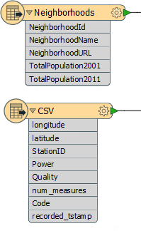
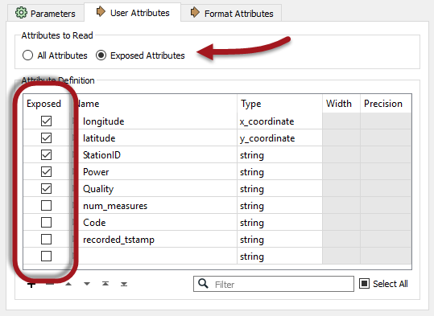
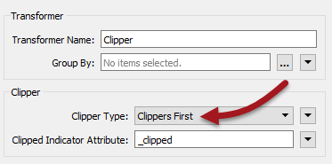
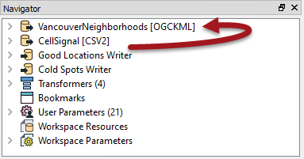
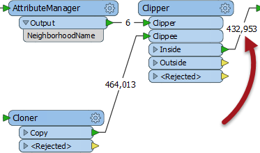
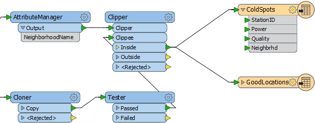
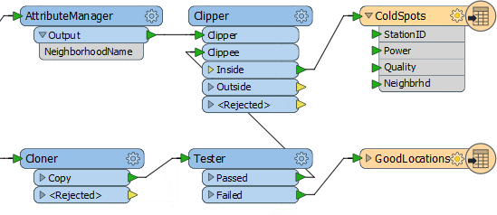

<!--Exercise Section-->

<table style="border-spacing: 0px;border-collapse: collapse;font-family:serif">
<tr>
<td style="vertical-align:middle;background-color:darkorange;border: 2px solid darkorange">
<i class="fa fa-cogs fa-lg fa-pull-left fa-fw" style="color:white;padding-right: 12px;vertical-align:text-top"></i>
Exercise 3
</td>
<td style="border: 2px solid darkorange;background-color:darkorange;color:white">
Cell Phone Signal Processing - Transformation Performance
</td>
</tr>

<tr>
<td style="border: 1px solid darkorange; font-weight: bold">Data</td>
<td style="border: 1px solid darkorange">City Neighborhoods (Google KML) Cell Phone Signals (CSV)</td>
</tr>

<tr>
<td style="border: 1px solid darkorange; font-weight: bold">Overall Goal</td>
<td style="border: 1px solid darkorange">Analyze and improve the workspace performance</td>
</tr>

<tr>
<td style="border: 1px solid darkorange; font-weight: bold">Demonstrates</td>
<td style="border: 1px solid darkorange">Improving Transformation Performance</td>
</tr>

<tr>
<td style="border: 1px solid darkorange; font-weight: bold">Start Workspace</td>
<td style="border: 1px solid darkorange">C:\FMEData2017\Workspaces\DesktopAdvanced\Performance-Ex3-Begin.fmw</td>
</tr>

<tr>
<td style="border: 1px solid darkorange; font-weight: bold">End Workspace</td>
<td style="border: 1px solid darkorange">C:\FMEData2017\Workspaces\DesktopAdvanced\Performance-Ex3-Complete.fmw C:\FMEData2017\Workspaces\DesktopAdvanced\Performance-Ex3-Complete-Advanced.fmw</td>
</tr>

</table>

You've been working on improving the performance of a friend's workspace. His project is to analyze cell phone signals; to filter out locations that receive a really poor signal, tag them with the neighborhood they belong to – to show which neighborhoods have poor coverage.

So far you’ve deconstructed the log, uncovered areas of concern, and cleaned up the readers and writers as much as possible. 

Now let’s look into using our new knowledge of transformation performance to try and speed up the workspace a bit more.

 **1) Start Workbench**
 Start FME Workbench and open the workspace Performance-Ex3-Begin.fmw (or the workspace from the previous exercise, if you still have it open).

 **2) Check for Extra Transformers**
 The first aspect of the workspace to check is for any extra transformers that aren’t needed and that will be slowing performance. The most obvious is the Logger transformer:

This was presumably used for debugging the original workspace but is now doing nothing for us. So, delete the Logger transformer attached to the CSV Reader.

---

<!--Tip Section--> 

<table style="border-spacing: 0px">
<tr>
<td style="vertical-align:middle;background-color:darkorange;border: 2px solid darkorange">
<i class="fa fa-info-circle fa-lg fa-pull-left fa-fw" style="color:white;padding-right: 12px;vertical-align:text-top"></i>
TIP
</td>
</tr>

<tr>
<td style="border: 1px solid darkorange">

Another way to do this - particularly on a large workspace - is using Tools &gt; Remove &gt; Loggers and Tools &gt; Remove &gt; Inspectors on the FME Workbench menubar.

</td>
</tr>
</table>

---

 **3) Remove Attributes**
 Another quick fix we can do is to remove any attributes we don’t need, right at the start of the workspace. Check the schemas of the reader and writer feature types:

The readers contain quite a lot of attributes, on both datasets. The writers contain very few attributes, and the GoodLocations feature type has none at all. This suggests we can remove some attributes that are not going to be needed in the output.

Put an AttributeManager transformer after the Neighborhood feature type, but before the Clipper, and set it up to keep only the NeighborhoodName attribute:

---

<table style="border-spacing: 0px">
<tr>
<td style="vertical-align:middle;background-color:darkorange;border: 2px solid darkorange">
<i class="fa fa-quote-left fa-lg fa-pull-left fa-fw" style="color:white;padding-right: 12px;vertical-align:text-top"></i>
Jake Speedie says…
</td>
</tr>

<tr>
<td style="border: 1px solid darkorange">

You might be thinking, "is it really worth removing attributes from only six neighborhood features?"
 The answer is a resounding "YES" - because those attributes are being copied on to 1.6 million CSV features.

</td>
</tr>
</table>

---

Now check the feature type parameters for the CSV reader. Notice the User Attributes tab has a parameter called Attributes to Read. Ensure this parameter is set to "Exposed Attributes" and uncheck the boxes against *num_measures*, *code*, and *recorded_tstamp*:

This (new for 2017) capability will ensure that the CSV reader only reads the attributes we absolutely required. Reducing attributes like that should definitely reduce the amount of memory being used. On my computer it goes from this:

<pre>
INFORM|FME Session Duration: 3 minutes 53.2 seconds. (CPU: 219.2s user, 11.7s system)
INFORM|END - ProcessID: 8452, peak process memory usage: 1598548 kB, current process memory usage: 81596 kB
</pre>

...to this:

<pre>
INFORM|FME Session Duration: 3 minutes 33.0 seconds. (CPU: 198.6s user, 12.2s system)
INFORM|END - ProcessID: 6500, peak process memory usage: 1478796 kB, current process memory usage: 82468 kB
</pre>

A nice reduction in time and memory use just from removing some excess attributes and an unwanted Logger transformer.

 **4) Check Group-Based Processes**
 The Clipper is a group-based transformer; it has to be since it is processing both the neighborhoods and the cell signal data. If you run the translation now - as in the screenshot below - you would see that the features build up in front of the transformer, but none are released until the processing is fully complete:

So we should check if there’s a way to turn the transformer into one that operates on a feature basis.  

Inspect the Clipper parameters. Notice that there is a parameter for Clipper Type. Change this to Clippers First:

This will make this virtually a feature-based transformer. Each clippee will not need to be cached because the full set of clippers is already known.

However, we have to make sure the Clippers really do arrive first, and this we can do by making the Clippers the first reader in the Navigator window.

So, click the VancouverNeighborhoods reader in the Navigator window and drag it above the CSV Reader (if necessary):

Run the workspace now and features will emerge from the transformer as they arrive, like so:

 **5) Run Workspace**
 Now run the workspace to see what we have so far.

Remember, after reader improvements we had this result:

<pre>
INFORM|FME Session Duration: 3 minutes 53.2 seconds. (CPU: 219.2s user, 11.7s system)
INFORM|END - ProcessID: 8452, peak process memory usage: 1598548 kB, current process memory usage: 81596 kB
</pre>

After removing attributes we had this:

<pre>
INFORM|FME Session Duration: 3 minutes 33.0 seconds. (CPU: 198.6s user, 12.2s system)
INFORM|END - ProcessID: 6500, peak process memory usage: 1478796 kB, current process memory usage: 82468 kB
</pre>

And after setting the Clippers First parameter we now have this:

<pre>
INFORM|FME Session Duration: 3 minutes 41.5 seconds. (CPU: 208.4s user, 10.5s system)
INFORM|END - ProcessID: 6040, peak process memory usage: 91320 kB, current process memory usage: 79908 kB
</pre>

That's a stunning improvement in memory use, just from "unblocking" a single transformer. Admittedly the time is not better, but it would have been if we hadn't already reduced the prior memory by so much. 

 **6) Rearrange Transformers**
 Another important part of performance is to assess the order of transformers (as we did with the AttributeManger/Cloner) to ensure no excess work is being performed.

Looking at the workspace, the Neighborhood attribute is only required by the bad (low power) features. It isn’t needed by the good locations.

But, we’re still attaching the information onto all of the features, good or bad.

Can we prevent that? Yes! We can move the Tester transformer to before the Clipper. Then we aren't attaching useless information to features that don't need it.

So, select the Tester transformer and press Ctrl+X to cut it from the workspace. Notice that the connections are healed automatically, though they aren’t quite right.

Now press Ctrl+V to paste the Tester back into the workspace, but unconnected. Now drag it into the CSV data stream, between the Cloner and the Clipper:

Finally, let’s fix the feature mapping.

Move the connection from Clipper:Inside &gt; GoodLocations to Tester:Failed &gt; GoodLocations:

Re-run the workspace. The result will be something like this:

<pre>
INFORM|FME Session Duration: 1 minute 50.1 seconds. (CPU: 99.7s user, 9.0s system)
INFORM|END - ProcessID: 4896, peak process memory usage: 91452 kB...
</pre>

Hurrah! Compared to the original log we’re over three times faster with 95% less memory use! Your friend should be very happy with what we've managed to achieve with his workspace.

---

<!--Exercise Congratulations Section--> 

<table style="border-spacing: 0px">
<tr>
<td style="vertical-align:middle;background-color:darkorange;border: 2px solid darkorange">
<i class="fa fa-thumbs-o-up fa-lg fa-pull-left fa-fw" style="color:white;padding-right: 12px;vertical-align:text-top"></i>
CONGRATULATIONS
</td>
</tr>

<tr>
<td style="border: 1px solid darkorange">

By completing this exercise you have learned how to:
<ul><li>Assess transformation performance</li>
<li>Improve transformation performance by removing excess transformers</li>
<li>Improve transformation performance by removing excess attributes</li>
<li>Improve transformation performance by using group-based parameters</li>
<li>Improve transformation performance by rearranging transformers</li>
<li>Use the PointCloud XYZ Reader to handle CSV data</li></ul>

</td>
</tr>
</table>
