<!--Exercise Section-->
<!--NB: In GitBook world we don't give a number to exercises-->

<table style="border-spacing: 0px;border-collapse: collapse;font-family:serif">
<tr>
<td style="vertical-align:middle;background-color:darkorange;border: 2px solid darkorange">
<i class="fa fa-cogs fa-lg fa-pull-left fa-fw" style="color:white;padding-right: 12px;vertical-align:text-top"></i>
Exercise 3
</td>
<td style="border: 2px solid darkorange;background-color:darkorange;color:white">
Cell Phone Signal Processing
</td>
</tr>

<tr>
<td style="border: 1px solid darkorange; font-weight: bold">Data</td>
<td style="border: 1px solid darkorange">City Neighborhoods (Google KML) Cell Phone Signals (CSV)</td>
</tr>

<tr>
<td style="border: 1px solid darkorange; font-weight: bold">Overall Goal</td>
<td style="border: 1px solid darkorange">Analyze and improve the workspace performance</td>
</tr>

<tr>
<td style="border: 1px solid darkorange; font-weight: bold">Demonstrates</td>
<td style="border: 1px solid darkorange">Improving Transformation Performance</td>
</tr>

<tr>
<td style="border: 1px solid darkorange; font-weight: bold">Start Workspace</td>
<td style="border: 1px solid darkorange">C:\FMEData2016\Workspaces\DesktopAdvanced\Performance-Ex3-Begin.fmw</td>
</tr>

<tr>
<td style="border: 1px solid darkorange; font-weight: bold">End Workspace</td>
<td style="border: 1px solid darkorange">C:\FMEData2016\Workspaces\DesktopAdvanced\Performance-Ex3-Complete.fmw C:\FMEData2016\Workspaces\DesktopAdvanced\Performance-Ex3-Complete-Advanced.fmw</td>
</tr>

</table>

You've been working on improving the performance of a friend's workspace. His project is to analyze cell phone signals; to filter out locations that receive a really poor signal, tag them with the neighborhood they belong to – to show which neighborhoods have poor coverage.

So far you’ve deconstructed the log, uncovered areas of concern, and cleaned up the Readers and Writers as much as possible. 

Now let’s lookin into using our new knowledge of transformation performance to try and speed up the workspace a bit more.

 **1) Start Workbench**
 Start FME Workbench and open the workspace Performance-Ex3-Begin.fmw (or the workspace from the previous exercise, if you still have it open).

 **2) Check for Extra Transformers**
 The first aspect of the workspace to check is for any extra transformers that aren’t needed and that will be slowing performance. The most obvious is the Logger transformer:

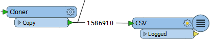

This was presumably used for debugging the original workspace but is now doing nothing for us. So, delete the Logger transformer attached to the CSV Reader.

 **3) Remove Attributes**
 Another quick fix we can do is to remove any attributes we don’t need, right at the start of the workspace. Check the schemas of the Reader and Writer feature types:

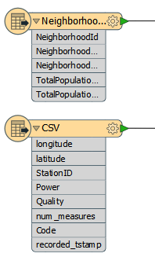

The Readers contain quite a lot of attributes, on both datasets. The Writers contain very few attributes, and the GoodLocations feature type has none at all. This suggests we can remove some attributes that are not going to be needed in the output.

Put an AttributeManager transformer after the Neighborhood feature type, but before the Clipper, and set it up to keep only the NeighborhoodName attribute:

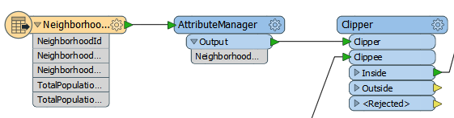

---

<table style="border-spacing: 0px">
<tr>
<td style="vertical-align:middle;background-color:darkorange;border: 2px solid darkorange">
<i class="fa fa-quote-left fa-lg fa-pull-left fa-fw" style="color:white;padding-right: 12px;vertical-align:text-top"></i>
Jake Speedie says…
</td>
</tr>

<tr>
<td style="border: 1px solid darkorange">

You might be thinking, "is it really worth removing attributes from only six neighborhood features?"
 The answer is a resounding "YES" - because those attributes are being copied on to 1.6 million CSV features.

</td>
</tr>
</table>

---

Now we can place a second AttributeManager to remove excess attributes from the CSV (signal) data. I know we're supposed to ignore that Cloner transformer, but the AttributeManager should definitely be *before* it. That way you're not cloning extra attributes for no reason.

So place an AttributeManager before the Cloner and use it to remove all attributes except StationID, Power, and Quality:

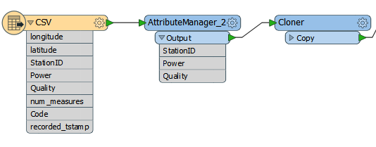

Reducing attributes like that should definitely reduce the amount of memory being used. On my computer it goes from this:

<pre>
INFORM|FME Session Duration: 4 minutes 1.9 seconds. (CPU: 219.7s user, 19.4s system)
INFORM|END - ProcessID: 46312, peak process memory usage: 1776304 kB
</pre>

...to this:

<pre>
INFORM|FME Session Duration: 3 minutes 36.2 seconds. (CPU: 194.4s user, 19.9s system)
INFORM|END - ProcessID: 53072, peak process memory usage: 1349336 kB
</pre>

A nice reduction in time and memory use just from removing some excess attributes and an unwanted Logger transformer.

 **4) Check Group-Based Processes**
 The Clipper is a group-based transformer; it has to be since it is processing both the neighborhoods and the cell signal data. If you run the translation now - as in the screenshot below - you would see that the features build up in front of the transformer, but none are released until the processing is fully complete:

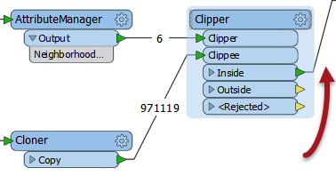

So we should check if there’s a way to turn the transformer into one that operates on a feature basis.  

Open the Clipper parameters. Notice that there is a parameter for Clipper Type. Change this to Clippers First:

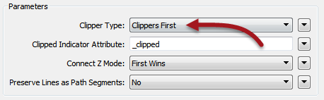

This will make this virtually a feature-based transformer. Each clippee will not need to be cached because the full set of clippers is already known.

However, we have to make sure the Clippers really do arrive first, and this we can do by making the Clippers the first Reader in the Navigator window.

So, click the VancouverNeighborhoods Reader in the Navigator window and drag it above the CSV Reader:

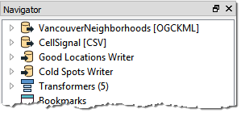

Run the workspace now and features will emerge from the transformer as they arrive, like so:

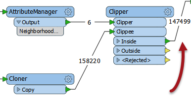

***NB:*** *I assume the numbers in and out of the transformer are different because FME doesn't update the counts for every single feature (that would just slow down the translation).*

 **5) Run Workspace**
 Now run the workspace to see what we have so far.

Remember, after Reader improvements we had this result:
<pre>
INFORM|FME Session Duration: 4 minutes 1.9 seconds. (CPU: 219.7s user, 19.4s system)
INFORM|END - ProcessID: 46312, peak process memory usage: 1776304 kB
</pre>

After removing attributes we had this:

<pre>
INFORM|FME Session Duration: 3 minutes 36.2 seconds. (CPU: 194.4s user, 19.9s system)
INFORM|END - ProcessID: 53072, peak process memory usage: 1349336 kB
</pre>

And after setting the Clippers First parameter we now have this:

<pre>
INFORM|FME Session Duration: 3 minutes 41.1 seconds. (CPU: 200.7s user, 18.7s system)
INFORM|END - ProcessID: 52820, peak process memory usage: 96220 kB
</pre>

That's a stunning improvement in memory use, just from "unblocking" a single transformer. Can we do even better?

 **6) Rearrange Transformers**
 Another important part of performance is to assess the order of transformers (as we did with the AttributeManger/Cloner) to ensure no excess work is being performed.

Looking at the workspace, the Neighborhood attribute is only required by the bad (low power) features. It isn’t needed by the good locations.

But, we’re still attaching the information onto all of the features, good or bad.

Can we prevent that? Yes! We can move the Tester transformer to before the Clipper. Then we aren't attaching useless information to features that don't need it.

So, select the Tester transformer and press Ctrl+X to cut it from the workspace. Notice that the connections are healed automatically, though they aren’t quite right.

Now press Ctrl+V to paste the Tester back into the workspace, but unconnected. Now drag it into the CSV data stream, between the Cloner and the Clipper:

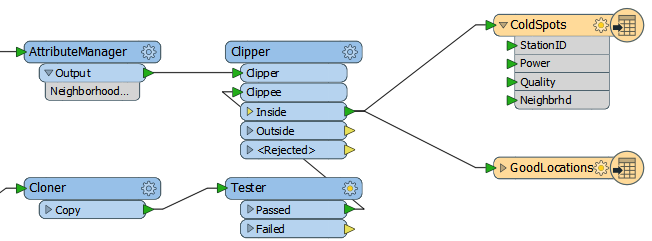

Finally, let’s fix the feature mapping.

Move the connection from Clipper:Inside &gt; GoodLocations to Tester:Failed &gt; GoodLocations:

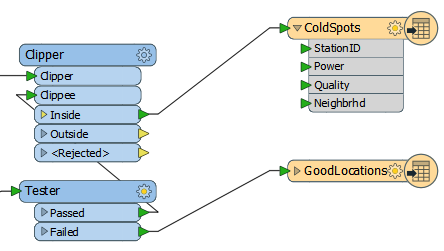

Re-run the workspace. The result will be something like this:

<pre>
INFORM|FME Session Duration: 1 minute 49.0 seconds. (CPU: 89.6s user, 18.7s system)
INFORM|END - ProcessID: 53180, peak process memory usage: 95240 kB
</pre>

Hurrah! Compared to the original log we’re over five times faster with 95% less memory use! Your friend should be very happy with what we've managed to achieve with his workspace.

---

<table style="border-spacing: 0px">
<tr>
<td style="vertical-align:middle;background-color:darkorange;border: 2px solid darkorange">
<i class="fa fa-cogs fa-lg fa-pull-left fa-fw" style="color:white;padding-right: 12px;vertical-align:text-top"></i>
Advanced Exercise
</td>
</tr>

<tr>
<td style="border: 1px solid darkorange">

There is, perhaps, one other way we can upgrade this workspace’s performance. It’s radical and unintuitive, but it might just work! If you have time to try this, then it is an interesting solution.

</td>
</tr>
</table>

---

Do you remember the previous tip about using the PointCloud XYZ reader for CSV data? Follow these instructions to see what effect that technique has.

 **7) Save Workspace**
 Save a copy of the workspace completed in the steps above.

 **8) Delete Reader/Transformers**
 Firstly, delete the CSV Reader (and its feature type), the AttributeManager for the CSV data, and the Tester transformer too. For a fair comparison, keep the Cloner.

 **9) Add Reader**
 Now select Reader > Add New Reader and in the Add Reader dialog enter the following values:

<table style="border: 0px">

<tr>
<td style="font-weight: bold">Reader Format</td>
<td style="">Point Cloud XYZ</td>
</tr>

<tr>
<td style="font-weight: bold">Reader Dataset</td>
<td style="">C:\FMEData2016\Data\CellSignals\CellSignal.csv</td>
</tr>

</table>

The Reader parameters are very important here, so click the Parameters button.

Firstly make sure the Separator Character is set to a comma (not “space”). Also check the option for "File Has Field Names."

Then in the Point Cloud Component Map, set the longitude and latitude attributes to X/Y components:

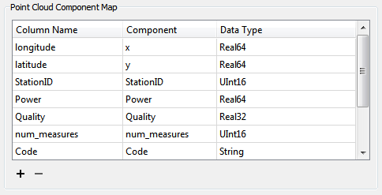

It’s important to get this exactly right, as you will have to re-add the Reader to fix any problems.

Click OK to close the dialog and OK again to add the Reader. Connect the new feature type to the Cloner Input port.

 **10) Add PointCloudFilter**
 A point cloud feature is not the same as a number of point features, so we will have to convert the data at some stage. However, let’s see if we can make use of some point cloud functionality first.

Add a PointCloudFilter transformer to the workspace after the Cloner. This is the point cloud equivalent to a Tester and may be quicker than testing each point individually:

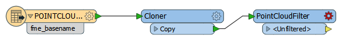

Open the parameters dialog for this transformer.

Under Expression select the option to open an arithmetic editor. In the editor, look under the list of Point Cloud components to the left and double-click on <user component> at the bottom of that list. Enter Power as the component name.

Now click on the end of the expression, enter a less than operator (<) and type the value -125 (make sure you put -125 and not +125). The dialog should look like so:

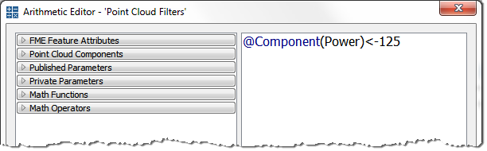

Click OK to close that dialog. Enter a new port name of Bad Signal. Click OK.

The workspace now looks like this, with a new output port:

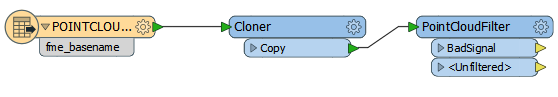

 **11) Add PointCloudCoercers**
 Add two PointCloudCoercer transformers to the workspace, one attached to each output from the PointCloudFilter. One output should be directed to the Clipper:Clippee port, the other to the GoodLocations output feature type:

The final step is to set the coercer parameters and expose some attributes. Open the parameters dialogs for each of the PointCloudCoercers in turn. In both cases, set Output Geometry to Individual Points.

Again, in both cases, set Preserve Point Components As to Attributes.

For the <Unfiltered> data, which doesn’t need attributes, leave the Point Components to Preserve section empty. For the Bad Signal data, enter the following component names to extract them as attributes:

- StationID
- Power
- Quality

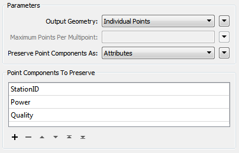

 **12) Save and Run Workspace**
 Now save and run the workspace. This time the log will report the performance as:

<pre>INFORM|FME Session Duration: 1 minute 18.7 seconds. (CPU: 61.9s user, 16.0s system)
INFORM|END - ProcessID: 46136, peak process memory usage: 124624 kB
</pre>

Well done! The memory use is up slightly, but the workspace is running faster than ever.