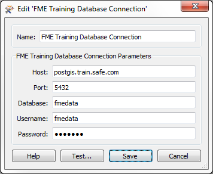
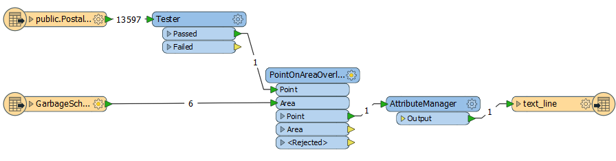
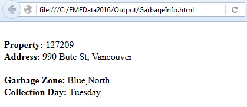
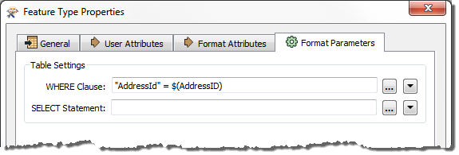

<!--Exercise Section-->

<table style="border-spacing: 0px;border-collapse: collapse;font-family:serif">
<tr>
<td style="vertical-align:middle;background-color:darkorange;border: 2px solid darkorange">
<i class="fa fa-cogs fa-lg fa-pull-left fa-fw" style="color:white;padding-right: 12px;vertical-align:text-top"></i>
Exercise 4
</td>
<td style="border: 2px solid darkorange;background-color:darkorange;color:white">
Garbage Collection Day Project
</td>
</tr>

<tr>
<td style="border: 1px solid darkorange; font-weight: bold">Data</td>
<td style="border: 1px solid darkorange">Addresses (PostGIS or Esri Geodatabase) Garbage Zones (Esri Geodatabase)</td>
</tr>

<tr>
<td style="border: 1px solid darkorange; font-weight: bold">Overall Goal</td>
<td style="border: 1px solid darkorange">Analyze and improve the workspace performance</td>
</tr>

<tr>
<td style="border: 1px solid darkorange; font-weight: bold">Demonstrates</td>
<td style="border: 1px solid darkorange">Database Optimization</td>
</tr>

<tr>
<td style="border: 1px solid darkorange; font-weight: bold">Start Workspace</td>
<td style="border: 1px solid darkorange">C:\FMEData2017\Workspaces\DesktopAdvanced\Performance-Ex4-PostGIS-Begin.fmw C:\FMEData2017\Workspaces\DesktopAdvanced\Performance-Ex4-Geodatabase-Begin.fmw</td>
</tr>

<tr>
<td style="border: 1px solid darkorange; font-weight: bold">End Workspace</td>
<td style="border: 1px solid darkorange">C:\FMEData2017\Workspaces\DesktopAdvanced\Performance-Ex4-PostGIS-Complete.fmw C:\FMEData2017\Workspaces\DesktopAdvanced\Performance-Ex4-Geodatabase-Complete.fmw</td>
</tr>

</table>

Members of the public often call the city to ask what day their garbage collection is. To help the city has an internal system hosted on FME Server. Members of the planning department can lookup an address ID, enter it into a published parameter, and the system retrieves the garbage pickup information.

The system works, but is perhaps slower than it should be. Let’s run this short exercise to discover why.

---

<!--Person X Says Section-->

<table style="border-spacing: 0px">
<tr>
<td style="vertical-align:middle;background-color:darkorange;border: 2px solid darkorange">
<i class="fa fa-quote-left fa-lg fa-pull-left fa-fw" style="color:white;padding-right: 12px;vertical-align:text-top"></i>
Miss Vector says...
</td>
</tr>

<tr>
<td style="border: 1px solid darkorange">

This exercise uses either a PostGIS database hosted on Amazon RDS or an ESRI Geodatabase. Be sure to open the correct workspace and follow the correct instructions for your format.

</td>
</tr>
</table>

---

 **1) Create Database Connection (PostGIS Only)**
 To use a PostGIS database as source requires a connection to it. 

In a web browser visit [http://fme.ly/database](http://fme.ly/database) - this will show the parameters for a PostGIS database running on Amazon RDS.

Start Workbench and select Tools > FME Options from the menubar

Click on the icon for the Database Connections category, then click the [+] button to create a new connection. In the "Add Database Connection" dialog, first select PostgreSQL as the database type. Then enter the connection parameters obtained through the web browser.

Give the connection a name (if you call it *FME Training Database Connection* it will match the starting workspace) and click Save. 

***NB:*** *Yes, the password is fmedata as well!*

Then click OK to close the FME Options dialog.

 **2) Open and Run Workspace**
 Open the workspace C:\FMEData2017\Workspaces\DesktopAdvanced\Exercise2d-PostGIS-Begin.fmw or Exercise2d-Geodatabase-Begin.fmw 

The workspace looks something like this:

Basically a published parameter accepts an address ID. The postal address database is read and filtered against this ID. The chosen address is used in a spatial overlay against garbage zones. The result is formatted in HTML and written out with a Text File Writer.

---

<!--Updated Section--> 

<table style="border-spacing: 0px">
<tr>
<td style="vertical-align:middle;background-color:darkorange;border: 2px solid darkorange">
<i class="fa fa-bolt fa-lg fa-pull-left fa-fw" style="color:white;padding-right: 12px;vertical-align:text-top"></i>
.1 UPDATE
</td>
</tr>

<tr>
<td style="border: 1px solid darkorange">

FME2016.1 now includes a dedicated HTML format writer, which could be used in place of the Text File writer in this exercise.

</td>
</tr>
</table>

---

To get a comparison, run the workspace. Use Prompt Mode to be prompted for an address ID. A suitable address ID to use is 127209 (PostGIS) or 6135 (Geodatabase).

The result, in a web browser, is this:

The performance will read like this:

**PostGIS**

<pre>
INFORM|FME Session Duration: 9.2 seconds. (CPU: 3.6s user, 0.5s system)
INFORM|END - ProcessID: 11576, peak process memory usage: 130092 kB
</pre>

**Geodatabase**

<pre>
INFORM|FME Session Duration: 2.2 seconds. (CPU: 1.9s user, 0.2s system)
INFORM|END - ProcessID: 9376, peak process memory usage: 86648 kB
</pre>

The Geodatabase is quicker because it is being read from your own file system, not a remote database.

 **3) Set Up WHERE Clause**
 Neither PostGIS or Geodatabase have a WHERE clause for the Reader itself, but their feature types do. So open the properties dialog for the PostalAddress Reader feature type and click the Format Parameters tab.

In the WHERE Clause parameter enter: 

**PostGIS**
<pre>
"AddressId" = $(AddressID)
</pre>

**Geodatabase**
<pre>
OBJECTID = $(AddressID)
</pre>

 

For PostGIS, be sure to notice the lower-case "d" in the "Id" part of the field name! Also note the difference in use of quotes between the two formats.

 **4) Delete Tester**
 Now we have the WHERE clause, the Tester transformer is no longer required, so delete it.

 **5) Re-Run Workspace**
 Re-run the workspace. This time only 1 feature is read from the database. The performance improves accordingly:

**PostGIS**

<pre>
INFORM|FME Session Duration: 5.7 seconds. (CPU: 2.4s user, 0.4s system)
INFORM|END - ProcessID: 3208, peak process memory usage: 128836 kB
</pre>

**Geodatabase**

<pre>
INFORM|FME Session Duration: 0.6 seconds. (CPU: 0.5s user, 0.1s system)
INFORM|END - ProcessID: 10728, peak process memory usage: 86248 kB
</pre>

Memory usage hasn’t improved, but the translation ran faster.

---

<!--Exercise Congratulations Section--> 

<table style="border-spacing: 0px">
<tr>
<td style="vertical-align:middle;background-color:darkorange;border: 2px solid darkorange">
<i class="fa fa-thumbs-o-up fa-lg fa-pull-left fa-fw" style="color:white;padding-right: 12px;vertical-align:text-top"></i>
CONGRATULATIONS
</td>
</tr>

<tr>
<td style="border: 1px solid darkorange">

By completing this exercise you have learned how to:
<ul><li>Create a database connection</li>
<li>Use a SQL WHERE clause to avoid reading all data</li></ul>

</td>
</tr>
</table>
