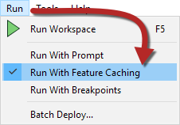
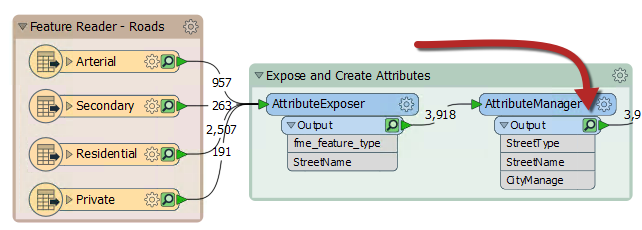
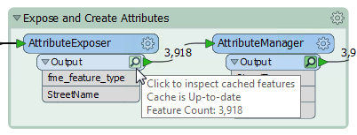
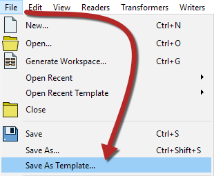
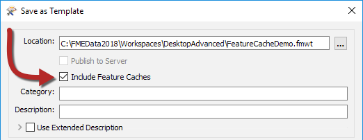

<!-- Copied from basic due to new functionality-->
<!--For 2018 this content is fine, since this is new functionality. For 2019 it should be expanded on to be truly more advanced-->

#Feature Caching

Sometimes it is important to inspect data at any step of the translation. Adding an Inspector transformer at every step would be tiresome, so instead FME has an option to cache data automatically. 

This behavior is activated using Run > Run with Feature Caching on the menubar:

With this option active, FME generates caches at every step of the translation when the workspace is run:

The caches are indicated by small icons on each object. In the above screenshot, the caches are green, but they can change to yellow or red depending on how fresh the data is. 

---

<!--New Section--> 

<table style="border-spacing: 0px">
<tr>
<td style="vertical-align:middle;background-color:darkorange;border: 2px solid darkorange">
<i class="fa fa-bolt fa-lg fa-pull-left fa-fw" style="color:white;padding-right: 12px;vertical-align:text-top"></i>
NEW
</td>
</tr>

<tr>
<td style="border: 1px solid darkorange">

Run with Feature Caching is essentially the same as Run with Full Inspection in prior versions of FME. It has been renamed in FME2018 to better match new functionality that takes advantage of these caches.

</td>
</tr>
</table>

---

##Inspecting Cached Features

Cached features can be inspected by simply clicking on the icon on a particular object. 

---

##Saving Caches 

Caches can be saved in the workspace so work can continue later without having to re-run the entire workspace. This can be done by saving the workspace as a template file. 

This is done by selecting File > Save As Template... on the menu bar:

Then when saving the template file, enable Include Feature Caches: 

This way when the template workspace is opened, anyone using FME2018 can inspect the saved caches and run the workspace.  

---

<table style="border-spacing: 0px">
<tr>
<td style="vertical-align:middle;background-color:darkorange;border: 2px solid darkorange">
<i class="fa fa-info-circle fa-lg fa-pull-left fa-fw" style="color:white;padding-right: 12px;vertical-align:text-top"></i>
TIP
</td>
</tr>

<tr>
<td style="border: 1px solid darkorange">

It's certainly quicker to set up "Run with Data Caching" than to manually add Inspector transformers. However, be aware that caching data naturally causes the translation to be slower, and to use system resources such as disk space. 
 Data caching is very useful while developing a workspace, but should be turned off before putting a workspace into production.

</td>
</tr>
</table>

