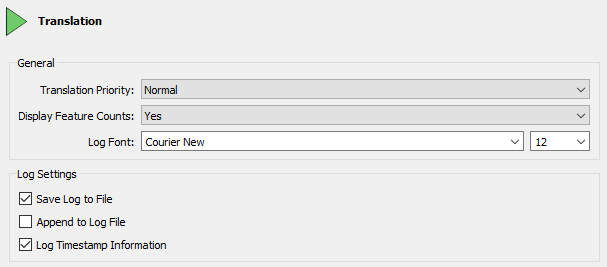
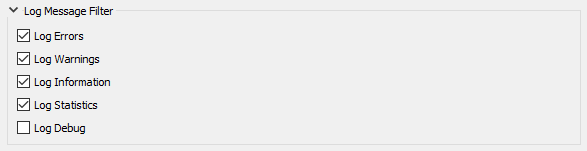
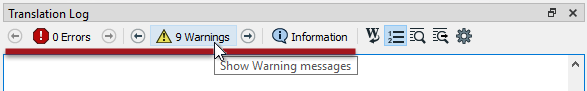

# Log File Interpretation

The FME log file is your best friend for assessing performance. It tells you how long a translation took, where the time went, and how well FME was able to use the available system resources.

## Log Messages ##

The first thing to notice is that each line of the log is (in most cases) a separate message, for example:

<pre>
Creating writer for format: Esri Shapefile
</pre>

However, sometimes the message spans several lines, such as:

<pre>
-~-~-~-~-~-~-~-~-~-~-~-~-~-~-~-~-~-~-~-~-~-~-~-~-~-~-~-~-~-~-~-~-~-~-~-~-~-~-~-~-
-~                                                                             ~-
-~    Feature caches have been recorded at every stage of the translation.     ~-
-~                      To inspect the recorded features,                      ~-
-~              click the feature cache icons next to the ports.               ~-
-~                                                                             ~-
-~-~-~-~-~-~-~-~-~-~-~-~-~-~-~-~-~-~-~-~-~-~-~-~-~-~-~-~-~-~-~-~-~-~-~-~-~-~-~-~-
</pre>

### Optional Log Message Fields ###

There are a number of options to adjust the log file and what is displayed. To access these select Tools &gt; FME Options &gt; Translation:

The most important setting is **Log Timestamp Information**. This option turns on a number of optional fields in the log messages. These are:

- **Absolute Date:** The date on which this step took place
- **Absolute Time:** The time at which this step took place
- **Cumulative Time:** The amount of time taken *to* this step in the current translation
- **Elapsed Time:** The amount of time taken *for* this step in the current translation
- **Message Type:** The nature of the message

For example:

<pre>
2019-04-01 12:13:55|   0.8|  0.0|INFORM|Closing native MapInfo reader
</pre>

The Message Type field is usually one of the following:

- **ERROR:** An error in the translation that usually requires FME to stop or cancel processing.
- **WARN:** A warning that signifies a problem that is not sufficient to stop or cancel processing.
- **INFORM:** An information message relating a non-error item.
- **STAT:** A message on translation statistics such as the number of features processed.

---

<table style="border-spacing: 0px">
<tr>
<td style="vertical-align:middle;background-color:darkorange;border: 2px solid darkorange">
<i class="fa fa-quote-left fa-lg fa-pull-left fa-fw" style="color:white;padding-right: 12px;vertical-align:text-top"></i>
FME Lizard says…
</td>
</tr>

<tr>
<td style="border: 1px solid darkorange">

The log <strong>file</strong> always contains timestamps, regardless of this setting.

</td>
</tr>
</table>

---

## Filtering Log Messages ##

A common requirement is to filter log messages, so that only messages of a certain type are displayed. For example, it can be useful to turn off INFORM and STAT messages in order to make it easier to spot ERRORs and WARNs.

There are two ways to achieve this. Firstly log messages can be filtered using options under Tools &gt; FME Options &gt; Translation:

These options turn each type of message on (or off) for all subsequent translation logs. If a message type is unchecked here it will not appear in a log at all.

The second method of filtering is a set of tools in the log window itself:

These tools are a way to toggle messages on and off in the log window only. They are easier to use and more flexible than using the FME Options for filtering.

---

<!--Warning Section--> 

<table style="border-spacing: 0px">
<tr>
<td style="vertical-align:middle;background-color:darkorange;border: 2px solid darkorange">
<i class="fa fa-exclamation-triangle fa-lg fa-pull-left fa-fw" style="color:white;padding-right: 12px;vertical-align:text-top"></i>
WARNING
</td>
</tr>

<tr>
<td style="border: 1px solid darkorange">

The Log Debug option (under FME Options) allows you to turn on debug messages in the log. These are extra log messages that are usually hidden from the user.
  Debug messages can help during debugging, but are less useful in general FME use. Many messages (labelled "BADNEWS") are alarming “errors” that FME has trapped and kept to itself (like an end-of-file message). For this reason it's not recommended that this option is turned on permanently.
  Also, note that the Log Debug setting persists in the workspace. If you turn that setting on and pass the workspace to another user, it retains the setting and shows debug messages when that other user runs the workspace!

</td>
</tr>
</table>

---

<table style="border-spacing: 0px">
<tr>
<td style="vertical-align:middle;background-color:darkorange;border: 2px solid darkorange">
<i class="fa fa-quote-left fa-lg fa-pull-left fa-fw" style="color:white;padding-right: 12px;vertical-align:text-top"></i>
FME Lizard says…
</td>
</tr>

<tr>
<td style="border: 1px solid darkorange">

If the log window text is a little small for you, or not stylish enough, use Tools &gt; FME Options &gt; Appearance &gt; Log Font to change the font size and style.

</td>
</tr>
</table>
