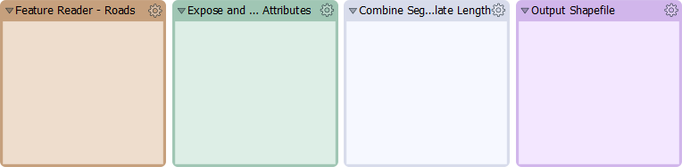
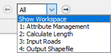
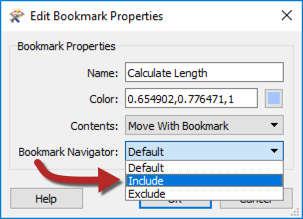
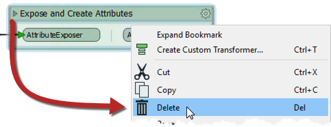
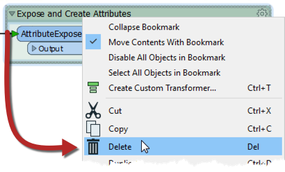
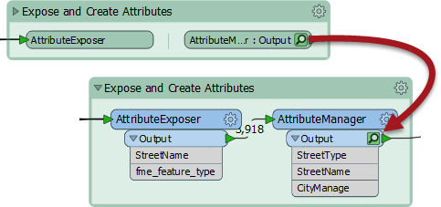

# Bookmarks 

Bookmarks play an important role in a well-styled workspace for a number of reasons, including these:
- Design: As a way to subdivide a workspace and manage those sections
- Access: As a marker for quick access to a certain section of the workspace
- Editing: As a means to move groups of transformers at a time
- Performance: As a means to improve workspace performance when caching data

---

## Design ##

Bookmarks are a great way to plan and design your workspace. Using bookmarks to create a wireframe mockup before adding transformer:

---

## Access ##

Bookmarks can be navigated through, which creates a presentation type form that zooms in on your bookmark of interest. This is also incredibly useful once your workspace extends beyond the view of your screen:

To set up bookmark navigation, open up the properties of the bookmark and then select *Include* for Bookmark Navigator:

---

## Editing ##

Bookmarks can be used to move a group of transformers at a time. This is useful for organizing and cleaning up a workspace. 

### Deleting Bookmarks ###

To delete all of the contents of a bookmark, including the bookmark itself, collapse the bookmark then delete it. This is useful for removing entire sections of your workspace:

To remove *only* the bookmark, leave the bookmark expanded and then delete it:

---

<!--New Section--> 

<table style="border-spacing: 0px">
<tr>
<td style="vertical-align:middle;background-color:darkorange;border: 2px solid darkorange">
<i class="fa fa-bolt fa-lg fa-pull-left fa-fw" style="color:white;padding-right: 12px;vertical-align:text-top"></i>
NEW
</td>
</tr>

<tr>
<td style="border: 1px solid darkorange">

Collapsible bookmarks are an entirely new feature for FME2018.

</td>
</tr>
</table>

---

### Performance and Bookmarks ###

When using Feature Caching, performance takes a big hit, especially when working with large workspaces. Caching all of the data can be prevented by using bookmarks. When a bookmark is collapsed and the workspace is run, only the output feature is cached:

This means that data is cached only for the final transformer in the bookmark, saving considerable time and resources. 

