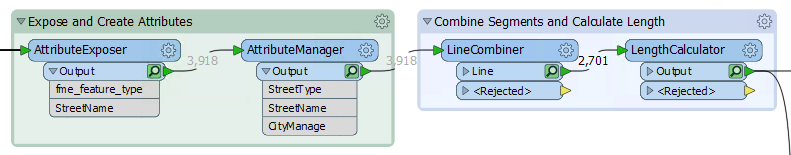
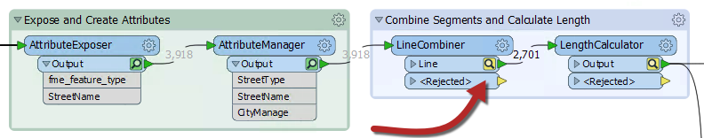
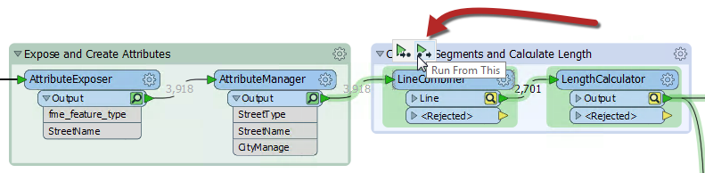
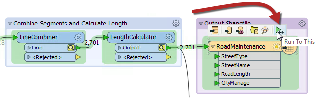

# Partial Runs #

When caching is turned on, running a translation causes data to be cached at every part of the workspace. In subsequent runs, those caches can be used instead of having to re-run entire sections of a workspace.

Here, for example, a workspace has been run with caching turned on:

Now the author makes a change to the LineCombiner parameters:

Notice that the caches change color (to yellow) on the LineCombiner and subsequent transformers. This denotes that caches are stale; their data contents no longer match what the workspace would produce.
To get the new results the author must re-run the workspace. However, they do not have to re-run the entire workspace; they can simply start the workspace at the point of change - the LineCombiner:

_Run From This_ causes the workspace to run from that point only, using data cached up until that point. Notice how hovering over the option causes all "downstream" transformers to be highlighted. They are the only ones that will be run. That makes the translation quicker.
The other option is _Run To This_. The author could use that option on the writer feature type and get much the same effect:

...but notice how the second branch from the LengthCalculator does not get highlighted. It will not be run. That shows how you can avoid running a particular section of workspace, in much the same way as if that connection had been disabled.

