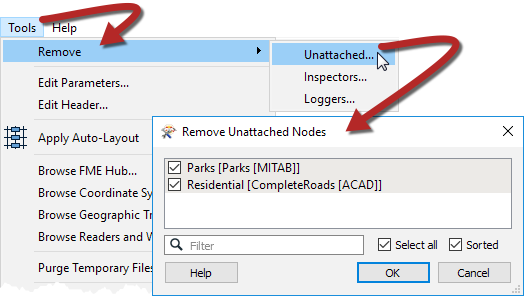

# General Performance Tips

In FME2018, the entire backend was redesigned to increase performance. While performance is still something to keep in mind, it doesn't require as much attention from the author as before. 

Even though FME is efficient, there are some key areas to be aware of that might impact your performance:

- Unused Readers and Feature Types
- Unused Writers
- Blocker Transformers
- Excess Loggers and Inspectors
- Reading an entire database
- Running with Feature Caching Enabled

---

## Remove Unattached ##

When developing a workspace it is easy to lose Feature Types that are unused, especially once the workspace grows in size. To quickly remove these unused Feature Types go to Tools > Remove... > Remove Unattached in the menu bar. 

## Remove Loggers and Inspectors ##

Although you won't see a huge performance difference, it makes for a cleaner workspace. You can remove all of the Loggers and Inspectors in one go before putting your workspace into production by going to Tools > Remove... > Inspectors or Loggers in the menu bar. Then select which ones you would like to remove. 

---

## Run with Feature Caching ##

Running a workspace with Feature Caching enabled takes a huge performance hit because the data is cached at each transformer. It is best to turn this feature off when it is not needed. If you do require Feature Caching but only for a section of your workspace, use a collapsable bookmark to only cache the output feature. 
