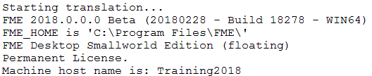
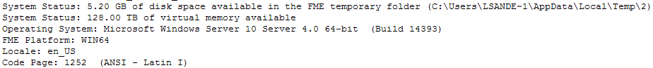
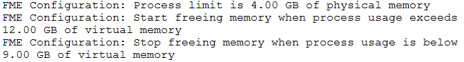
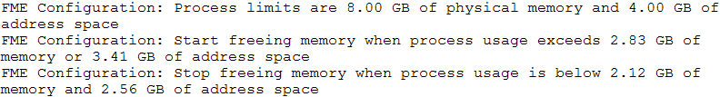

## Configuration and Setup Information ##

Configuration and setup messages in the FME log tell us vital information about FME's version and configuration, the system resources and how FME intends to use them, and what system paths are being used.

For example, here you can see which version of FME is being used (FME2018, 64-bit), its license type (floating), and the machine name (Training2018). If you do have multiple FME versions installed, here’s where you can check to ensure the correct one is running.

Further on we can see that the system has 5.17 GB of free space in the FME temporary folder and 128 TB of virtual memory. We can also see what operating system we are running FME on (Windows Server 10) and what the current language and encoding settings are:

Later in the log is important information about the system resources and FME’s memory management:

In this case, there is a limit of 4GB memory per process. The following numbers indicate how FME will manage memory resources. It will use 12GB of virtual memory and then it will start to release memory by caching features to disk. This caching will stop once virtual memory use is less than 9GB. 

This way FME will perform to its potential automatically, while not taking so much memory that the system may fail or other processes on the system would suffer.

With 64-bit FME, address space is an impractically high number (128TB in Windows 8.1 or later) that has no practical value (other failures would occur long before that number is breached). So instead of address space, on 64-bit FME the log reports "Virtual Memory", a more realistic number that combines physical memory with a portion of disk called Swap Space.

### 32-Bit FME ###

32-bit FME gives a slightly different set of messages. The numbers reported include "address space", which is a theoretical limit of the amount of memory FME could use, regardless of available physical memory and disk space: 

---

### Temporary Folder ###

For performance tuning one of the most important parts of the log reports the temporary folder being used. When physical memory resources become low FME starts to cache data to disk and swap that data in and out of physical memory as required.

The temporary folder is where it writes data to, so there are two important considerations for that folder.

Firstly it's important to ensure this folder does have enough temporary disk space for the translation being carried out. Depending on the workspace, the transformations being carried out, and other processes happening on the computer; temporary disk space requirements may be many times greater than the size of the original dataset.

Secondly, it's useful if the disk being written to is both fast and unused by any other process. It will not, for example, help performance to share the temporary disk with the operating system; additionally, a solid-state disk is much faster than a traditional hard drive.

---

<!--Person X Says Section-->
<!--Jake Speedie is the representative for this chapter-->

<table style="border-spacing: 0px">
<tr>
<td style="vertical-align:middle;background-color:darkorange;border: 2px solid darkorange">
<i class="fa fa-quote-left fa-lg fa-pull-left fa-fw" style="color:white;padding-right: 12px;vertical-align:text-top"></i>
Jake Speedie says…
</td>
</tr>

<tr>
<td style="border: 1px solid darkorange">

The comparative benefits of RAM vs SSD vs HDD are hard to quantify. Do a web search if you don't believe me; people quote RAM as being 4x as fast, 20x as fast, 100,000x as fast! 
  In reality it depends on so many factors. But in general, use as much memory as you can to avoid caching, and use SSD so that - where caching/swapping is unavoidable - it runs as fast as possible.

</td>
</tr>
</table>