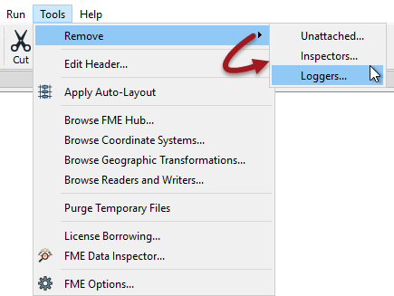
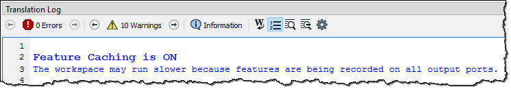

# Workspace Authoring versus Production Performance

Workspaces are authored in FME Workbench, and quite often they are run in FME Workbench too. However, wherever a workspace is run, the production version should look quite different to when it was being authored. 

That's because when an author builds and tests a workspace, they use a number of features designed to help in those creation and debugging steps. However, these features often slow the translation, so it's important to avoid them in a production-ready workspace.

Note that many of these features don't appear to hinder performance during workspace development, because development usually takes place on a small subset of data. But scaling up to production-levels of data also scales up the impact on performance.

In short, it's important to think of development and production as two entirely different stages, and design workspaces appropriately for each stage.

---

<table style="border-spacing: 0px">
<tr>
<td style="vertical-align:middle;background-color:darkorange;border: 2px solid darkorange">
<i class="fa fa-quote-left fa-lg fa-pull-left fa-fw" style="color:white;padding-right: 12px;vertical-align:text-top"></i>
FME Lizard says…
</td>
</tr>

<tr>
<td style="border: 1px solid darkorange">

There are always exceptions to any rule, and you may disagree with some of the content below. However, it is definitely true that you should try as much as possible to remove any functionality used for debugging, before putting a workspace into production.

</td>
</tr>
</table>

---

## Logger and Inspector Transformers ##

Logger and Inspector transformers are commonly used to inspect data during the authoring process.

The Logger writes information to the log file, while the Inspector sends data to the FME Data Inspector. Both should be avoided in a production workflow for two reasons. Firstly such inspection techniques aren't generally needed in a production workflow, and secondly both will cause a reduction in performance. The Inspector, in particular, can use a large amount of system resources in sending data to the Data Inspector.

All Logger and Inspector transformers can be removed in one action by using Tools &gt; Remove... &gt; Inspectors or Loggers in the menu bar:

There is a more pressing need to remove these transformers from a workspace run in FME Desktop. When run on FME Server the Inspector transformers will be ignored, as there is no visualization tool on that platform.

---

## Feature Caching ##

Running a workspace with Feature Caching enabled takes a huge performance hit because each transformer caches data. It is again a debugging tool and so best to turn this feature off when authoring and testing is complete, and the workspace is put into production. This is so important that the log window even records when feature caching is turned on:

 

If feature caching was used to aid inspection of features, this should not be required on a production workflow. If feature caching was used for the purpose of a partial run, then only the required section of workspace should be put into production.
 
As with Inspector transformers, feature caching has no effect on a workspace run on FME Server. 

---

## Disabled Sections ##

In some cases parts of a workspace are disabled - or separated from the main workflow by a disabled connection - in order to test just specific sections. This is not something that should be maintained in a production workspace.

If the components were disabled for testing only, then they should be activated for production work. If the components are not needed at this time, consider storing them in a separate workspace or saving a separate workspace version without them.

<table style="border-spacing: 0px">
<tr>
<td style="vertical-align:middle;background-color:darkorange;border: 2px solid darkorange">
<i class="fa fa-quote-left fa-lg fa-pull-left fa-fw" style="color:white;padding-right: 12px;vertical-align:text-top"></i>
FME Lizard says…
</td>
</tr>

<tr>
<td style="border: 1px solid darkorange">

If there are parts of a workspace that may not be needed, why not use a user parameter to divert data? In software development these are called <strong>Feature Flags</strong> and <strong><a href="https://medium.com/@john.byrne.jb/feature-flags-in-fme-95304302fd14">this blog</a></strong> by an FME user explains how to implement them in a workspace.

</td>
</tr>
</table>
