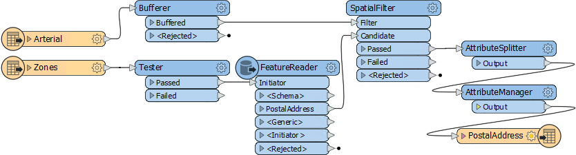
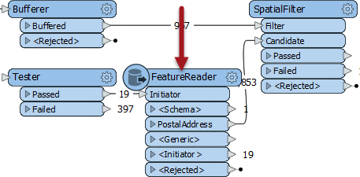

# Assessing Performance #

Assessing the performance of a workspace such as this:

...requires a bit of time and attention, but knowing how a workspace performs helps to make informed decisions on how to best design (or redesign) it. 

When testing for performance ensure that there is only one instance of FME running, and all other non-essential programs are closed. You'll also need to turn off feature caching, as that can have an effect on the results. 

---

## Assessing Reader Performance ##

To be able to improve the efficiency of a reader requires an estimate of how well it is working in the first instance, yet this can be hard to separate out in a workspace that is also transforming data.

The key message that signifies reading is complete is “Emptying Factory Pipeline”. Here, for example, reading of the data finished after 26.4 seconds of processing (of course the actual elapsed time might be longer if FME was waiting for a database or the file system to respond):

<pre>
2019-03-29 11:48:54|  26.4|  0.0|INFORM|Emptying factory pipeline
</pre>

However, sometimes that message can be misleading. FME processes the data at the same time it is reading it, so that it won't read an entire data set before processing. To avoid this confusion, disable all the transformers and simply run readers:

With the transformers disabled, the message now appears much sooner:

<pre>
2019-03-29 11:49:35|   1.2|  0.0|INFORM|Emptying factory pipeline
</pre>

So we can tell that reading the data is only taking 1.2 seconds.

---

##Assessing Writer Performance ##

As with readers, you can't improve the performance of a writer unless you can first assess how well it is already performing. However, assessing the speed of writing has the same complexity as reading: FME starts writing data as soon as it becomes available and doesn’t necessarily wait until processing is done.

So, how can we assess writer performance? Assessing a writer is clearly different to a reader. If you isolate the writers by disabling everything else, there won't be any data to write! 

The easiest way is to disable the writer itself! 

If the original result was this:

<pre>
2019-03-29 11:54:14|  26.5|  0.0|INFORM|Translation was SUCCESSFUL with 19 warning(s) (148 feature(s) output)
2019-03-29 11:54:14|  26.5|  0.0|INFORM|FME Session Duration: 26.7 seconds. (CPU: 22.5s user, 4.0s system)
</pre>

...and with the writer disabled it is now this:

<pre>
2019-03-29 11:56:48|  26.6|  0.0|INFORM|Translation was SUCCESSFUL with 19 warning(s) (0 feature(s) output)
2019-03-29 11:56:48|  26.6|  0.0|INFORM|FME Session Duration: 26.6 seconds. (CPU: 22.1s user, 4.4s system)
</pre>

...then we can easily calculate that the writing process is taking merely 0.1 seconds.

---

<!--Tip Section--> 

<table style="border-spacing: 0px">
<tr>
<td style="vertical-align:middle;background-color:darkorange;border: 2px solid darkorange">
<i class="fa fa-info-circle fa-lg fa-pull-left fa-fw" style="color:white;padding-right: 12px;vertical-align:text-top"></i>
TIP
</td>
</tr>

<tr>
<td style="border: 1px solid darkorange">

Another method is a two-step process.
  Firstly, add a Recorder as the final transformer, to preserve the data in FFS format at the moment it is about to be written. Run the workspace.
  Secondly, replace the Recorder with a Player transformer, to re-read the preserved FFS data. Disable everything else up to that point and re-run the workspace.
  The data is played back into the workspace and written to the output, giving us a measure of writer performance.

</td>
</tr>
</table>

---

## Assessing Transformer Performance ##

Assessing the time taken in transformation requires a two-step process. 

First, disable writers and run the translation, taking note of the elapsed time: 

Then disable the transformers too and rerun the workspace, to calculate the time taken to read the data only:

The difference in elapsed time between reading the data and reading/transforming the data is the elapsed transformation time.

It's important not to add an Inspector or Logger transformer to see what is happening to the output. This will  slow the translation down and give you a false measure. You must also be sure to disable the actual writer and not just the feature types or connections to them.

The only writer that is useful in this scenario is the Null format writer. This causes a writer to be present, but it does nothing except to count features and then discard them. The benefit is improved logging of feature counts, but without any data having to be written.

---

<!--Warning Section--> 

<table style="border-spacing: 0px">
<tr>
<td style="vertical-align:middle;background-color:darkorange;border: 2px solid darkorange">
<i class="fa fa-exclamation-triangle fa-lg fa-pull-left fa-fw" style="color:white;padding-right: 12px;vertical-align:text-top"></i>
WARNING
</td>
</tr>

<tr>
<td style="border: 1px solid darkorange">

Naturally, where a FeatureReader or FeatureWriter transformer is used, assessing reading and writing requires a different procedure:
  
  It would be necessary to run the workspace twice; once with everything disabled after that point, and once with everything disabled up to (and including) that point. Then subtract the two run-times to get the correct result.

</td>
</tr>
</table>