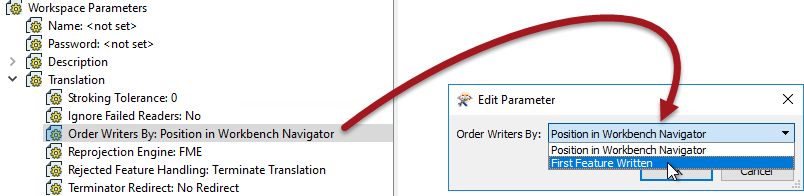
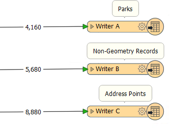

# Improving Writer Performance #

There are various ways to speed up writing data. Compared to reading, tuning the underlying systems is a more important improvement, whereas the number of features is less important as it's much harder to write extra data unintentionally.

---

## File System Improvements ##

If you are writing to a file system then make sure the disk is fast and responsive – use solid state drives – and that the operating system is not busy writing other files at the same time, as the latter could cause a significant bottleneck. 

Also, check if you are using RAID; some configurations need multiple writes and can slow down a translation.

---

## Database Improvements ##

If you are writing to a database, then existing indexes and joins can cause the process to be slower than expected. In many cases, it will be quicker to drop an index, write the data, and then recreate the index. 

More information on database performance with FME comes in a later section.

---

## Multiple Writers ##

Perhaps the most important technique for improving writer performance involves the scenario where a workspace has multiple writers. 

In short, it’s important to get the writers into the optimum order, to ensure that the writer that is to receive the largest amount of data is written first.

The reasoning behind this is that the first writer in a workspace starts to write data as soon as it is received. Other writers cache theirs until they are ready to start writing.

Therefore, if the largest amount of data is written immediately, lesser amounts of data have to be written to, and stored in, a cache.

This can improve performance tremendously, particularly when the translation is especially unbalanced; for example, one million features go to one writer, and only ten features go to another.

---

<table style="border-spacing: 0px">
<tr>
<td style="vertical-align:middle;background-color:darkorange;border: 2px solid darkorange">
<i class="fa fa-quote-left fa-lg fa-pull-left fa-fw" style="color:white;padding-right: 12px;vertical-align:text-top"></i>
FME Lizard says...
</td>
</tr>

<tr>
<td style="border: 1px solid darkorange">

Think of it like an airport. It’s more efficient when you load the busiest flights first, because it empties the terminal waiting areas quicker. For more information see <a href="http://fme.ly/FirstWriter">this FME Evangelist article</a>.

</td>
</tr>
</table>

---

### Setting Writer Order ###

There are two ways to affect the order that writing occurs in.

Firstly each writer is listed in the Navigator window in Workbench and can be re-ordered by moving them up and down in the list in the Navigator window:

The first writer in the list is the one that is initiated first, therefore it should be the one to receive the most data.

The second method is to use a workspace parameter called Order Writers By:

This parameter can be left to *Position in Workbench Navigator* in which case the order of writers as defined in the Navigator takes priority. Alternatively, it can be set to *First Feature Written*. In that case, the writer that receives the first feature will be the first to start writing data.

---

<table style="border-spacing: 0px">
<tr>
<td style="vertical-align:middle;background-color:darkorange;border: 2px solid darkorange">
<i class="fa fa-quote-left fa-lg fa-pull-left fa-fw" style="color:white;padding-right: 12px;vertical-align:text-top"></i>
FME Lizard says…
</td>
</tr>

<tr>
<td style="border: 1px solid darkorange">

Given this screenshot, which should we make the first writer in this workspace?
   
  <a href="http://52.73.3.37/fmedatastreaming/Manual/QAResponse2017.fmw?chapter=12&question=3&answer=1&DestDataset_TEXTLINE=C%3A%5CFMEOutput%5CQAResponse.html">1. A</a>
 <a href="http://52.73.3.37/fmedatastreaming/Manual/QAResponse2017.fmw?chapter=12&question=3&answer=2&DestDataset_TEXTLINE=C%3A%5CFMEOutput%5CQAResponse.html">2. B</a>
 <a href="http://52.73.3.37/fmedatastreaming/Manual/QAResponse2017.fmw?chapter=12&question=3&answer=3&DestDataset_TEXTLINE=C%3A%5CFMEOutput%5CQAResponse.html">3. C</a>
 <a href="http://52.73.3.37/fmedatastreaming/Manual/QAResponse2017.fmw?chapter=12&question=3&answer=4&DestDataset_TEXTLINE=C%3A%5CFMEOutput%5CQAResponse.html">4. Don't know!</a>

</td>
</tr>
</table>

