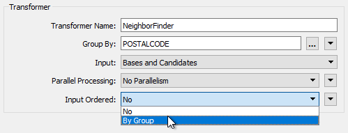
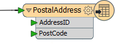
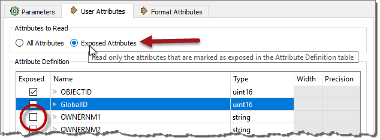
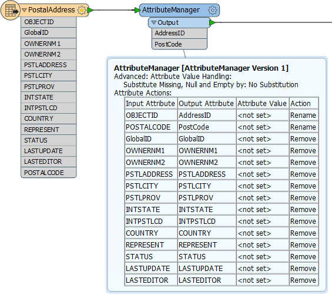

# Optimizing Transformation Performance #

In most cases, slow, memory-consuming translations are caused by group-based transformers.

Remember that in feature-based transformation a transformer performs an operation on a feature-by-feature basis where a single feature at a time is processed. Such a transformation only takes as much memory as is necessary to store a single feature.

However, a group-based transformer performs an operation on a group or collection of features and it takes as much memory as is necessary to store all features of the group!

It is this grouping of data that causes performance degradation. However, many group-based transformers have parameters that, in effect, make them more feature-based.

---

<table style="border-spacing: 0px">
<tr>
<td style="vertical-align:middle;background-color:darkorange;border: 2px solid darkorange">
<i class="fa fa-quote-left fa-lg fa-pull-left fa-fw" style="color:white;padding-right: 12px;vertical-align:text-top"></i>
FME Lizard says….
</td>
</tr>

<tr>
<td style="border: 1px solid darkorange">

You’ll get better performance when you put the least amount of data into a group-based transformer as possible.
For example, put feature-based filter transformers BEFORE the group-based process, not after it (see following exercise). Another technique is to make group-based transformers more feature-based...

</td>
</tr>
</table>

---

## Input Ordered Parameter ##

A common parameter to Group-Based transformers is called "Input Ordered." and appears near the Group By parameter in most transformer dialogs:

The condition for applying these is that the groups of features are pre-sorted into their groups. When this is the case, and the parameter is set to By Group, then FME processes the data more efficiently. 

For example, in the above screenshot, the user is using the ZoneCategory attribute as a group-by parameter (i.e. a set of statistics is created for each set of features *with the same ZoneCategory value*). If the incoming data is already sorted in order of ZoneCategory then the user can set the Input Ordered parameter and allow FME to treat this more like a feature-based transformer.

---

<!--Warning Section--> 

<table style="border-spacing: 0px">
<tr>
<td style="vertical-align:middle;background-color:darkorange;border: 2px solid darkorange">
<i class="fa fa-exclamation-triangle fa-lg fa-pull-left fa-fw" style="color:white;padding-right: 12px;vertical-align:text-top"></i>
WARNING
</td>
</tr>

<tr>
<td style="border: 1px solid darkorange">

When using Input Ordered By Group on a transformer with two (or more) input ports, you need to arrange data to arrive in group order (Port 1, Group A, Port 2, Group A, Port 1, Group B, Port 2, Group B, etc.)
  i.e. it's not just a case of each stream of data being ordered correctly, you need to alternate streams/ports for each group - and that's very difficult to achieve.

</td>
</tr>
</table>

---

## Features First Parameter ##

Besides the "Input Ordered" parameter, some transformers have their own, unique, parameters for performance improvements. Many of these specify one type of feature to arrive "first."

For example, the PointOnAreaOverlayer transformer expects two sets of data: Points and Areas. By default, FME requires all incoming Points and Areas because it needs to be sure it has ALL of the Areas before it can process any Points.

But, if FME knows the Area features will arrive first (i.e. the first Point feature signifies the end of the Areas) then it doesn’t need all Point features. It can process each one immediately because it knows there are no more Areas that it could match against.

The user specifies that this is true using the parameter Areas First:

But how does a user ensure the Area features arrive first? Well, like writers you can change the order of readers in the Navigator so that the reader at the top of the list is read first.

Changing the reader order doesn’t improve performance *per se*, but it does let you apply performance-improving parameters like the above.

---

## Attributes and Transformation ##

As mentioned (in Reader Performance) reducing data helps performance because it saves FME from either holding it in memory or caching it to a disk.

However, this isn’t just helped by reducing the number of features; it is also helped by reducing the size of each individual feature.

One aspect of this is attributes. Carrying attributes through a translation impacts performance, so if the attributes are not required in the output, it’s best to remove them *as early as possible* in the translation.

For example, the incoming schema looks like this:

But the outgoing schema looks like this:

Since so many of the source attributes are not required in the output, it makes sense to remove them from the translation, and as early as possible. There are two ways to do this. Some reader formats (but not all) have a setting in the reader feature type to avoid reading excess attributes:

With that, you can ensure that only attributes exposed are read. The other way to remove attributes is by using a transformer (AttributeManager, AttributeRemover, or AttributeKeeper) directly after the source feature type:

This ensures that none of the extra attributes become a drain on resources by being processed by any further transformers.

---

### Lists ###

One specific type of attribute to beware of is a *List*. A list in FME is an attribute that can have multiple values. Because of this, it can be a big drain on resources.

For example, use a Joiner to join a feature to 1,000 records and the list for that feature will have 1,000 sets of records. This is bad enough, but if the list is exploded and all of the original attributes kept, then there will be 1,000 features each with 1,000 sets of attributes!

In general, beware of creating lists unnecessarily and of keeping them in a workspace beyond the point at which they are still of use.

---

## Geometry and Transformation ##

Like attributes, geometry can be removed from a feature, in this case using the GeometryRemover transformer.

Many FME users create translations that handle tabular – non-spatial – data. If you are reading a spatial dataset, then writing it to a tabular format, be sure to remove the geometry early in the workspace, just as you would an attribute.

Another particular problem is carrying around spatial data as attributes. Spatial database formats - for example, Oracle or GeoMedia - usually store geometry within a field in the database; for example GEOM. When FME reads the data it converts the GEOM field into FME geometry and drops the field from the data.

However, if you read a geometry table with a non-geometry reader, the translation could end up with the geometry stored as an FME attribute. A similar thing could happen when a workspace reads only one geometry column of a multiple geometry tables.

Geometry will create *very* large and complex attributes, which take up a lot of resources. If you don’t need them, then it’s worth removing them.

Basically, you should only carry through the translation any geometry and attributes you need for the output of your workspace. If the data is not required, then it can and should be removed as early in the workspace as possible.

<table style="border-spacing: 0px">
<tr>
<td style="vertical-align:middle;background-color:darkorange;border: 2px solid darkorange">
<i class="fa fa-quote-left fa-lg fa-pull-left fa-fw" style="color:white;padding-right: 12px;vertical-align:text-top"></i>
FME Lizard says…
</td>
</tr>

<tr>
<td style="border: 1px solid darkorange">

Which of these transformers have group-related parameters for improving performance (pick all that apply and see if you can get the answers without looking at the transformers): 
  <a href="http://52.73.3.37/fmedatastreaming/Manual/QAResponse2017.fmw?chapter=12&question=4&answer=1&DestDataset_TEXTLINE=C%3A%5CFMEOutput%5CQAResponse.html">1. StatisticsCalculator</a>
 <a href="http://52.73.3.37/fmedatastreaming/Manual/QAResponse2017.fmw?chapter=12&question=4&answer=2&DestDataset_TEXTLINE=C%3A%5CFMEOutput%5CQAResponse.html">2. SpikeRemover</a>
 <a href="http://52.73.3.37/fmedatastreaming/Manual/QAResponse2017.fmw?chapter=12&question=4&answer=3&DestDataset_TEXTLINE=C%3A%5CFMEOutput%5CQAResponse.html">3. PointCloudCombiner</a>
 <a href="http://52.73.3.37/fmedatastreaming/Manual/QAResponse2017.fmw?chapter=12&question=4&answer=4&DestDataset_TEXTLINE=C%3A%5CFMEOutput%5CQAResponse.html">4. FeatureMerger</a>

</td>
</tr>
</table> 

PUTTING TRANSFORMERS IN THE RIGHT ORDER. DO THE MINIMUM AMOUNT OF WORK. FILTER *THEN* PROCESS.