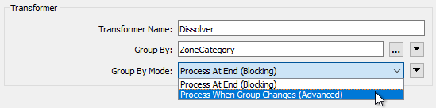

# Optimizing Transformation Performance #

The key to improving transformer performance is to reduce the amount of memory used, particularly in group-based transformers. To do this you can either reduce the amount of data entering a group-based transformer, or use parameters that, in the right conditions, can reduce the need to store data in memory.

## Transformer Order and Filtering ##

Although the order of transformers can sometimes vary without affecting the result, at other times it is important to get the correct order for performance reasons.

You’ll get better performance when you put the least amount of data into a group-based transformer as possible. One scenario is to put feature-based filter transformers *before* the group-based process, not after it:

For example, here the author is filtering data after statistics have been calculated on one set of data. It would be more sensible to filter the data before calculating the statistics, otherwise processing has been carried out on features that were eventually ignored.

The best way to remember this is: **Filter, Remove, Action!**

In other words, filter first, then remove attributes, then carry out the action.

---

## Group-By Mode Parameter ##

A common parameter to most Group-Based transformers is called "Group By Mode" and appears near the Group By parameter in most transformer dialogs:

When set to Process at End (Blocking) then ALL of the features are stored in memory until they are all available. Then groups are formed. The transformer is literally blocking data from proceeding. 

When the parameter is set to Process When Group Changes (Advanced), then FME processes groups as they become available. That way less data is stored in memory and processing is more efficient.

The condition for applying this parameter is that the groups of features are pre-sorted into their groups. 

For example, in the above screenshot, the user is using the ZoneCategory attribute as a group-by parameter (i.e. zones are dissolved together where they are the same category). If the incoming data is already sorted in order of ZoneCategory then the user can set the Group By Mode parameter and allow FME to process the data more efficiently.

---

<!--Warning Section--> 

<table style="border-spacing: 0px">
<tr>
<td style="vertical-align:middle;background-color:darkorange;border: 2px solid darkorange">
<i class="fa fa-exclamation-triangle fa-lg fa-pull-left fa-fw" style="color:white;padding-right: 12px;vertical-align:text-top"></i>
WARNING
</td>
</tr>

<tr>
<td style="border: 1px solid darkorange">

When using Input Ordered By Group on a transformer with two (or more) input ports, you need to arrange data to arrive in group order (Port 1, Group A, Port 2, Group A, Port 1, Group B, Port 2, Group B, etc.)
  i.e. it's not just a case of each stream of data being ordered correctly, you need to alternate streams/ports for each group - and that's very difficult to achieve.

</td>
</tr>
</table>

---

## Features First Parameter ##

Besides the "Group By Mode" parameter, some transformers have their own, unique, parameters for performance improvements. Many of these specify one type of feature to arrive "first."

For example, the PointOnAreaOverlayer transformer expects two sets of data: Points and Areas. By default, FME requires all incoming Points and Areas because it needs to be sure it has ALL of the Areas before it can process any Points.

But, if FME knows the Area features will arrive first (i.e. the first Point feature signifies the end of the Areas) then it doesn’t need all Point features. It can process each one immediately because it knows there are no more Areas that it could match against.

The user specifies that this is true using the parameter Areas First:

But how does a user ensure the Area features arrive first? Well, like writers you can change the order of readers in the Navigator so that the reader at the top of the list is read first.

Changing the reader order doesn’t improve performance *per se*, but it does let you apply performance-improving parameters like the above.

---

## Attributes and Transformation ##

As mentioned (in Reader Performance) reducing data helps performance because it saves FME from either holding it in memory or caching it to a disk.

However, this isn’t just helped by reducing the number of features; it is also helped by reducing the size of each individual feature.

One aspect of this is attributes. Carrying attributes through a translation impacts performance, so if the attributes are not required in the output, it’s best to remove them *as early as possible* in the translation.

For example, when the reader and writer schemas look like this:

...it makes sense to remove excess attributes from the translation, as early as possible. 

There are two ways to remove attributes. Some reader formats (but not all) have a setting in the reader feature type to avoid reading excess attributes in the first place:

With that, you can ensure that *only* attributes exposed are read. The other way to remove attributes is by using a transformer (AttributeManager, AttributeRemover, or AttributeKeeper) directly after the source feature type:

This ensures that none of the extra attributes become a drain on resources by being processed by any further transformers.

### Lists ###

One specific type of attribute to beware of is a *List*. A list in FME is an attribute that can have multiple values. Because of this, it can be a big drain on resources.

For example, use a Joiner to join a feature to 1,000 records and the list for that feature will have 1,000 sets of records. This is bad enough, but if the list is exploded and all of the original attributes kept, then there will be 1,000 features each with 1,000 sets of attributes!

In general, beware of creating lists unnecessarily and of keeping them in a workspace beyond the point at which they are still of use.

---

## Geometry and Transformation ##

Like attributes, geometry can be removed from a feature, in this case using the GeometryRemover transformer.

Many FME users create translations that handle tabular – non-spatial – data. If you are reading a spatial dataset and writing it to a tabular format, be sure to remove the geometry early in the workspace, just as you would an attribute.

Another particular problem is carrying around spatial data as attributes. Spatial database formats - for example, Oracle or GeoMedia - usually store geometry within a field in the database; for example GEOM. When FME reads the data it converts the GEOM field into FME geometry and drops the field from the data.

However, if you read a geometry table with a non-geometry reader, the translation could end up with the geometry stored as an FME attribute. A similar thing could happen when a workspace reads only one geometry column of a multiple geometry tables.

Geometry will create *very* large and complex attributes, which take up a lot of resources. If you don’t need them, then it’s worth removing them.

---

<table style="border-spacing: 0px">
<tr>
<td style="vertical-align:middle;background-color:darkorange;border: 2px solid darkorange">
<i class="fa fa-quote-left fa-lg fa-pull-left fa-fw" style="color:white;padding-right: 12px;vertical-align:text-top"></i>
FME Lizard asks...
</td>
</tr>

<tr>
<td style="border: 1px solid darkorange">

<quiz name="">
  <question multiple>
    

      Q) Which of these transformers have group-related parameters for improving performance (pick all that apply and see if you can get the answers without looking at the transformers)
    

    <answer>StatisticsCalculator</answer> 
    <answer>SpikeRemover</answer> 
    <answer correct>LineOnLineOverlayer</answer> 
    <answer correct>FeatureMerger</answer> 
     <explanation>A)The FeatureMerger has both a Group-By Mode and Suppliers First parameters, to help improve performance. The LineOnLineOverlayer has the Group-By Mode parameter, but it only has one input port so it won't have an XXXX-First type of parameter. The StatisticsCalculator has a group-by, but no parameters to improve performance. The SpikeRemover is feature-based, and so has no group-based performance enhancements.</explanation>
  </question>
</quiz>
</tr>
</table>
