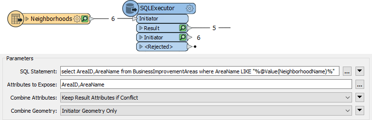
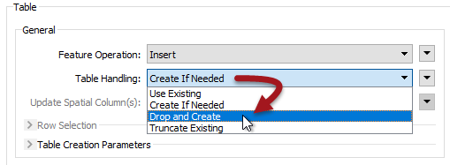

# Database Optimization #

FME can only be as fast as the database it is reading from or writing to. This section will help FME increase its efficiency when working with databases. 

## Database Reading ##

Reading and filtering data (querying) from a database is nearly always faster when you can use the native functionality of the database. Just as previously mentioned you can use the search envelope and WHERE clauses to narrow down what is being read from the database into FME. 

---

## Database Transformers ##

Besides readers, transformers can also be used to query database data. The best to use is the SQLExecutor (or SQLCreator) as these pass their queries to the database using native SQL. If you don’t want to write SQL then you can use the FeatureReader transformer, but be aware this transformer is more generic and won’t give quite the same performance.

The SQLExecutor is particularly worth being aware of, as it issues a query for each incoming feature. This can be useful where you need to make multiple queries.

For example, here a query is issued to the database for every Neighborhood feature that enters the SQLExecutor:

Generally, the output from the SQLExecutor is an entirely new feature. If you want to simply retrieve attributes to attach to the incoming feature, then the DatabaseJoiner transformer is more appropriate.

---

## Database Writing ##

Whereas the performance of reading from a database is largely dependent on the database setup itself, when writing to a database there are very many FME parameters that can help to fine-tune the overall performance.

Remember that writing to a database incurs network overheads. There has to be a balance between various factors:

1. The amount of data and number of requests being sent (network traffic)
2. The amount of data stored by FME awaiting transfer to the database (FME performance)
3. The amount of data stored in the database awaiting committal (database performance)
4. The risk of losing uncommitted data

Each database writer has a set of parameters for handling these components. Not every format supports these, but the two most common parameters are *Features per Transaction* and *Features per Bulk Write*.

### Features per Bulk Write ###

The Features per Bulk Write parameter controls the second factor in the list (the amount of data stored by FME awaiting transfer to the database). 

The parameter is defined by a numeric value. Features sent to an FME database writer get cached in memory until the number of features specified by this parameter is reached. Only then will they be sent to the database. This is also known as *chunk size*.

This parameter is a way to balance network traffic with FME performance. A higher number means FME caches more features (so uses more system resources), but makes fewer requests to the database (and therefore causes less network traffic).

A lower number means FME caches less data, but there are more requests made to the database.

Features per Bulk Write also needs to be considered against the value of Features per Transaction.

### Features Per Transaction ###

Features per Transaction (also sometimes called Transaction Interval) controls the third factor in the list (the amount of data stored in the database awaiting committal). 

This too is defined by a numeric value. Features sent to the database by FME are cached in memory by the database. When the number of features specified by this parameter is reached, FME sends the command to commit them.

Each commit adds delay to the writing process, so setting this parameter must balance the speed of the translation (set a higher number) against the risk that a translation may fail and features need to be rolled-back (set a lower number).

#### Features Per Transaction Examples ####

If Features Per Transaction is set to a value of 1, then each and every feature is committed individually. If the process fails then only the last feature will be lost from the database. The cost for this reduced risk is a matching reduction in performance.

If Features Per Transaction is set to a very high value (more than the number of features being written) then only one commit takes place. If the process fails then all features submitted to the database are lost. The benefit of this increased risk is a matching increase in performance.

#### Features Per Transaction and Bulk Writes ####

There is an interaction between these two parameters that controls where features are cached.
 
If Features per Transaction is less or equal to Features per Bulk Write, then FME caches a number of features and sends them to the database where they are immediately committed.

If Features per Transaction is greater than Features per Bulk Write, then FME sends features to the database where they will be cached until the transaction commit total is reached.

---

<table style="border-spacing: 0px">
<tr>
<td style="vertical-align:middle;background-color:darkorange;border: 2px solid darkorange">
<i class="fa fa-quote-left fa-lg fa-pull-left fa-fw" style="color:white;padding-right: 12px;vertical-align:text-top"></i>
FME Lizard says…
</td>
</tr>

<tr>
<td style="border: 1px solid darkorange">

The Transaction and Chunk parameters can differ from format to format, so it’s very important that you check out the FME Readers and Writers Manual to confirm what parameters are available for your database, and how exactly they operate.

</td>
</tr>
</table>

---

### Writing and Database Indexing ###

Whereas indexes can improve performance for reading data, for writing they can cause a great reduction in the speed of translation.

That’s because the index gets updated by the database automatically with every feature that is written. This occurs on a per-feature basis, regardless of commit intervals. 

To remedy this it’s suggested that indexes are dropped (deleted) before carrying out bulk inserts of data into a database table. This can be done directly on the database, or using an FME SQLExecutor transformer.

### Writing and Table Creation ###

A writer feature type also has options to truncate or drop tables when writing to them:

As with the above, dropping a table is more efficient than truncating it because the drop action also removes the indexes.

For similar reasons, you may want to turn off networking connectivity when writing data to a Geodatabase geometric network.
