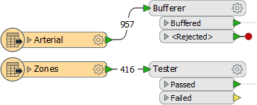
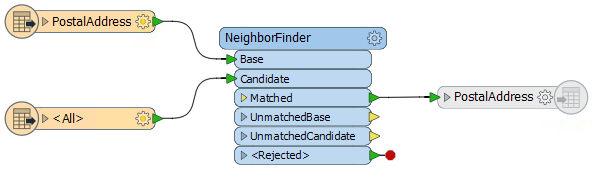
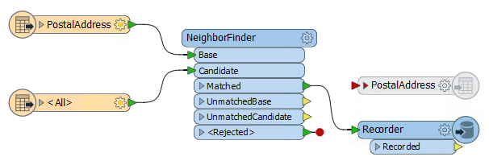
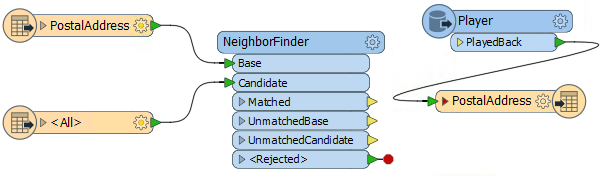

# Assessing Performance 

Assessing performance requires a bit of time and attention, but knowing how your workspace is performing will help you make informed decisions on how to manipulate the data. When testing for performance ensure that there is only one instance of FME running, and all other non-essential programs are closed. You'll also require something to record your times on, like a piece of paper. 

---

## Assessing Reader Performance ##

To be able to improve the efficiency of a reader requires an estimate of how well it is working in the first instance, yet this can be hard to separate out in a workspace that is also transforming data.
The key message that signifies reading is complete is “Emptying Factory Pipeline”. Here, for example, reading of the data finished after 144 seconds of processing (of course the actual elapsed time might be longer if FME was waiting for a database or the file system to respond):

<pre>
2018-02-08 10:46:52| 144.1| 0.0|INFORM|Emptying factory pipeline
</pre>

Sometimes that message can be misleading. FME processes the data at the same time it is reading it, so it won't read an entire data set before processing. So to avoid this, disable all the transformers and simply run the reading part of the workspace:

Now when the workspace is run it is reading the data only, with no transformation, and the factory pipeline message appears after a mere 5.4 seconds:

<pre>
2017-02-08 13:15:12| 5.4| 0.0|INFORM|Emptying factory pipeline
</pre>

So from this, we can assess that the data reading takes only 5.4 seconds out of the 27.6 total.

This is also important to know _during_ processing because the log window can also give the impression that the workspace is still reading (and is therefore yet to process) data. 

---

##Assessing Writer Performance ##

As with readers, you can't improve the performance of a writer unless you can first assess how well it is already performing. But assessing the speed of writing has the same complexity as reading: FME starts writing data as soon as it becomes available and doesn’t necessarily wait until processing is done.

So, how can we assess writer performance? Plainly this is different to readers. If you isolate the writers by disabling everything else, there won't be any data to write! 

The easiest way is to disable the writer itself! 

If the result is this:

<pre>
Translation was SUCCESSFUL with 0 warning(s) (0 feature(s) output)
FME Session Duration: 14.2 seconds. (CPU: 13.4s user, 0.4s system)
</pre>

...whereas previously it was this:

<pre>
Translation was SUCCESSFUL with 0 warning(s) (0 feature(s) output)
FME Session Duration: 16.0 seconds. (CPU: 15.2s user, 0.4s system)
</pre>

...then we can easily calculate that the writing process is taking 1.8 seconds.

Another method is a two-step process. Firstly add a Recorder transformer – after all other transformation has taken place – to preserve the data in FFS format at the moment it is about to be written:

Now replace the Recorder with a Player transformer – to re-read the preserved FFS data – and disable everything else up to that point:

Now the data will be played back into the workspace, and is followed up by being written to the output.

---

### Assessing Transformer Performance ###

Assessing the time taken in transformation requires a two-step process. 

First, disable writers and run the translation, taking a note of the elapsed time: 

Then disable the transformers too and run the workspace again, to calculate the time taken to read the data only. The difference in elapsed time between reading the data and reading/transforming the data is the elapsed transformation type.

It's important not to add an Inspector or Logger transformer to the end to see what is happening to the output. This will only slow the translation down and give you a false measure. You must also be sure to disable the actual writer and not just the feature types or connections to them.
The only writer that is useful in this scenario is the Null format writer. This causes a writer to be present, but it does nothing except to count features and then discard them. The benefit is improved logging of feature counts, but without any data having to be written.