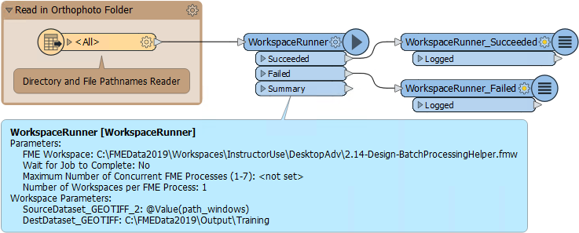
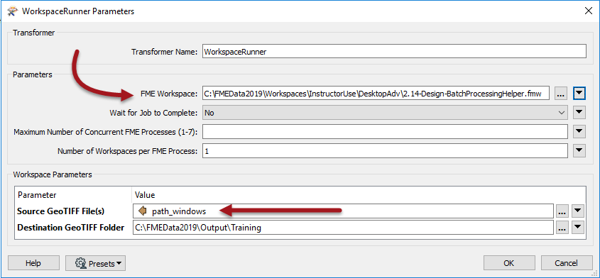
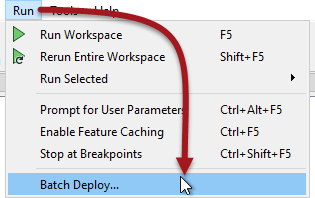

# Batch Processing #

Batch processing is the action of processing multiple source datasets in the same workspace. By splitting each dataset into a separate process, performance can be improved. This is achieved with the WorkspaceRunner transformer.

---

## Batch Processing Using the WorkspaceRunner ##

The WorkspaceRunner is a transformer that runs another FME workspace when used in a translation. One use of it is for chaining multiple workspaces to run one after another. However, it can be used to run multiple workspaces simultaneously, in a form of batch processing, and is especially effective used in conjunction with the Directory and File Pathname reader. 

For example, we have a workspace that reads in orthophoto tiles and clips them to neighborhood boundaries, writing them using a combination of tile and neighborhood as the output filename:

Imagine we get new orthophotos each week. Instead of changing the data in the previous workspace each time, we create a workspace to batch process all the new files. This allows FME to start multiple processes simultaneously so that the data is processed faster:

To set up the WorkspaceRunner in a workspace (the *Parent*), the FME Workspace parameter is pointed to the workspace to be batch processed (the *Worker* or *Helper*). The Source File parameter is set to *path_windows*, an attribute created by the Directory and File Pathnames Reader:

The option to Wait for Jobs to Complete ensures one job is completed before starting another. Setting this option prevents multiple Concurrent FME Processes. 

If the job order is unimportant, the parameter Maximum Number of Concurrent FME Processes can be set. This causes multiple FME processes (up to a maximum of seven) to be launched, and these can be seen in the Details tab of Windows Task Manager:

Notice that the FME Engine processes are completely separate to the FME Workbench and Data Inspector processes. One of the FME.EXE processes is running the parent workspace, the others are running the helpers.

---

## Batch Processing Using the Batch Deploy Wizard ##

Batch deploy is available under the Run menu in FME Workbench. It supports both instant batch processing and the creation of batch files. This allows you to process a large number of source datasets in the current workspace and produce a separate output for each:

 

Batch deploy operates in the form of a Wizard. The user specifies the input and output datasets plus any other relevant settings such as a suffix for the output file names. 

If the process is not carried out right away, a batch .tcl file is created containing the batch process settings, as well as a .bat file which is used to start the process at a later date. 

---

<table style="border-spacing: 0px">
<tr>
<td style="vertical-align:middle;background-color:darkorange;border: 2px solid darkorange">
<i class="fa fa-quote-left fa-lg fa-pull-left fa-fw" style="color:white;padding-right: 12px;vertical-align:text-top"></i>
FME Lizard says…
</td>
</tr>

<tr>
<td style="border: 1px solid darkorange">

Batch Processing (on Desktop) can also be done using the command line or an FME Command File. These techniques are more advanced then we want to get into for this course, but if you are interested in learning more you can check out the Knowledge Base Article <a href="https://knowledge.safe.com/articles/1384/fme-batch-processing-methods-1.html" alt="Batch Processing Article">FME Batch Processing Methods</a>

</td>
</tr>
</table>
